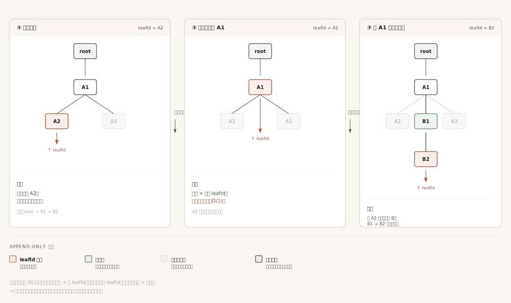
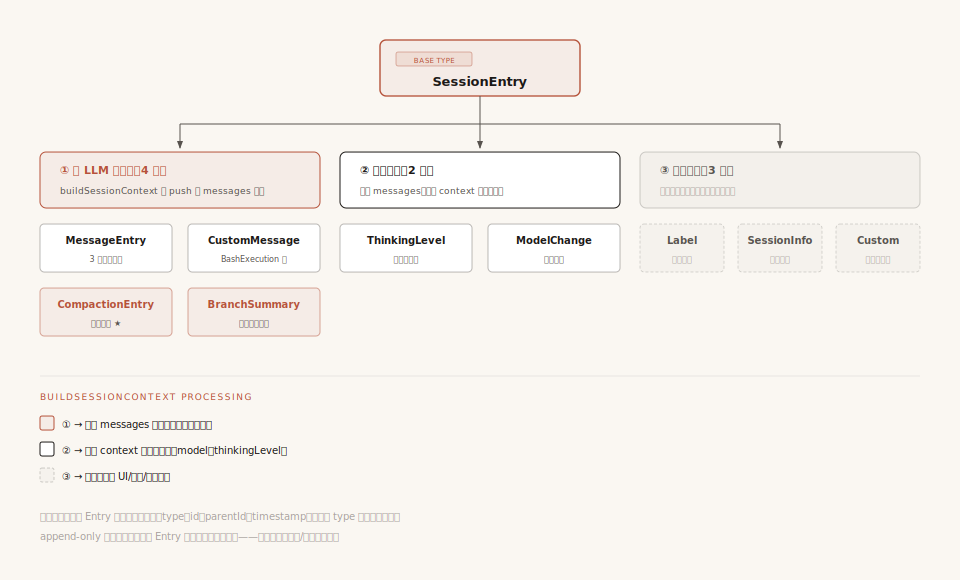

# 第10章：会话管理 —— 对话的存储、恢复与分叉

第 9 章讲压缩算法时，反复提到一个概念——Session Tree。压缩结果（CompactionEntry）存在 Session Tree 上，`buildSessionContext()` 从 Session Tree 构建 LLM 需要的上下文。

这一章就来回答：Session Tree 到底是什么？

但在解释 Session Tree 之前，得先回答一个更基础的问题——**会话数据到底怎么存？** 这个问题原文跳过了，但它才是这一章的真正起点。

---

## 一、问题：会话数据怎么存？

前 8 章我们一直在跟 `context.messages` 打交道——它是一个数组，存着当前轮的对话。但每次 Agent 启动时，这个数组从哪来？关闭后到哪去？

这就引出一个最基础的工程问题：**会话数据怎么存？**

这个问题其实**包含两个独立的子问题**，需要拆开看：

- **子问题 A：存在哪里？**（存储介质）
- **子问题 B：长什么样？**（数据结构）

两个维度是正交的——你可以"用 mysql 存线性数组"，也可以"用 JSONL 文件存一棵树"。混淆它们会让后续讨论糊成一团。下面分别展开。

### 子问题 A：存在哪里？（介质）

如果你做过后端开发，第一反应可能是 mysql / postgres 这种关系型数据库——一张 messages 表，`user_id + role + content + timestamp`，按会话 id 分组查询。

Pi 的 coding-agent **没有走这条路**。它选了**本地 JSONL 文件**——每个会话一个 `.jsonl` 文件，存在用户本地磁盘的项目目录下。一行一个 entry，纯文本。

为什么选文件而不是数据库？这跟 coding-agent 的产品定位有关：

- **单用户、本地运行**：coding-agent 是 CLI 工具，跑在用户自己的机器上，没有"多用户并发""跨机器查询"的需求，数据库那套并发/索引/事务全是过度设计
- **会话跟项目走**：`cd /project-a` 时打开项目 a 的会话历史，`cd /project-b` 时打开项目 b 的——每个项目的 `.pi/sessions/` 目录就是那个项目的对话档案
- **零依赖、零运维**：不需要装 mysql，不需要起服务，开箱即用
- **可读、可调试**：JSONL 是纯文本，可以 `cat` / `grep` / 用编辑器直接打开看，调试时一目了然

但 Pi 没有把这条路焊死。agent-core 层提供了一个 `SessionStorage` 接口（`harness/types.ts:440`），让其他应用可以自己实现数据库版本。agent-core 自带两个实现：`JsonlSessionStorage`（文件）和 `InMemorySessionStorage`（内存，测试用）。**注意**：coding-agent 的 `SessionManager`（`session-manager.ts:758`）**并未实现** agent-core 的 `SessionStorage` 接口——两者是**独立的两套实现**，coding-agent 直接读写自己的 JSONL 文件，没有走 agent-core 的抽象层。这种"接口存在但不强制复用"的安排，是 Pi 内部各包之间松耦合的一个真实案例。

> 实现：`packages/agent/src/harness/types.ts:440` 的 `SessionStorage` 接口；`packages/agent/src/harness/session/jsonl-storage.ts` 的 `JsonlSessionStorage`；`packages/coding-agent/src/core/session-manager.ts:758` 的 coding-agent 独立的 `SessionManager`（不实现前者）

所以"存在哪里"这一层的选择是：**coding-agent 选了本地 JSONL 文件，但接口允许其他应用换数据库**。这层搞清楚了，下一层问题才好讨论。

### 子问题 B：长什么样？（结构）

存哪里解决了，但还有更深一层的问题：**对话数据的逻辑形态是什么？**

最直觉的答案：**线性数组**。`messages = [msg1, msg2, msg3, ...]`，一条接一条。这种结构最简单，也是 mysql 那种 messages 表默认的形态。

但真实使用场景里，对话**不总是线性的**：

- **重试**：Agent 的回复不好，你想"退回上一轮"重新生成
- **分支**：你想在某个节点尝试两种不同的方案，比较结果
- **回退**：走了一条路发现不对，想回到之前的岔路口

如果对话是线性数组，这些操作意味着"删掉后面的消息再重写"。删了就没了——如果你想保留两条分支的记录呢？比如先试方案 A 走到底，再回过头试方案 B——A 的对话记录也得留着对比。

线性数组做不到"分叉不丢数据"。Pi 的答案是 **Session Tree**——把对话历史组织成一棵**只追加、不修改、不删除**的树。回退/分支不是"删数据"，而是"移动一个指针"。

| 维度 | 一般选择 | Pi 的选择 |
|------|---------|----------|
| 存哪里 | mysql 等数据库 | 本地 JSONL 文件（接口允许换数据库） |
| 长什么样 | 线性数组 | 树（Session Tree） |

下面用一个完整的真实会话当例子，把这棵树一步一步"长"出来给你看。

---

## 二、跟着一次真实会话看树怎么长出来

抽象地讲"Session Tree 是一棵 append-only 的树"几乎没人能看懂。我们用一个具体场景：**调试一个认证 bug**。

设想你打开 Pi Agent，进行 8 步操作：

```
步骤 1: 切换到 Claude 4.6 模型（你想用更聪明的模型）
步骤 2: 你问 "auth.ts 里 salt 验证为什么失败？"
步骤 3: Agent 决定调 read 工具读 auth.ts
步骤 4: read 工具返回 auth.ts 的内容
步骤 5: Agent 分析后回复 "问题在 23 行，salt 没编码"
步骤 6: 你不太满意这个回答，回退到步骤 2 重来
步骤 7: 你换思路问 "先看 hash 函数的实现"
步骤 8: Agent 调 grep + read 给出新的分析
```

下面看这 8 步怎么让会话树从"空"长成一棵有分支的树。

### 第 1 步：切换模型，第一个节点上树

会话启动时，文件第一行是 Session Header（不是树节点，是文件元信息）。然后你切换模型，产生第一个真正的树节点 `ModelChangeEntry`：

```
e1: ModelChangeEntry
    parentId: null（根节点）
    payload: { model: "claude-sonnet-4-6" }
```

这棵树现在只有一个节点：

```
e1 (model_change)
↑
leafId 在这
```

### 第 2 步：你提问，UserMessage 节点上树

你输入"auth.ts 里 salt 验证为什么失败？"，产生第二个节点 `MessageEntry`：

```
e2: MessageEntry
    parentId: e1
    message:
      role: "user"
      content: [{ type: "text", text: "auth.ts 里 salt 验证为什么失败？" }]
```

注意 `parentId: e1`——它指向"上一个节点"，不指向 session header。树形：

```
e1 (model_change)
 └── e2 (user message)
       ↑
     leafId
```

### 第 3 步：Agent 调 read 工具，AssistantMessage 节点上树

Agent 决定先读文件，产生一个含 ToolCall 的 AssistantMessage：

```
e3: MessageEntry
    parentId: e2
    message:
      role: "assistant"
      content: [
        { type: "text", text: "让我读一下 auth.ts" },
        { type: "toolCall", id: "call_001", name: "read",
          arguments: { path: "src/auth.ts" } }
      ]
      stopReason: "toolUse"
```

这一条 AssistantMessage **同时包含文本和工具调用**——它们放在同一个 content 数组里，是同一个节点。不是"文本一个节点 + 工具调用一个节点"。这点第 6 章讲过，但读者容易忘，再强调一次。

```
e1 (model_change)
 └── e2 (user)
      └── e3 (assistant + ToolCall)
            ↑
          leafId
```

### 第 4 步：read 工具返回结果，ToolResult 节点上树

工具执行完，产生一个 ToolResult 消息节点：

```
e4: MessageEntry
    parentId: e3
    message:
      role: "toolResult"
      toolCallId: "call_001"     ← 关联到 e3 里的 ToolCall
      content: [{ type: "text", text: "export function verifySalt(s) { ... }" }]
      isError: false
```

注意 `toolCallId` 字段——它把这条 ToolResult 和触发它的 ToolCall 关联起来。这是第 5 章讲过的"工具结果必须精准关联回调用请求"在数据层的体现。

```
e1 (model_change)
 └── e2 (user)
      └── e3 (assistant + ToolCall)
           └── e4 (toolResult)
                 ↑
               leafId
```

### 第 5 步：Agent 给出分析，又一个 AssistantMessage

Agent 看到文件内容后回复分析：

```
e5: MessageEntry
    parentId: e4
    message:
      role: "assistant"
      content: [{ type: "text", text: "问题在 23 行，salt 没编码" }]
      stopReason: "stop"
```

到现在为止，5 步操作产生了 5 个节点，全部挂在一条直线上——这就是"主分支"：

```
e1 (model_change)
 └── e2 (user: "salt 验证为什么失败?")
      └── e3 (assistant: read auth.ts)
           └── e4 (toolResult: auth.ts 内容)
                └── e5 (assistant: "问题在 23 行")
                      ↑
                    leafId
```

到这里你看到了"追加操作"——每一步只做两件事：创建新节点（带 parentId）+ 移动 leafId。没有任何旧节点被修改。

### 第 6 步：回退——这是关键转折

你对"问题在 23 行"这个分析不太满意，想换个思路。这时你执行**回退**——但**没有删除任何节点**：

```typescript
branch(branchFromId: "e2"): void {
    this.leafId = "e2";   // 只改这一行
}
```

操作只有一行：`leafId = "e2"`。回退后树长这样：

```
e1 (model_change)
 └── e2 (user: "salt 验证为什么失败?")
      ├── e3 (assistant: read auth.ts)        ← 旧分支还在
      │    └── e4 (toolResult)                     数据完整保留
      │         └── e5 (assistant: "问题在 23 行")
      │
      ↑ leafId 现在指回 e2
```

**e3、e4、e5 一个都没删**——它们还在树上，只是不在"当前路径"上。这就是 append-only 的核心：**回退不是删数据，是移动指针**。

为什么要保留？因为你不知道以后会不会想回到旧分支。也许新思路走半天没结果，你想退回去看原来的"问题在 23 行"分析。如果回退时删了，就再也找不回来了。

### 第 7 步：换思路重新问——新分支自然长出

你从 e2 这条岔路口换了一个问题，产生新节点：

```
e6: MessageEntry
    parentId: e2   ← 跟 e3 共享同一个父！
    message:
      role: "user"
      content: [{ type: "text", text: "先看 hash 函数的实现" }]
```

注意——e6 的 `parentId` 也是 `e2`，跟 e3 一样。这是分支的本质：**两个节点共享同一个 parent，就是树上的两个分支**。

```
e1 (model_change)
 └── e2 (user: "salt 验证为什么失败?")
      ├── e3 (assistant: read auth.ts)
      │    └── e4 (toolResult)
      │         └── e5 (assistant: "问题在 23 行")
      │
      └── e6 (user: "先看 hash 函数")    ← 新分支起点
            ↑
          leafId
```

### 第 8 步：新分支继续长

Agent 在新分支上调 grep + read 工具，产生 3 个新节点（assistant + toolResult + assistant）：

```
e1 (model_change)
 └── e2 (user: "salt 验证为什么失败?")
      ├── e3 (assistant: read auth.ts)
      │    └── e4 (toolResult)
      │         └── e5 (assistant: "问题在 23 行")
      │
      └── e6 (user: "先看 hash 函数")
           └── e7 (assistant: grep hash)
                └── e8 (toolResult: grep 结果)
                     └── e9 (assistant: 新分析)
                           ↑
                         leafId
```

到这里整棵树有 9 个节点，分成两个分支。**所有数据完整保留**——你可以随时回到 e5 那个分支继续工作，也可以在 e9 这个分支继续推进。

这就是 Session Tree 的完整叙事：**对话是一棵树，每条消息是一个节点，回退/分支不删数据，只是移动指针**。



**配图说明**：三幅快照展示树的演化——① 当前在 A2 → ② 用户回退到 A1（只移 leafId，A2 节点仍在树上变虚线，O(1)）→ ③ 从 A1 长出新分支 B1→B2。所有"被抛弃"的分支永远不删，是 append-only 的铁律。底部图例：红色 = leafId 当前位置，绿色 = 新分支，虚线灰 = 被抛弃但仍保留的分支。

---

## 三、树上节点的解剖

看完树怎么长出来，我们仔细看节点本身。

### 一个完整的 MessageEntry 长这样

第 3 步产生的那条 AssistantMessage，在 .jsonl 文件里是这样一行：

```json
{
  "type": "message",
  "id": "e3",
  "parentId": "e2",
  "timestamp": "2026-07-03T10:23:45.000Z",
  "message": {
    "role": "assistant",
    "content": [
      { "type": "text", "text": "让我读一下 auth.ts" },
      { "type": "toolCall", "id": "call_001", "name": "read",
        "arguments": { "path": "src/auth.ts" } }
    ],
    "model": "claude-sonnet-4-6",
    "stopReason": "toolUse",
    "usage": { "input": 1250, "output": 80 }
  }
}
```

读这串 JSON 你就明白了 Session Tree 的全部精髓：

| 字段 | 干什么 | 设计动机 |
|------|--------|---------|
| `type: "message"` | 区分节点类型 | 树上不止消息，还有 model_change、compaction 等多种类型 |
| `id: "e3"` | 节点唯一标识 | 别的节点通过 parentId 指向它 |
| `parentId: "e2"` | 指向父节点 | **认父不认子**——节点不知道自己有哪些子节点 |
| `timestamp` | 创建时间 | 排序、调试用 |
| `message` | 真正的消息载荷 | role + content + model 等字段（第 6 章讲过） |

**关键点：`parentId` 是单向的**。节点知道自己从哪来（parentId），但父节点不知道自己有哪些孩子。这不是疏忽，是设计——如果父节点要维护 children 列表，追加新子节点时就得修改父节点，违反 append-only 原则。**所以"认父不认子"是 append-only 的必要条件**。

### 9 种 Entry 类型，按职责分三组

第 2 节那个例子里出现了 `model_change`、`user`、`assistant`、`toolResult` 四种节点。其实 Pi 一共定义了 9 种 Entry 类型。看起来多，其实**按"对 LLM 调用的影响"分三组**就清晰了：

**第一组：进 LLM 上下文（4 种）**

这 4 种最终会变成 messages 数组里的一项，发给 LLM 看到：

| 类型 | 产生什么消息 | 例子 |
|------|------------|------|
| `MessageEntry` | UserMessage / AssistantMessage / ToolResultMessage | 第 2-5 步所有的对话消息 |
| `CustomMessageEntry` | CustomMessage（第 6 章讲的自定义消息） | 扩展注入的特殊消息 |
| `CompactionEntry` | CompactionSummaryMessage（替换旧消息） | 第 9 章讲的压缩结果 |
| `BranchSummaryEntry` | BranchSummaryMessage（被抛弃分支的摘要） | 后面 §四 讲 |

**第二组：影响后续 LLM 调用（2 种）**

这 2 种不产生消息，但改变后续 LLM 调用的参数：

| 类型 | 改变什么 | 例子 |
|------|---------|------|
| `ModelChangeEntry` | 后续用哪个模型 | 第 1 步切到 Claude 4.6 |
| `ThinkingLevelChangeEntry` | 后续的思考级别 | 用户调整思考强度 |

**第三组：纯元数据，不影响 LLM（3 种）**

这 3 种既不产生消息、也不改 LLM 参数，纯粹是给 UI 或扩展用的：

| 类型 | 干什么 |
|------|--------|
| `LabelEntry` | 给节点贴书签（"这里是关键点"） |
| `SessionInfoEntry` | 会话元信息（名称、创建者等） |
| `CustomEntry` | 扩展自己存的元数据 |

**为什么要把类型分这么细？** 因为 `buildSessionContext()`（下一节讲）需要按类型分派处理——是消息就进 messages 数组，是状态变更就改状态变量，是元数据就跳过。如果只有一种类型，处理逻辑就得塞满 `if-else`，可读性和扩展性都差。



**配图说明**：所有 Entry 共享基础字段（type / id / parentId / timestamp），按"对 LLM 调用的影响"分三组——① 进上下文（4 种，红色，会 push 到 messages 数组）；② 影响状态（2 种，黑色，只改 model / thinkingLevel 变量）；③ 纯元数据（3 种，虚线灰色，buildSessionContext 直接跳过）。这个分类决定了下一节 `buildSessionContext` 的派发逻辑。

> 类型定义在 `packages/agent/src/harness/types.ts` 的 SessionEntry 联合类型

### 为什么"认父不认子"是 append-only 的必要条件

回到 `parentId` 这个设计。如果改成"认子不认父"——子节点没 parentId，但父节点有 children 列表——会发生什么？

回到第 7 步，你要从 e2 长出新分支 e6。如果是"认子"，e2 的 children 列表从 `[e3]` 改成 `[e3, e6]`——**这需要修改 e2**。但 append-only 规定节点不可变，这就矛盾了。

所以**只有"认父不认子"才能让追加操作不修改任何旧节点**。这是个看似违反直觉（"树通常父节点知道子节点"）但完全合理的设计。

---

## 四、三个核心操作 + 分支摘要

有了第 2 节的具体例子，现在可以把三个核心操作 + 分支摘要一起讲清楚。

### 操作 1：追加——O(1) 不改任何旧节点

追加操作只有三步：

```
1. 创建新 Entry（含自己的 id、parentId 指向当前 leafId、payload）
2. 存入 byId 映射表（id → entry）
3. leafId = 新 entry 的 id
```

回到第 3 步（产生 e3 节点）：

```typescript
appendEntry({ type: "message", id: "e3", parentId: "e2", message: ... });
// 内部:
//   byId.set("e3", newEntry);
//   this.leafId = "e3";
```

**没有修改 e2**——只是创建 e3 时让它的 parentId 指向 e2。e2 完全不知道自己多了个孩子，但通过 byId 表反查就能找到所有指向它的子节点。这就是"认父不认子 + byId 映射表"的配合——**结构上单向，但通过全局表可以反向查询**。

### 操作 2：回退——只移动 leafId

```typescript
branch(branchFromId: "e2"): void {
    if (!this.byId.has(branchFromId)) {
        throw new Error(`Entry ${branchFromId} not found`);
    }
    this.leafId = "e2";   // 核心就是这一行
}
```

**核心就是 `leafId = branchFromId` 这一行**（外加一个存在性检查防止指向不存在的节点）。没有删除 e3、e4、e5——它们还在 byId 里，还在 .jsonl 文件里。回退只是说"以后追加新节点时，parentId 指向 e2 而不是当前最后那个节点"。

### 操作 3：分支——回退后追加的自然结果

回退到 e2 后再追加 e6，e6 的 parentId 自动就是 e2——这就是分支。**分支不是独立的操作，是"回退 + 追加"的组合效果**。

### 分支摘要：BranchSummaryEntry——回退时的可选项

回到第 6 步。你从 e5 回退到 e2，旧分支（e3-e5）就成了"被抛弃的分支"。这些数据完整保留在树上，但**当前路径的 LLM 看不到它们**（因为 buildSessionContext 只走当前路径）。

有时候你希望当前路径的 Agent **大致知道**之前试过什么——不用看完整对话，知道个大概就行。比如"之前的尝试发现 salt 编码有问题，但没解决根因"。这时你可以用 `branchWithSummary()`：

```typescript
branchWithSummary(fromId: "e5"): Promise<void> {
    // 1. 把 e3-e5 这段被抛弃的分支喂给 LLM 生成一份结构化摘要
    // 2. 创建一个新的 BranchSummaryEntry，其 parentId 指向 e2（与 e3-e5 同父）
    // 3. 摘要内容是结构化的（Goal / Progress / Decisions 等，跟压缩摘要格式一样）
}
```

挂上去后树变成：

```
e2 (user)
 ├── e3 (assistant: read auth.ts)
 │    └── e4 (toolResult)
 │         └── e5 (assistant: "问题在 23 行")
 │
 ├── e_BranchSummary (BranchSummaryEntry: "之前试过 read auth.ts，发现 salt 编码问题但未解决根因")
 │
 └── e6 (user: "先看 hash 函数")
      ...
```

**BranchSummaryEntry 跟普通消息的区别**：它是被抛弃分支的"遗言"，不是真实发生的对话。它会被 buildSessionContext 转换成一条 **BranchSummaryMessage**（注意区别于压缩产生的 CompactionSummaryMessage，两者是不同的消息类型——见 `session-manager.ts:397` 的 `createBranchSummaryMessage` vs `:403` 的 `createCompactionSummaryMessage`；第 6 章讲过：convertToLlm 翻译成 `<summary>` 标签的 UserMessage）。所以新分支的 Agent 会看到："之前尝试过 X，结论是 Y"——它知道了历史，但不会被旧分支的细节淹没。

**这是可选的**——如果你觉得旧分支完全不重要，直接 `branch()` 就够了，不生成摘要。`branchWithSummary()` 是给"想保留历史精华但不想保留完整对话"的场景准备的。

> 实现：`packages/coding-agent/src/core/session-manager.ts` 的 `branchWithSummary`；摘要生成复用了第 9 章的结构化 prompt

---

## 五、从树到 LLM 上下文：buildSessionContext

树长好了，但 **LLM 不认识树**。LLM 的 API 只接受一个**线性 messages 数组**（第 6 章讲过：user / assistant / toolResult 三种）。所以每次调用 LLM 之前，要把树"压扁"成数组。这就是 `buildSessionContext()` 的工作。

### 为什么这一步必须存在

想象 LLM 的视角：你给它发一个 HTTP 请求，body 里是 `messages: [...]`——一个数组。它不知道你的会话历史是树形还是数组，它只看 messages 数组。

所以无论你的内部数据结构多复杂，**到 LLM 边界必须变成线性**。这是 Session Tree 的"出口"——树的存储形态是树形，但出口形态是线性的 messages 数组。

### 第一步：路径遍历——从 leaf 往回走到 root

回到我们的例子，当前 leafId 是 e9。`buildSessionContext` 先从 e9 往回走到根，收集路径上的所有 entry：

```typescript
const path: SessionEntry[] = [];
let current = byId.get(leafId);   // e9
while (current) {
    path.push(current);   // 先按 leaf → root 顺序收集
    current = current.parentId ? byId.get(current.parentId) : undefined;
}
path.reverse();           // 反转为 root → leaf 顺序
```

走完之后，path 数组（从 root 到 leaf 的顺序）是：

```
[e1, e2, e6, e7, e8, e9]
```

**注意 e3、e4、e5 不在 path 里**——它们不在当前分支上。这就是"当前路径"的含义——只看 leaf 到 root 这一条线，其他分支的数据不会发给 LLM。

### 第二步：按类型分派处理

路径上的每个 entry，按类型决定怎么处理：

```
e1 (model_change)   → 更新状态变量 model = "claude-sonnet-4-6"，不进 messages
e2 (user message)   → 推入 messages 数组
e6 (user message)   → 推入 messages 数组
e7 (assistant + ToolCall) → 推入 messages 数组
e8 (toolResult)     → 推入 messages 数组
e9 (assistant)      → 推入 messages 数组
```

最后构建出来的 messages 数组长这样：

```typescript
[
  { role: "user", content: "auth.ts 里 salt 验证为什么失败?" },        // e2
  { role: "user", content: "先看 hash 函数的实现" },                    // e6
  { role: "assistant", content: [{ text: ... }, { toolCall: grep ...}] }, // e7
  { role: "toolResult", toolCallId: "call_002", content: ... },        // e8
  { role: "assistant", content: [{ text: "新分析..." }] }              // e9
]
```

注意一个微妙的事情：**e2 和 e6 都是 user 消息，连续两条 user**。这在 LLM API 协议里允许吗？大多数 Provider 允许，但有些会要求合并。Pi 在 convertToLlm 那一层会处理这种合并（第 6 章讲过的 convertToLlm 翻译规则）。

### 状态变量：覆盖式提取

model_change 和 thinkingLevel_change 不进 messages 数组，但它们影响"用什么参数调用 LLM"。提取方式是**覆盖式**——沿路径从 root 走到 leaf，遇到变更就覆盖：

```
e1 (model_change: "claude-sonnet-4-6")  → model 变量 = "claude-sonnet-4-6"
e2-e9（没有 model_change）              → model 变量保持不变
```

如果路径上有多条 model_change（比如先切到 4.6、又切到 4.5、再切回 4.6），最后一次覆盖生效——这跟"最后生效"的语义一致。

> **初始值兜底**：`buildSessionContext` 中 `model` 状态变量的初始值是 `null`（`session-manager.ts:367`）。如果路径上**没有任何 model_change 节点**（比如从未切换过模型），函数返回 `model: null`，由调用方（`agent-session-runtime`）兜底使用 session 启动时配置的初始 model。assistant 消息本身不携带"用哪个模型生成"的信息——model 完全由 model_change 节点决定。

**这就是为什么 Pi 把"切换模型"也存成节点而不是状态变量**——节点能完整记录"什么时候切的、在哪个位置切的"，而状态变量只能存最后值。如果你回退到切换模型之前的节点，buildSessionContext 走的路径不包含那条 model_change，model 就自动回到切换前的值。**节点化的状态让回退天然正确**。

### CompactionEntry 的特殊处理：选择性收集

第 9 章讲压缩时说"压缩结果替换掉被压缩的旧消息"——具体怎么替换，就在这一步。假设路径上有 CompactionEntry：

```
e1 (user)              ← 这之前是早期对话（已被压缩）
e2 (assistant)         ← 被压缩
e3 (assistant)         ← 被压缩
e4 (compaction)        ← 压缩节点，记录了 firstKeptEntryId = "e3"
e5 (user)              ← 压缩后保留的近期消息
e6 (assistant)
```

`buildSessionContext` 遍历到 e4 时，**不是简单地"停止收集之前的消息"**，而是**按 firstKeptEntryId 选择性收集**：

1. 先生成一条 `CompactionSummaryMessage`（来自 e4 的 summary 字段），推入 messages 数组开头
2. 在 e4 **之前**的 entry 中，**只收集 firstKeptEntryId（e3）及之后的**——e1、e2 被丢弃，e3 保留
3. e4 **之后**的所有 entry 正常收集

最终的 messages 数组：

```typescript
[
  CompactionSummaryMessage (从 e4 生成),   // 替换了 e1、e2
  { role: "assistant", ... },              // e3（保留区第一个）
  { role: "user", ... },                    // e5
  { role: "assistant", ... },              // e6
]
```

**这就是第 9 章说的"压缩结果替换旧消息"的具体实现**——不是真的删 e1、e2（append-only 不允许删），而是 buildSessionContext 在遍历时按 firstKeptEntryId "跳过"它们。下次如果你回退到 e4 之前的位置，buildSessionContext 的路径不包含 e4，e1-e3 又会作为正常消息出现——压缩不是破坏性的，只是"当前路径上"的视图。

注意 firstKeptEntryId 是 CompactionEntry 自己记录的字段——它在压缩发生时就计算好了"保留哪些近期消息"。第 9 章讲的"找切割点"就是为了确定这个 firstKeptEntryId。

> 实现：`packages/coding-agent/src/core/session-manager.ts` 的 `buildSessionContext`，路径遍历和分派处理的核心逻辑

---

## 六、JSONL 持久化的具体细节

§一 已经讲了"为什么选 JSONL 文件"，这一节展开"具体怎么写"。

### 格式：一行一个 Entry

第 2 节那个会话，最终在磁盘上的 .jsonl 文件长这样（每行一个 entry，紧凑显示）：

```jsonl
{"type":"session","version":3,"id":"UUIDv7","cwd":"/project","timestamp":"2026-07-03T10:00:00Z"}
{"type":"model_change","id":"e1","parentId":null,"provider":"anthropic","modelId":"claude-sonnet-4-6","timestamp":"2026-07-03T10:00:05Z"}
{"type":"message","id":"e2","parentId":"e1","message":{"role":"user","content":[{"type":"text","text":"auth.ts 里 salt 验证为什么失败?"}]},"timestamp":"2026-07-03T10:23:00Z"}
{"type":"message","id":"e3","parentId":"e2","message":{"role":"assistant","content":[{"type":"text","text":"让我读一下 auth.ts"},{"type":"toolCall","id":"call_001","name":"read","arguments":{"path":"src/auth.ts"}}],"stopReason":"toolUse"},"timestamp":"2026-07-03T10:23:30Z"}
{"type":"message","id":"e4","parentId":"e3","message":{"role":"toolResult","toolCallId":"call_001","content":[{"type":"text","text":"export function verifySalt(s) { ... }"}],"isError":false},"timestamp":"2026-07-03T10:23:31Z"}
{"type":"message","id":"e5","parentId":"e4","message":{"role":"assistant","content":[{"type":"text","text":"问题在 23 行，salt 没编码"}],"stopReason":"stop"},"timestamp":"2026-07-03T10:24:00Z"}
{"type":"message","id":"e6","parentId":"e2","message":{"role":"user","content":[{"type":"text","text":"先看 hash 函数的实现"}]},"timestamp":"2026-07-03T10:30:00Z"}
{"type":"message","id":"e7","parentId":"e6",...}
```

第一行是 Session Header（`type: "session"`），记录会话元信息（cwd、版本号等）。后续每行是一个 Entry。

**几个值得注意的细节**：

1. **e6 的 parentId 是 e2**——通过这个字段就能在文件里看出"这里有个分支"。用 `grep '"parentId":"e2"'` 就能找到所有从 e2 长出来的子节点
2. **timestamp 是 ISO 字符串**——人类可读，调试时一眼看出顺序
3. **id 是 8 位短 UUID**（如 `a1b2c3d4`）——比完整 UUID 省空间，会话内冲突概率足够低

**为什么用 JSONL 而不是单个 JSON？** 因为 JSONL 是**行级追加**的——新 Entry 直接 `appendFileSync` 到文件末尾，不需要读入-修改-重写整个文件。这和 append-only 树的设计完美契合：树只追加不修改，文件也只追加不重写。

> 实现：`packages/coding-agent/src/core/session-manager.ts` 的 `_appendEntry`（约 L941），用 `appendFileSync`

### 延迟写入：避免"有问无答"的半截对话

有一个写入策略细节：**首次 assistant 消息到达前，写入会延迟**。具体规则分四种情况：

| 已有 assistant？ | 已 flushed？ | 行为 |
|----------------|------------|------|
| 没有 | 已 flushed | 立即 append 当前 entry |
| 没有 | 未 flushed | 标记为"未 flushed"，**不写盘**——等 assistant 到来 |
| 有 | 未 flushed | **重写整个文件**（包含 header + 所有积压 entry），用 `openSync("wx") + writeFileSync` 保证原子性，标记为已 flushed |
| 有 | 已 flushed | 立即 append 当前 entry |

为什么要这套复杂逻辑？为了避免"有问无答"的半截对话残留——用户问了一句但 Agent 没回（网络断了、API 报错了），如果立即把每条用户消息都写盘，下次打开会话时就会看到一条孤零零的用户消息悬在那儿，没有对应回复。延迟到首次 assistant 消息到达再批量写入，保证落盘的对话至少有一对完整的 user-assistant 往返。

之后所有 entry 都立即 append——首次 flush 后这个机制就不再起作用，因为已经"上了轨道"。

### 偶尔的全文件重写

虽然日常追加用 `appendFileSync`，但有两种情况会触发全文件重写（`writeFileSync`）：

- **创建分支副本**：克隆会话到新 .jsonl 文件时，需要把当前路径上的所有 entry 复制过去
- **修复损坏的会话文件**：发现文件格式异常时，重新规范地写一遍

重写不破坏 append-only 原则——重写产生的是新文件或新格式，原历史数据完整保留在重写后的内容里。

> 实现：`packages/coding-agent/src/core/session-manager.ts` 的 `_rewriteFile`，约 L876

---

## 七、两层实现：接口允许换数据库

Session Tree 有两层实现，呼应 §一 讲的"接口允许换数据库"：

| | agent-core 层 | coding-agent 层 |
|---|---|---|
| **API 风格** | 异步 | 同步 |
| **Entry 类型** | 11 种 | 9 种 |
| **存储** | `SessionStorage` 接口（可插拔） | **独立实现**，直接操作 JSONL |
| **用途** | 通用框架层 | 编码 Agent 产品层 |

agent-core 提供了通用的 Session 管理框架和 `SessionStorage` 接口。**但要注意：coding-agent 的 SessionManager 并未实现这个接口**——它是一套**完全独立**的实现，直接操作自己的 JSONL 文件，复用了 agent-core 的类型定义（如 `SessionEntry`），但没复用其存储抽象。两套实现平行存在。

这种"接口存在但 coding-agent 不复用"的安排有两个含义：（1）你想做一个 Web 版的 Pi Agent，可以**自己**用 mysql 实现 `SessionStorage` 接口，agent-core 的其他逻辑都不用改；（2）但你**不能**直接拿 coding-agent 的 SessionManager 去套 agent-core 的 SessionStorage 接口——它们签名不兼容。这是 §一 讲的"接口允许换数据库"的具体落地，但落地路径是"各自实现"而非"统一继承"。

> `SessionStorage` 接口在 `packages/agent/src/harness/types.ts:440`；两个参考实现：`packages/agent/src/harness/session/jsonl-storage.ts`（文件）和 `memory-storage.ts`（内存）；coding-agent 独立实现在 `packages/coding-agent/src/core/session-manager.ts:758`

---

## 八、总结

### 一条主线：会话存储的两个独立维度

回头看你能在这一章带走的最核心的东西——**会话数据怎么存，要拆成两个独立问题来想**：

| 维度 | 回答什么 | 一般做法 | Pi 的选择 |
|------|---------|---------|----------|
| **存储介质** | 存哪里？ | mysql 等数据库 | 本地 JSONL 文件（接口允许换） |
| **数据结构** | 长什么样？ | 线性数组 | 树（Session Tree） |

这两个维度可以独立做选择。下次你设计任何"对话历史持久化"或类似的状态保存系统，先问自己这两个问题，再决定方案——不要把它们粘成一团。

### Session Tree 的本质：用树形 + append-only 实现"不丢数据的回退"

为什么树？因为对话不是线性的——用户会回退、重试、分支。
为什么 append-only？因为删了的数据找不回来，而历史分支可能有价值。
为什么认父不认子？因为 append-only 要求节点不可变，父节点不能维护 children 列表。
为什么路径遍历？因为 LLM 只认线性 messages 数组，树形数据必须"压扁"。

**这一连串设计选择是连贯的**——每一个选择都回应了上一个选择带来的约束，最终形成一套自洽的方案。

### 三个可迁移的思路

**1. 拆开"存哪里"和"长什么样"两个维度。** 设计持久化系统时，先分别想清楚这两个问题，再组合方案。混在一起讨论会让选择空间被压缩——你会以为"用了数据库就必须线性数组"或"用了文件就必须 append-only"，其实不然。

**2. append-only 数据结构用于"撤销/回退/分支"场景。** 当系统需要这些能力时，不要删除旧数据。用 append-only + 指针定位（leafId），让历史完整保留。代价是存储空间，但磁盘便宜、数据无价。

**3. 节点化状态变量，让回退天然正确。** Pi 把"切换模型""调整思考级别"也存成节点（ModelChangeEntry 等），而不是塞进一个全局状态对象。好处是回退时状态变量自动回到当时的样子——路径遍历只看当前路径上的变更，自动忽略被回退掉的变更。这是个值得在自己项目里借鉴的设计。

---

## 九、下一站

到本章为止，我们深入了 Pi 的核心运行机制：Agent Loop（第3章）、模型调用（第4章）、工具系统（第5章）、消息系统（第6章）、事件驱动（第7章）、上下文工程（第8章）、上下文压缩（第9章）、会话管理（第10章）。

但还有一个重要的能力我们没讲——**扩展系统**。前面几章反复提到"扩展可以拦截工具调用""扩展可以修改消息""扩展可以预处理上下文"。Pi 怎么做到不改源码就给 Agent 加能力？

> **后续章节说明**：本插图版目前只覆盖到第 10 章（会话管理）。扩展系统、测试模式、设计精华总结等内容在原版文字教程（`分析文档/项目原理-二次整理版/`）里有完整章节，本插图版暂未迁移，感兴趣的读者可以先去文字版查阅。

---

> **本章关键源码索引**：
> - `packages/agent/src/harness/types.ts` — SessionEntry 类型定义、SessionStorage 接口
> - `packages/agent/src/harness/session/jsonl-storage.ts` — JsonlSessionStorage 实现
> - `packages/agent/src/harness/session/memory-storage.ts` — InMemorySessionStorage（测试用）
> - `packages/coding-agent/src/core/session-manager.ts` — coding-agent 的 SessionManager（buildSessionContext、appendEntry、branchWithSummary 等）
> - `packages/coding-agent/src/core/compaction/branch-summarization.ts` — 分支摘要生成
