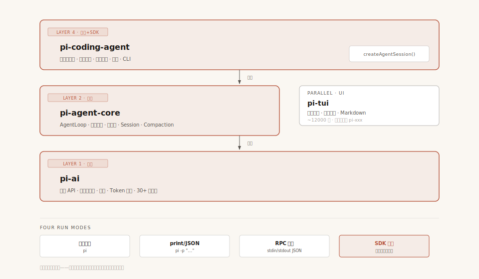

# 第1章：开篇 —— 为什么 Pi-Agent 值得你花时间

> 本文是「Pi-Agent 项目原理详解」的开篇。不涉及源码细节，而是回答一个更根本的问题：Pi 是什么？它为什么值得你花时间？读完这篇，你会对 Pi 的三个身份——**编码工具、学习教材、开发 SDK**——有一个清晰的全局认知。

---

## 一、开场：三个问题，一个答案

你可能因为三种不同的原因点开了这个系列：

1. **"我想找个好用的编码 Agent"** — 你受够了臃肿的工具，想要一个极简、透明、快的东西
2. **"我想知道 Agent 到底怎么做的"** — 你翻过一些 Agent 框架的源码，要么太复杂（几万行起跳），要么太简陋（一个 while 循环就敢叫 Agent）
3. **"我要做自己的 Agent"** — 你有垂直场景的需求，需要基于 SDK 做二次开发，不想从零造轮子

这三个问题，恰好对应 Pi 的三个身份。而这三个身份指向同一个项目，这本身就值得好奇。

在深入源码之前，我们先站远一点，看看 Pi 的全貌。

---

## 二、Pi 是什么：一张图看懂

### 一句话定义

**Pi 是一款极简、可扩展的终端编码 Agent 外壳（coding agent harness），由 libGDX 作者 Mario Zechner 创建，全部用 TypeScript 编写，MIT 协议开源。**

拆开来看：

- **"编码 Agent"** — 它能读懂你的代码库，写代码、改代码、跑命令，像一个坐在你旁边的结对编程伙伴
- **"终端外壳"** — 它住在终端里，没有 GUI，没有 IDE 插件，输出写进终端回滚缓冲区。这决定了它的一切后续设计选择
- **"极简"** — 核心四个内置工具（read / write / edit / bash）、约 90 词（英文 word，非 token）的静态系统提示词模板（运行时拼接 tools/skills/contextFiles 后通常 200-400 词）、约 12000 行 TUI 代码（核心 `tui.ts` 单文件约 1700 行）。它刻意**不**构建 MCP、子 Agent、计划模式、权限弹窗、后台 bash
- **"可扩展"** — 极简核心之上的缺失功能，通过 TypeScript 扩展、技能、Pi Package 来补充

### 关键数字

| 指标 | 数值 | 含义 |
|------|------|------|
| GitHub Stars | 64,000+ | 十个月的增长，社区验证了需求 |
| 内置工具数 | 4 核心 + 3 辅助 | 核心：read / write / edit / bash；辅助：grep / find / ls |
| 系统提示词 | 静态模板 ~90 词（英文 word，运行时 200-400 词） | 对比 Claude Code 的数万字 |
| TUI 代码量 | ~12000 行 | 核心 `tui.ts` 单文件约 1700 行；Mario 的游戏引擎背景带来的"克制" |
| 支持供应商 | 30+ 家 | 源码 `KnownProvider` 枚举实际 35 个（含区域变体），独立品牌约 27 个；Anthropic、OpenAI、Google、Groq、Ollama 等 |
| 核心包数量 | 4 个 | pi-ai / pi-agent-core / pi-tui / pi-coding-agent |
| 运行模式 | 4 种 | 交互 / print-JSON / RPC / SDK |

> **关于数字的说明**：Pi 官网早期营销材料常说"4 个内置工具"、"15+ 家供应商"、"约 600 行 TUI"——前两者分别指**核心 4 个工具**（不含 grep/find/ls 辅助工具）和早期版本列举的知名厂商；"600 行 TUI"是早期版本的数字，v0.80.2 实际已增长到约 12000 行。本表按 **v0.80.2 源码实际数字**呈现，避免读者对照源码时困惑。

### 四个核心包，各司其职

```
┌──────────────────────────────────────────┐
│          pi-coding-agent                 │  ← 完整 CLI 产品 + SDK
│  系统提示词 · 内置工具 · 会话管理 · 扩展  │
├──────────────────────────────────────────┤
│  pi-tui              │  pi-agent-core    │  ← 终端 UI + Agent 引擎
│  差分渲染 · 组件系统  │  AgentLoop · 工具 │
│                      │  系统 · 事件流    │
├──────────────────────┴───────────────────┤
│              pi-ai                       │  ← 多供应商 LLM 抽象
│  统一 API · 上下文交接 · 流式 · Token 追踪│
└──────────────────────────────────────────┘
```

这四层里，`pi-ai / pi-agent-core / pi-coding-agent` 构成一条**三层堆栈**（每层可独立使用），`pi-tui` 是一个**正交的 UI 库**，与 Agent 体系完全解耦——你可以只用 `pi-ai` 调模型，也可以用 `pi-agent-core` 在你自己的应用里跑 Agent Loop，完全不需要碰 CLI。这是 Pi 作为 SDK 的核心价值，我们在第五节细讲。



**配图说明**：四个核心包的分层依赖图。coding-agent 在顶层（产品+SDK），agent-core 在中层（引擎），pi-ai 在底层（模型抽象），pi-tui 是平行的 UI 层不依赖任何 AI 包。底部展示四种运行模式。

> 外围还有一个实验性的 `pi-orchestrator`（v0.80.x 新增），负责多 Agent 编排，不在核心学习主线内。

---

## 三、视角一：作为编码 Agent —— 一个好用的日常工具

先聊最实际的：把它当工具用，体验怎么样？

### 3.1 上下文干净得令人羡慕

这是 Pi 最硬核的差异化。Pi 的系统提示词 + 工具定义加起来不到 1,000 个 token。对比 Claude Code 的数万 token，差距不是一点半点。

**为什么这件事重要？** 上下文窗口是 Agent 最稀缺的资源。固定指令占得越少，留给你的代码、你的项目上下文的空间就越多。而且 Pi 不会在你背后偷偷注入任何东西——所有 prompt 源码公开可见，你甚至可以用 `SYSTEM.md` 文件把整个系统提示词替换掉。

技能（Skills）采用**渐进式披露**：只在被调用时才加载，不会预加载进每一个会话。你可以拥有一座丰富的能力库，而不必为用不上它们的会话付上下文开销。

### 3.2 透明到骨头里

Pi 对 Agent 操作的可见度不做任何妥协。你能看到模型收到的每一条消息、模型做每一个工具调用的完整输入输出、跨会话的完整成本追踪、以及会话的 HTML/JSON 导出。

"这有什么了不起的？"如果你用过其他编码 Agent，你可能经历过：Agent 做了一个奇怪的决定，你想知道它为什么这样做，但你看不到它"看到"了什么。在 Pi 里，没有这种黑箱。

### 3.3 模型自由

Pi 支持 30+ 家 LLM 供应商（v0.80.2 源码 `KnownProvider` 枚举实际有 35 个，含区域变体如小米 4 个、Moonshot 2 个；去重后独立品牌约 27 个）：Anthropic、OpenAI、Google、Azure、Bedrock、Mistral、Groq、Cerebras、xAI、Hugging Face、Kimi、MiniMax、OpenRouter、Ollama、DeepSeek、智谱、小米、Together、Fireworks 等等。

更重要的是，你可以在**会话中途**切换模型——用 `/model` 或 `Ctrl+L`。比如用 Claude 做复杂推理，然后切到 MiniMax 做简单文本处理省钱。`pi-ai` 库在底层处理了跨供应商的上下文交接（思考轨迹转换、供应商特定签名 blob 的回放等），虽然本质上有损，但比大多数工具"切换等于重新开始"的做法要好得多。

### 3.4 树状会话：走错路了就分叉

Pi 把会话存成**树结构**（DAG，有向无环图），而不是线性日志。用 `/tree` 跳到任意历史消息，从那里分叉出一个新分支继续探索。所有分支活在同一个文件里，不用开十个终端窗口。

这在调试时尤其有用——你可以在同一个起点尝试三种不同的修复方案，而不必担心"回不去了"。

### 3.5 YOLO 模式与安全哲学

Pi 默认运行在"YOLO 模式"——Agent 不经审批弹窗就直接执行动作。

这听起来危险，但 Mario 的论点是：基于审批的安全措施会让用户疲劳（"弹窗疲劳"），最终要么被整体禁用、要么沦为看都不看就机械点同意的"安全表演（security theater）"。他建议以容器化作为恰当的安全边界。如果你确实需要审批流程，可以用大约 50 行扩展代码自己实现——框架提供了所有必要的钩子。

### 3.6 上手一分钟

```bash
curl -fsSL https://pi.dev/install.sh | sh
# 或者
npm install -g --ignore-scripts @earendil-works/pi-coding-agent
```

然后在任意项目目录里运行 `pi`。设一个 `ANTHROPIC_API_KEY` 环境变量，或者用 `/login` 完成认证，就可以开始了。

### 3.7 不靠环境变量：用 `models.json` 定义第三方模型

官方教程里默认让你设 `ANTHROPIC_API_KEY`，但实际项目里你大概率想用的是国内的智谱、DeepSeek、Kimi、Qwen 之类。这些**不可能靠一个环境变量搞定**——你需要告诉 Pi：base URL 在哪、用哪种 API 协议、模型 ID 叫什么、上下文窗口多大。

Pi 的解法是一个本地 JSON 配置文件：`~/.pi/agent/models.json`（Windows 下是 `C:\Users\<你>\.pi\agent\models.json`）。文件由 [ModelRegistry.create()](repo/packages/coding-agent/src/core/model-registry.ts#L367) 在启动时自动读取，不需要任何命令行参数。

**一个真实例子**：

```json
{
  "providers": {
    "zhipu": {
      "baseUrl": "https://open.bigmodel.cn/api/paas/v4",
      "api": "openai-completions",
      "apiKey": "<your-zhipu-key>",
      "models": [
        { "id": "glm-4.5-air", "name": "GLM-4.5-Air" },
        { "id": "glm-4-flash", "name": "GLM-4-Flash" }
      ]
    },
    "deepseek": {
      "baseUrl": "https://api.deepseek.com",
      "api": "openai-completions",
      "apiKey": "<your-deepseek-key>",
      "models": [
        { "id": "deepseek-v4-flash", "name": "DeepSeek V4 Flash" },
        {
          "id": "deepseek-v4-pro",
          "name": "DeepSeek V4 Pro",
          "contextWindow": 1000000,
          "maxTokens": 384000
        }
      ]
    }
  }
}
```

拆开看几个关键字段：

- **`providers`** — 顶层是 provider 字典，键名（`zhipu`/`deepseek`）是你自己起的名字，会作为模型的 `provider` 字段显示
- **`api`** — 选协议。最常见的是 `openai-completions`（OpenAI 兼容接口，国内厂商几乎都支持）、`anthropic-messages`、`openai-responses`。这个字段决定了 Pi 用哪种请求格式去调
- **`baseUrl`** — provider 的接口地址
- **`apiKey`** — 明文存放。**务必把 `.pi/` 加进 `.gitignore`**，否则一个 `git add .` 就会泄露
- **`models`** — 该 provider 下的模型列表。`id` 是调 API 时传的真实模型名，`name` 是 TUI 里显示的友好名
- **`contextWindow` / `maxTokens`** — 可选，告诉 Pi 这个模型的窗口和最大输出长度，影响上下文压缩策略

**配置完之后怎么用？** 三种方式：

1. **临时切换**：会话中按 `/model` 或 `Ctrl+L`，列出所有已加载模型（包括你刚配的）fuzzy 搜索选一个
2. **设为默认**：编辑 `~/.pi/agent/settings.json`，加上 `"defaultProvider": "deepseek"` 和 `"defaultModel": "deepseek-v4-pro"`，启动 Pi 就直接用它
3. **命令行查列表**：`pi models`（或 `pi models deepseek` 做 fuzzy 过滤）—— 出错时会在终端顶部打印 `models.json` 的解析错误，方便排查

models.json 还支持两种进阶用法（本教程不展开）：用 `modelOverrides` 给**内置 provider** 的某个具体模型打补丁（比如改 `baseUrl` 指向自部署网关）；用 `compat` 字段处理非标准接口的兼容性问题（比如某些网关需要特殊的 `max_tokens` 字段名）。schema 的完整定义在 [model-registry.ts:158-218](repo/packages/coding-agent/src/core/model-registry.ts#L158-L218)。

---

## 四、视角二：作为学习素材 —— Agent 设计的教科书

第二个身份：Pi 是学习"怎么构建一个生产级 Agent"的绝佳教材。

### 4.1 为什么是 Pi？——因为它足够小

很多 Agent 框架动辄几万行代码，光是搞清楚启动流程就要读几十个文件。Pi 的核心循环只有几百行，但它的设计质量一点都不"简陋"——它在 TerminalBench 基准测试中排名第二（使用 Claude Opus 4.5），仅次于 Terminus，尽管它缺少 MCP、子 Agent、计划模式等功能。

**这意味着你可以在有限的时间内真正"读完"一个高质量 Agent 的全部核心代码。** 这种事对 Claude Code 来说是不可能的，对 LangChain 也是不可能的。

### 4.2 本教程会讲什么

本教程（插图版）目前已发布 **10 章**，前 6 章建立核心理解，后 4 章进入进阶工程议题：

| 章节 | 主题 | 核心问题 | 难度 |
|------|------|----------|------|
| 第 1 章 | 开篇总览 | Pi 是什么？为什么值得学？ | 入门 |
| 第 2 章 | 项目结构与分层架构 | 四个包怎么分工？为什么这样分层？ | 入门 |
| 第 3 章 | Agent Loop | 怎么让 LLM 反复思考和行动？ | ★ 核心 |
| 第 4 章 | 模型调用 | 怎么用一套代码调 30+ 家模型？ | ★ 核心 |
| 第 5 章 | 工具系统 | 工具怎么定义、验证、执行？ | ★ 核心 |
| 第 6 章 | 消息系统 | 对话历史怎么表示和传递？ | ★ 核心 |
| 第 7 章 | 事件驱动架构 | 为什么需要事件？ | 进阶 |
| 第 8 章 | 上下文工程 | 怎么让有限窗口装下无限对话？ | 进阶 |
| 第 9 章 | 上下文压缩 | 对话太长怎么办？ | 进阶 |
| 第 10 章 | 会话管理 | 会话怎么存、怎么恢复、怎么分叉？ | 进阶 |

> **阅读建议**：前 6 章建议按顺序通读，它们是理解 Pi-Agent 运行机制的基础。第 7 章起可按需跳读，每章相对独立。

每一个章节都会回答三个层次的问题：**是什么**（概念）、**怎么做**（源码分析）、**为什么这样做**（设计取舍）。

### 4.3 Pi 的"减法哲学"：真正的教育在取舍里

看一个"什么都做了"的框架，你只能学到"他们做了什么"。看一个刻意什么都不做的框架，你才能学到"做 Agent 到底需要什么"。

Pi 官网的 "What we didn't build" 章节是一份倒过来的宣言。竞争对手在罗列功能，Pi 在罗列舍弃。每一次舍弃背后，都有清晰的工程理由：

| Pi 不做的 | 为什么不做 | 替代方案 |
|-----------|-----------|----------|
| MCP 支持 | MCP 服务器（如 Playwright MCP）会在会话开始灌入 13,700+ token 的工具描述 | 带 README 的 CLI 工具，Agent 按需读取 |
| 子 Agent | 增加复杂度，降低可观察性 | tmux 多实例，或专用扩展 |
| 权限弹窗 | 导致"弹窗疲劳"，沦为安全表演 | 容器化隔离，或用扩展搭审批流程 |
| 计划模式 | 计划写到 markdown 文件里更持久、可复用 | 写 plan.md 文件 |
| 后台 bash | tmux 已经解决了这个问题 | 用 tmux |
| 内置待办 | TODO.md 文件更灵活 | 用 markdown 文件或自建扩展 |

这些取舍是理解 Pi 设计哲学的关键，也是学习 Agent 设计时最有价值的思考素材。

---

## 五、视角三：作为 SDK —— 构建你自己的 Agent

第三个身份：Pi 是一套可以独立复用的 SDK，让你在它的基础上构建自己的 Agent 应用。

### 5.1 SDK 堆栈：三层架构 + 一个正交的 UI 库

回看第二节那张四层架构图，你会发现 `pi-tui` 是和 `pi-agent-core` **并排**画的——它不在堆栈链上，而是 coding-agent 在交互模式下才用到的"侧依赖"。所以从 SDK 复用角度，Pi 实际是一条**三层堆栈**（`pi-ai → pi-agent-core → pi-coding-agent`），加上一个**正交的终端 UI 库**（`pi-tui`）。堆栈三层每层都可独立使用，UI 库也可独立使用——但它解决的是与 Agent 无关的另一类问题。

**Layer 1: `pi-ai` — 只管调模型**

```typescript
// 入口在 compat 子模块（不在主入口）
import { getModel, stream } from '@earendil-works/pi-ai/compat';
import type { Context } from '@earendil-works/pi-ai';

const model = getModel('anthropic', 'claude-sonnet-4-5');
// Context 是 interface（不是 class），用对象字面量构造
const context: Context = {
  systemPrompt: 'You are helpful.',
  messages: [{ role: 'user', content: 'Hello!' }],
};

// stream() 返回事件流；complete() 则直接 await 拿到最终 AssistantMessage
const eventStream = stream(model, context);
for await (const event of eventStream) {
  if (event.type === 'text_delta') process.stdout.write(event.delta);
}
```

`pi-ai` 不依赖任何 Agent 概念。你可以在任何需要调 LLM 的项目里用它——聊天机器人、文档分析、代码审查工具、甚至和 Agent 完全无关的应用。它支持 30+ 供应商、流式输出、跨供应商上下文交接、token 成本追踪、以及浏览器端运行。

**Layer 2: `pi-agent-core` — 只管跑循环**

```typescript
// 教学示意（简化）；真实 API 见 agent.ts:166 的 Agent 类
// Agent 类构造函数只接受 AgentOptions（convertToLlm/streamFn/beforeToolCall 等）
// model/tools/systemPrompt 是在调用 prompt() 时通过 AgentSessionConfig 传入
import { Agent } from '@earendil-works/pi-agent-core';
// 注意：defineTool 在 coding-agent 包，不在 agent-core
// import { defineTool } from '@earendil-works/pi-coding-agent';

const agent = new Agent({
  /* AgentOptions：钩子、streamFn、convertToLlm 等 */
});

// 真实运行入口：agent.prompt() 内部调用 private 的 runWithLifecycle()
// 返回事件流需通过 subscribe(listener) 订阅，事件类型见 types.ts 的 AgentEvent 联合类型
```

`pi-agent-core` 依赖 `pi-ai`，但不依赖 `pi-coding-agent` 或 `pi-tui`。你可以用它构建任意类型的 Agent——不限于编码场景。数据分析 Agent、客服 Agent、自动化测试 Agent——只要是需要"模型思考 → 调工具 → 看结果 → 再思考"循环的场景，都可以用。

**Layer 3: `pi-coding-agent` — 完整的 CLI + SDK**

这是堆栈的最顶层，把下面两层组装成一个完整的编码 Agent 产品。同时也暴露出 SDK 接口，让你以"无头"（headless）模式在自己的应用中嵌入 Agent：

```typescript
import { createAgentSession } from '@earendil-works/pi-coding-agent';
import { getModel } from '@earendil-works/pi-ai/compat';

const session = await createAgentSession({
  cwd: '/path/to/project',
  model: getModel('anthropic', 'claude-sonnet-4-5'), // Model 对象，不是 {id, api}
});

// subscribe 接收一个监听器函数，事件类型是 AgentSessionEvent 联合类型
session.subscribe((event) => {
  if (event.type === 'turn_end') {
    console.log('Agent 完成了一轮思考');
  }
});

await session.prompt('Read the codebase and explain the architecture.');
```

**侧库: `pi-tui` — 一个与 Agent 无关的终端 UI 库**

把 `pi-tui` 单独拿出来说，是因为它有个特别的属性：**完全独立于 Pi 的 Agent 体系**。它的 [package.json](repo/packages/tui/package.json) 只依赖 `get-east-asian-width`和 `marked`（markdown 解析）两个包，源码里零处 `import` 来自 `@earendil-works/pi-*` 的兄弟包。反倒是 coding-agent 单向依赖它（比如 [list-models.ts:6](repo/packages/coding-agent/src/cli/list-models.ts#L6) 从 pi-tui 引入 `fuzzyFilter`）。

`pi-tui` 是 Mario 的老本行（libGDX 游戏引擎作者）的作品，约 12000 行代码实现了：

- **差分渲染** —— 每帧只重绘变化的单元格，基本无闪烁
- **保留模式 UI** —— 类似 React 的声明式组件系统，而非 ncurses 那种命令式
- **内置组件** —— 带自动补全的输入框、markdown 渲染器、语法高亮、模糊搜索

**它有什么用？** 跟 Agent 没关系——任何需要终端交互界面的 Node.js 程序都能用：CLI 工具、交互式 dashboard、TUI 游戏、自定义 REPL。如果你曾经觉得 blessed/ink 要么太重要么太抽象，pi-tui 是一个值得读源码的极简替代品。

**为什么会出现在 Pi 里？** 因为 Pi 选择"终端外壳"形态（见第二节），就必须自己解决终端渲染问题。Mario 没用任何现成 TUI 库，而是按游戏引擎的思路重写了一个。这个"副产物"反而成了 Pi 最容易脱离 Pi 单独复用的部分——它根本不在乎你是在调 LLM 还是在做别的事。

### 5.2 扩展系统：让 Agent 修改自己的能力

Pi 的扩展系统具备**热重载**能力——当 Agent 修改了一个扩展文件，改动立即生效，无需重启会话。这催生了一种强大的模式：**可以让编码 Agent 来修改和增强自己的能力。**

扩展可以实现：
- **自定义工具** — 定义新的 tool，带 TypeBox schema 参数校验
- **UI 组件** — 在终端里嵌入自定义界面
- **斜杠命令** — 注册新的 `/` 命令
- **事件监听** — 在工具调用、turn 结束等时机插入逻辑
- **主题** — 定制 TUI 外观
- **提示词模板** — 可复用的 prompt 片段

这五种定制杠杆（扩展、技能、提示词模板、主题、Pi Package），本质上提供了**从"用 Pi"到"改造 Pi"的平滑升级路径**。

### 5.3 四种运行模式

| 模式 | 用途 | 示例 |
|------|------|------|
| 交互模式 | 日常编程的经典 TUI | `pi` |
| print/JSON 模式 | 脚本和 CI/CD 流水线 | `pi -p "explain this code"` |
| RPC 模式 | 通过 stdin/stdout 交换 JSON | 集成进非 Node.js 程序 |
| SDK 模式 | 嵌入自己的应用 | `createAgentSession()` |

这种多模式设计意味着 Pi 可以从"开发者手边的工具"无缝演进为"生产系统中 Agent 能力的提供者"——你不需要在项目成长后换一套框架。

### 5.4 开源项目已经在用

OpenClaw 等项目已经在生产环境中使用 Pi 的 SDK，把每一个 Agent 实例跑在 Pi 上。Pi Package 可以通过 npm 或 git 分发，生态正在形成。

---

## 六、Pi 的对立面：两种相反的哲学

理解 Pi 最好的方式，是看它的对立面。

**Claude Code** 代表"全包"路线：内置计划模式、子 Agent、MCP、权限弹窗、待办追踪——一艘功能齐全的"飞船"。系统提示词数万字，功能持续膨胀，用户被推送着适应工具。

**Everything Claude Code**（214K+ Stars）则把这种哲学推向极致：数百条现成命令和 Agent 打包在一起，用户从"满"开始，慢慢删。

**Pi 代表相反的轨迹：从"空"开始，让你来填。** 核心极简，扩展随心。工具适应你的工作流，而不是强迫你适应工具的设计。

这两种哲学没有绝对的对错。但如果你是一个"想知道 Agent 到底在干什么"的人，Pi 大概率更适合你。

---

## 七、总结

Pi 是一个"三位一体"的项目：

1. **作为工具**：一个极简、透明、可驾驭的终端编码 Agent。上下文干净、模型自由、树状会话、YOLO 默认——适合想要完全掌控自己工具的开发者
2. **作为教材**：一个高质量、可读完的 Agent 设计参考。10 章内容覆盖 Agent 架构的核心决策点（从 Agent Loop 到会话管理），每一行代码都有"为什么这样做"的答案
3. **作为 SDK**：一套层次分明、可独立复用的开发套件。三层堆栈（`pi-ai → pi-agent-core → pi-coding-agent`）每层都能单独使用，外加一个与 Agent 解耦的 `pi-tui` 终端 UI 库；四种运行模式覆盖从本地到生产的所有场景

但最重要的是，Pi 证明了**做减法是一种有竞争力的产品立场**。在一个正朝着"全包"狂奔的赛道里，"我不需要的，就不会被构建"这句话本身，就是一项真正的功能。

---

> ### 版本说明
>
> 本文档系列基于 Pi **v0.80.2** 编写。代码分析以 `repo/packages/` 中的实际源码为准。官方仓库已从 `badlogic/pi-mono` 迁移至 `earendil-works/pi`。
