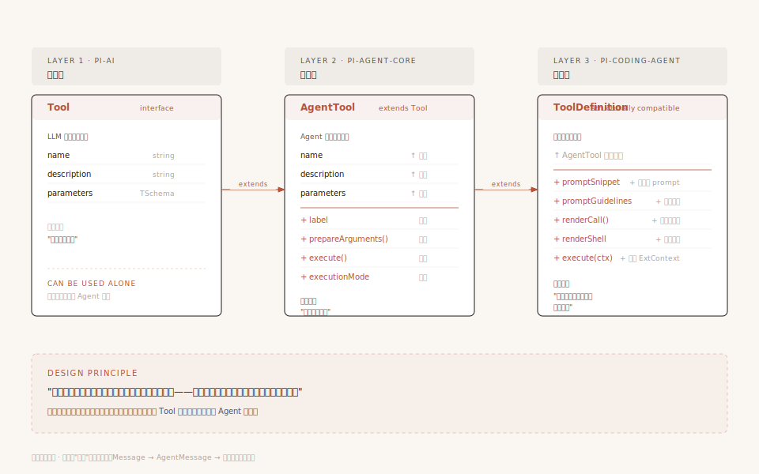

# 第2章：三层架构 —— Pi-Agent 项目的骨骼

> 本章我们站在高处，把 Pi 的整体架构看清楚——代码放在哪里、包之间怎么依赖、类型怎么在层与层之间流转。理解了这幅全景图，后面再钻进任何一个模块都不会迷路。

---

## 1. 你打开了一个 Agent 代码库

假设你第一次克隆了 Pi 的代码库，在终端里敲下 `ls`，你会看到这样的目录结构：

```
repo/
├── packages/
│   ├── ai/              ← @earendil-works/pi-ai
│   ├── agent/           ← @earendil-works/pi-agent-core
│   ├── coding-agent/    ← @earendil-works/pi-coding-agent
│   ├── orchestrator/    ← @earendil-works/pi-orchestrator（实验性，多 Agent 编排）
│   └── tui/             ← @earendil-works/pi-tui
├── package.json         ← 根配置，npm workspaces
└── tsconfig.json
```

五个包，整整齐齐排成一排。

> 注 1：历史上还存在过 `pi-web-ui`（浏览器端 Lit 组件库），但官方已于 2026-05-20 在 commit `b141e1fa` 中移除该 workspace，当前仓库不再包含此包。
>
> 注 2：`pi-orchestrator` 为 v0.80.x 新增的实验性编排包，依赖 `pi-coding-agent`，负责多 Agent 协调、RPC 进程通信与 Supervisor 监控。它属于**外围编排层**，不在"核心三件套"的学习主线里，本模块末尾单独说明。

如果你做过 Node.js 项目，大概率用过 monorepo（把多个包放在一个仓库里管理）。Pi 用的就是标准的 npm workspaces 方案——根目录的 `package.json` 里声明了 `"workspaces": ["packages/*"]`，npm 会自动把 `packages/` 下的每个子目录当作一个独立的包来管理。

但这不是重点。重点是：**为什么是五个包（其中四个构成核心三件套的延伸，一个是外围编排层）？它们之间的关系是什么？能不能合并？**

要回答这个问题，我们需要先搞清楚每个包到底在干什么。

---

## 2. 五个包，各管各的

先不要管依赖关系，我们从每个包自己的视角看它在做什么。

### 2.1 pi-ai：管"调模型"

`@earendil-works/pi-ai`（源码在 `packages/ai/`）解决的问题是：**怎么用一套代码调用不同的 LLM？**

它的 `package.json` 里写了这么一行描述：

> "Unified LLM API with automatic model discovery and provider configuration"（统一 LLM API，支持自动模型发现和提供商配置）

具体来说，它做了三件事：

1. **定义统一的类型**：不管你用 OpenAI、Anthropic、Google 还是 AWS Bedrock，消息格式都是一样的——`UserMessage`、`AssistantMessage`、`ToolResultMessage`，模型定义都是 `Model<TApi>`
2. **统一流式调用**：所有提供商的调用方式统一成一个 `streamSimple()` 函数，返回一个 `AssistantMessageEventStream`（可以逐 token 读取的流）
3. **适配 30+ 提供商**：支持从 OpenAI、Claude、Gemini 到 DeepSeek、Groq、小米等 30 多个提供商，每个提供商一个适配器文件

你看它的 `index.ts` 导出了什么就知道了：

```typescript
// packages/ai/src/index.ts（v0.80.x 节选）
// 顶部注释明确写：Core only, side-effect free: no generated catalogs,
// no provider factories, no api-registry, no OAuth implementations, no compat.
// 全局 API 注册表、stream/complete 函数等已迁至 ./compat.ts（packages/ai/src/compat.ts）
export type { Static, TSchema } from "typebox";
export { Type } from "typebox";
export * from "./api/lazy.ts"            // 各 Provider API 的懒加载入口
export * from "./auth/context.ts"        // 认证上下文
export * from "./auth/credential-store.ts"
export * from "./auth/helpers.ts"
export * from "./auth/types.ts"
export * from "./images-models.ts"
export * from "./models.ts"              // 模型定义（KnownProvider 35 个）
export * from "./types.ts"               // 统一类型
export * from "./utils/event-stream.ts"  // 事件流基类
// 流式调用入口（stream / streamSimple）实际位于 ./compat.ts
```

没有 "agent"（代理）、没有 "tool"（工具）、没有 "loop"（循环）。它只管一件事：**把 LLM API 的差异抹平，对外暴露一套统一的接口**。

### 2.2 pi-agent-core：管"跑循环"

`@earendil-works/pi-agent-core`（源码在 `packages/agent/`）解决的问题是：**怎么让 LLM 反复思考和行动？**

它的 `package.json` 描述是：

> "General-purpose agent with transport abstraction, state management, and attachment support"（通用 Agent 框架，支持传输抽象、状态管理和附件支持）

关键词是 **"general-purpose"（通用的）**。这个包不知道自己在做编程 Agent、客服 Agent 还是任何具体领域的 Agent。它只知道：

- 怎么维护对话状态（`AgentState`）
- 怎么跑一个"调用 LLM → 执行工具 → 再调用 LLM"的循环（`agentLoop`）
- 怎么在循环过程中发出事件，让外部知道发生了什么（`AgentEvent`）
- 怎么管理会话历史、做上下文压缩（`Session`、`compact`）

看它的 `index.ts` 导出：

```typescript
// packages/agent/src/index.ts（节选）
export * from "./agent.js"               // Agent 类
export * from "./agent-loop.js"          // 循环函数
export * from "./harness/session/..."    // 会话管理
export * from "./harness/compaction/..." // 上下文压缩
export * from "./types.js"              // 类型定义
```

没有 "read"（读文件）、没有 "bash"（执行命令）、没有 "edit"（编辑代码）。它不关心具体做什么事，只关心"怎么把一个 Agent 跑起来"。

### 2.3 pi-coding-agent：管"具体业务"

`@earendil-works/pi-coding-agent`（源码在 `packages/coding-agent/`）解决的问题是：**怎么做一个编程助手？**

它的 `package.json` 描述是：

> "Coding agent CLI with read, bash, edit, write tools and session management"（编程 Agent CLI，提供读、执行、编辑、写工具和会话管理）

这一层是最"厚"的——上百个源文件，比前两层加起来还多。因为它知道所有具体的事：

- 7 个编程工具（read、bash、edit、write、grep、find、ls）怎么实现
- 扩展系统怎么加载和运行
- 会话怎么持久化到磁盘
- CLI 怎么解析参数、怎么在终端渲染输出
- 认证信息怎么存储

它的入口是 `cli.ts`，用户在终端输入 `pi` 命令时，就从这里启动：

```typescript
// packages/coding-agent/src/cli.ts
#!/usr/bin/env node
import { main } from "./main.js";
main(process.argv.slice(2));
```

一个简单的入口，背后是一整条启动链路：

```
你输入: pi "帮我改个 bug"
│
├── cli.ts          ← 解析命令行参数
│   └── main.ts     ← 创建会话、选择运行模式（交互/打印/RPC）
│       └── AgentSession    ← 组装工具、加载扩展
│           └── Agent       ← 管理状态、跑循环
│               └── agentLoop()  ← 核心循环开始
```

### 2.4 pi-tui：管"显示"

最后一个包是 UI 层：

- **pi-tui**：终端 UI 库，负责在终端里渲染 Markdown、代码高亮、差分显示。它的依赖里**没有任何 AI 相关的包**——运行时仅 `marked`（Markdown 渲染）+ `get-east-asian-width`（东亚字符宽度计算）；`chalk`、`@xterm/headless` 在 devDependencies，不打包进运行时

这个包和"Agent 怎么工作"没有直接关系，它只是负责把 Agent 的工作过程展示给用户看。后面的学习中我们不会深入这一层。

### 2.5 pi-orchestrator：管"多 Agent 编排"（实验性）

`@earendil-works/pi-orchestrator`（源码在 `packages/orchestrator/`）是 v0.80.x 新增的**实验性**包，解决的问题是：**怎么让多个 coding-agent 协同工作？**

它的核心由几个文件组成：

- `supervisor.ts` —— 监控者，管理子 Agent 的生命周期
- `rpc-process.ts` —— 基于 RPC 的进程间通信
- `radius.ts` —— 编排范围/边界控制
- `serve.ts` / `storage.ts` —— 服务暴露与状态持久化

注意它的定位：它**依赖 `pi-coding-agent`**，站在 coding-agent 之上，本身不实现任何 Agent 内核逻辑（循环、状态、压缩仍由 agent-core 提供）。它只是把若干个 coding-agent 实例"编"起来，让它们可以分工、通信、被监督。

> ⚠️ 这是实验性能力，API 和文件结构都可能调整。学习主线只看核心三件套（ai / agent-core / coding-agent）即可，orchestrator 留到进阶阶段再接触。

---

## 3. 看完五个包，你大概有了直觉

读完上面那一段，你脑子里可能已经有了一个画面：

```
┌─────────────────────────────────────────────┐
│  pi-coding-agent：我知道怎么写代码            │  ← 最懂业务
│  （工具、扩展、CLI、会话持久化）               │
├─────────────────────────────────────────────┤
│  pi-agent-core：我知道怎么跑 Agent            │  ← 只懂框架
│  （循环、状态、事件、压缩）                    │
├─────────────────────────────────────────────┤
│  pi-ai：我知道怎么调模型                      │  ← 只懂模型
│  （统一 API、流式调用、30+ 提供商适配）        │
└─────────────────────────────────────────────┘

旁边还有一个独立的 UI 包：
┌──────────┐
│  pi-tui  │  ← 只管显示
└──────────┘
```

很直觉的分层：底层调模型，中间跑循环，顶层做业务。对吧？

但等等——

---

## 4. 打开 package.json，事情没那么简单

> **阅读路径提示**：第 4-5 节是**架构理解进阶**，深入依赖关系和类型流转的细节。第 4 节修正"严格分层"的常见误解、讲清依赖方向——**如果你打算基于 SDK 二次开发，这一节必读**；第 5 节展开三层类型字段递进，更偏类型系统细节，记不住字段不影响后续学习。**只想快速用起来的读者，可以跳过这两节，直接去第 6 节看"分层承诺怎么兑现"。**

如果你的分层理解是"上层只能依赖相邻的下层"，那打开 `packages/coding-agent/package.json` 的 `dependencies` 字段，你会看到一个意料之外的细节：

```json
// packages/coding-agent/package.json
"dependencies": {
    "@earendil-works/pi-agent-core": "^0.80.2",   // ← 依赖中间层，合理
    "@earendil-works/pi-ai": "^0.80.2",            // ← 也直接依赖底层？
    "@earendil-works/pi-tui": "^0.80.2",
    // ... 其他依赖
}
```

coding-agent **直接依赖了 pi-ai**，而不是只通过 pi-agent-core 间接使用它。

如果你之前认为分层就是"隔一层调一层"（就像网络协议栈那样），这个发现会让你愣一下：这不是打破分层了吗？为什么顶层要跨层直接引用底层的东西？

### 答案藏在类型系统里

打开 `packages/agent/src/types.ts` 的第一行，你会看到：

```typescript
// packages/agent/src/types.ts:1-14
import type {
    Api,
    AssistantMessage,
    AssistantMessageEvent,
    AssistantMessageEventStream,
    Context,
    ImageContent,
    Message,
    Model,
    SimpleStreamOptions,
    TextContent,
    Tool,
    ToolResultMessage,
} from "@earendil-works/pi-ai";
```

pi-agent-core 的类型定义里，大量基础类型都是从 pi-ai 导入的：`Message`、`Model`、`ImageContent`、`Tool`…… 这些是整个系统的"原子概念"——就像化学元素一样，不管你在哪一层，都需要用到"原子"的定义。

同样，coding-agent 也需要直接用到 pi-ai 的类型。比如用户往聊天里贴了一张截图，coding-agent 需要知道图片数据用什么格式表示——这个 `ImageContent` 类型就定义在 pi-ai 里。

所以 coding-agent 直接依赖 pi-ai 不是设计失误，而是**必然**——某些基础类型必须在一处统一定义，所有层都引用这一处。

### 那分层的规则到底是什么？

关键不在于"能不能跨层引用"，而在于**依赖方向是不是单向的**。

我们来验证一下。看看每个包的 `dependencies` 里有没有反向依赖：

| 包 | 依赖了谁 | 有没有反向依赖？ |
|---|---------|---------------|
| pi-ai | @anthropic-ai/sdk, openai, @google/genai 等 SDK | 没有，它不依赖任何 pi-xxx 包 |
| pi-agent-core | @earendil-works/pi-ai, typebox, yaml | 只向上依赖 pi-ai，不依赖 coding-agent |
| pi-coding-agent | @earendil-works/pi-ai, @earendil-works/pi-agent-core, @earendil-works/pi-tui | 只向上依赖，不反向依赖 |

用一张图表示：

```
pi-ai（底层）
  ↑         ↑
  │         │
  │    pi-agent-core（中间层）
  │         ↑
  │         │
  └─── pi-coding-agent（顶层）
            ↑
            │
       pi-orchestrator（实验性外围编排层，可选）
```

所有箭头都朝上。**底层永远不知道上层的存在**——pi-ai 的代码里没有任何一个 import 指向 pi-agent-core 或 pi-coding-agent；orchestrator 也不会反向渗透到 coding-agent 内部。这就是分层的真正规则：**不是限制引用层级，而是控制依赖方向必须单向向上。**

有人可能会问：那 pi-tui 呢，它也是底层的吗？

pi-tui 的运行时依赖只有 `marked`（Markdown 渲染）和 `get-east-asian-width`（东亚字符宽度），**没有任何 pi-xxx 包**。它不依赖 pi-ai，也不依赖 pi-agent-core。它就是一个独立的终端渲染工具。pi-coding-agent 依赖 pi-tui，把它当工具用，不存在循环依赖。

> 代码来源：各包的 `package.json` 的 `dependencies` 字段。`packages/ai/src/types.ts` 定义了 `KnownApi`（9 种 API 类型）和 `KnownProvider`（30+ 提供商），这些是整个系统的类型基础。

---

## 5. 类型在层间的流转：从原子到分子

理解了依赖方向之后，下一个问题是：**类型怎么在层与层之间传递？**

还是用化学做类比。pi-ai 定义了"原子"（最基础的类型），pi-agent-core 把原子组合成"分子"（Agent 专用类型），pi-coding-agent 再把分子组合成"材料"（业务专用类型）。

### 第一层：pi-ai 定义原子

```typescript
// packages/ai/src/types.ts（节选）
// 最基础的消息类型——所有 LLM 都认的格式
type Message = UserMessage | AssistantMessage | ToolResultMessage

// 模型定义——描述一个 LLM 的全部信息
interface Model<TApi> {
    id: string           // 如 "claude-sonnet-4-6"
    name: string
    api: TApi            // 如 "anthropic-messages"
    contextWindow: number // 如 200000
    // ... 更多字段
}

// 工具定义——描述一个工具的 schema
interface Tool<TSchema> {
    name: string
    description: string
    parameters: TSchema
}
```

这三个类型——`Message`、`Model`、`Tool`——就是整个 Pi 系统的原子。任何包只要和 LLM 打交道，都必须用到它们。

### 第二层：pi-agent-core 把原子组合成分子

```typescript
// packages/agent/src/types.ts（节选）
import type {
    Message, Model, Tool, ImageContent, ...
} from "@earendil-works/pi-ai";

// 扩展消息：除了标准 LLM 消息，还可以有自定义消息
type AgentMessage = Message | CustomAgentMessages[keyof CustomAgentMessages]

// 扩展工具：除了 schema，还有参数预处理、执行函数和执行模式（types.ts:371-394）
interface AgentTool<TParameters extends TSchema = TSchema, TDetails = any> extends Tool<TParameters> {
    label: string                                    // 显示名称
    prepareArguments?: (args: unknown) => Static<TParameters>   // 参数预处理
    execute: (toolCallId: string, params, signal?: AbortSignal, onUpdate?: AgentToolUpdateCallback<TDetails>) => Promise<AgentToolResult<TDetails>>
    executionMode?: ToolExecutionMode                 // "sequential" | "parallel"
}
```

注意两件事：

1. **`AgentMessage` 是 `Message` 的超集**。`Message` 是只有三种标准消息（User/Assistant/ToolResult），`AgentMessage` 在此基础上加入了自定义消息（如压缩摘要、分支信息等）。用 TypeScript 的联合类型（`|`）实现扩展，而不是修改原来的类型定义。
2. **`AgentTool` 继承了 `Tool`**。底层的 `Tool` 只知道"工具叫什么、参数是什么"（这是 LLM 需要知道的信息），上层的 `AgentTool` 加上了"怎么执行、串行还是并行"（这是 Agent 循环需要知道的信息）。

### 第三层：pi-coding-agent 把分子组合成材料

到了 coding-agent 层，类型变成了具体的业务定义：

```typescript
// packages/coding-agent/src/core/extensions/types.ts:435-482（节选）
// 工具定义（产品视角）——完整接口有 10+ 个字段，下面列出关键字段
// 注意：ToolDefinition 在 TypeScript 层面是独立 interface 重新声明，
// 与 AgentTool 是"结构兼容"而非用 extends 继承（详见 types.ts:435）
interface ToolDefinition<TParams extends TSchema, TDetails = unknown, TState = any> {
    name: string
    label: string                         // UI 展示名
    description: string
    promptSnippet?: string                // 自动拼到 system prompt 的工具片段
    promptGuidelines?: string[]           // 工具使用守则
    parameters: TParams
    renderShell?: "default" | "self"      // 渲染模式
    prepareArguments?: (args: unknown) => Static<TParams>   // 参数预处理钩子
    executionMode?: ToolExecutionMode     // 并行/串行
    execute: (toolCallId, params, signal, onUpdate, ctx: ExtensionContext) => Promise<AgentToolResult<TDetails>>  // 签名扩展：比 AgentTool.execute 多 ctx 参数
    renderCall?: ...                      // 自定义调用渲染
    // ... 还有渲染器、UI 组件等业务属性
}

// 扩展定义（运行时聚合体，types.ts:1585-1595）
interface Extension {
    path: string                                       // 扩展路径
    resolvedPath: string                               // 解析后的绝对路径
    sourceInfo: SourceInfo                             // 来源信息
    handlers: Map<string, HandlerFn[]>                 // 各类处理器
    tools: Map<string, RegisteredTool>                 // 注册的工具（Map，非 Record）
    messageRenderers: Map<string, MessageRenderer>     // 消息渲染器
    commands: Map<string, RegisteredCommand>           // 注册的命令（Map，非 Record）
    flags: Map<string, ExtensionFlag>                  // 扩展标志
    shortcuts: Map<KeyId, ExtensionShortcut>           // 快捷键绑定
}
```

### 类型扩展的 Before → After 对照

把三层类型变化放到一起看：

```
Before（pi-ai 层）：Tool 只知道"长什么样"
────────────────────────────────────────────
interface Tool<TSchema> {
    name: string
    description: string
    parameters: TSchema
}

         ↓ agent-core 扩展

After（pi-agent-core 层）：AgentTool 知道"怎么执行"
────────────────────────────────────────────
interface AgentTool<TSchema> extends Tool<TSchema> {
    label: string                              ← 新增
    execute: (...) => Promise<AgentToolResult> ← 新增
    executionMode?: "sequential" | "parallel"  ← 新增
}

         ↓ coding-agent 扩展

After（pi-coding-agent 层）：ToolDefinition 加上"怎么显示"
────────────────────────────────────────────
interface ToolDefinition {
    // 继承 AgentTool 的全部字段
    // + 渲染器、权限控制等业务属性
}
```

每一层只关心自己该关心的事，通过继承或组合在上层类型的基础上扩展。底层类型从不修改——pi-ai 的 `Tool` 接口里没有 `execute` 字段，因为 LLM 不需要知道工具怎么执行。



**配图说明**：三列对比 Tool / AgentTool / ToolDefinition 的字段。每一层只加自己该关心的字段——LLM 关心"长什么样"、Agent 关心"怎么执行"、coding-agent 关心"怎么显示"。底层可独立发布复用，是分层架构的核心承诺。

> 代码来源：`packages/ai/src/types.ts:6-15`（`KnownApi` 类型定义）、`packages/agent/src/types.ts:1-12`（从 pi-ai 导入基础类型）、`packages/coding-agent/src/core/extensions/index.ts`（ToolDefinition 和 Extension 类型导出）。

---

## 6. 那我写 Agent 真的需要三层吗？

到这里，三层架构看起来很优雅。但如果你只是一个开发者，想写一个简单的 Agent——比如一个只会用 OpenAI、只需要一两个工具的 Agent——真的需要搞三层吗？

我们来看看不分会怎样。

### 场景 A：不分层，所有代码放一个文件

你写了一个 Agent，循环逻辑和 OpenAI SDK 调用写在一起：

```typescript
// 假设：不分层的 Agent
import OpenAI from "openai";

const client = new OpenAI();
const messages = [];

while (true) {
    const response = await client.chat.completions.create({
        model: "gpt-4o",
        messages,
    });
    // 解析工具调用、执行、追加到 messages ...
}
```

能用。但如果你想换成 Claude，你得改 Agent 循环里的调用代码。循环逻辑和模型 API 耦合了。

### 场景 B：只分两层（去掉 coding-agent 层）

用 pi-ai + pi-agent-core，不引入 coding-agent：

```typescript
// 只用底层 + 中间层
import { Agent, agentLoop } from "@earendil-works/pi-agent-core";
import { streamSimple } from "@earendil-works/pi-ai";
```

完全可行。pi-agent-core 不知道什么是 "read" 工具、什么是 "bash" 工具——它只定义了工具的接口规范（`AgentTool`），具体注册什么工具由你决定。你甚至可以不注册任何工具，让它纯聊天。

**这说明 coding-agent 层不是必须的。** 它的上百个文件是在 pi-agent-core 的基础上"添砖加瓦"——加了编程专用的工具、CLI 界面、扩展系统。如果你的 Agent 不是编程助手，你完全可以用 pi-agent-core 搭配自己写的工具。

### 场景 C：只用一层（只用 pi-ai）

```typescript
// 只用底层
import { streamSimple } from "@earendil-works/pi-ai";

const stream = streamSimple(model, context);
for await (const event of stream) {
    console.log(event);
}
```

也完全可以。pi-ai 自己就是一个独立的包——调用 LLM、流式返回结果，不需要任何 Agent 框架。

但你就得自己写循环、自己管理消息状态、自己处理工具调用。这正是 pi-agent-core 存在的意义——**它帮你做了 Agent 最难的那部分（循环、状态、事件、压缩），你只需要告诉它用什么工具。**

### 三层不是教条，依赖方向控制才是

上面的三个场景说明：

| 场景 | 适合什么 | 你自己做什么 |
|------|---------|------------|
| 只用 pi-ai | 只需要调 LLM、不需要 Agent 循环 | 自己管状态、自己写循环（如果需要） |
| pi-ai + pi-agent-core | 需要完整 Agent 能力、但有自己独特的业务场景 | 写自己的工具、自己的入口 |
| 全部三层 | 做 Pi 同类的编程助手 | 直接用，或写扩展 |

层数取决于你的复杂度。但无论几层，有一条规则不能违反：

**底层的代码里不能出现任何对上层的引用。**

pi-ai 不能 import pi-agent-core 的任何东西。pi-agent-core 不能 import pi-coding-agent 的任何东西。这条规则确保了：你可以把任何一层换成自己的实现，而不影响其他层。比如你可以把 pi-ai 换成自己的模型调用层，pi-agent-core 和 pi-coding-agent 都不需要改。

---

## 7. 三个可以带走的方法

从 Pi 的分层设计里，我提炼出三个在你自己的 Agent 项目中可以复用的方法。

### 方法 1："依赖漏斗"分层法

**是什么**：设计包结构时，先画依赖箭头。底层是"不知道外面世界的"，中间层是"知道底层但不知道业务的"，顶层是"知道一切的"。

**怎么做**：
1. 找出你的代码里"完全不依赖外部知识"的部分 → 放底层
2. 找出"依赖底层但不知道具体业务"的部分 → 放中间层
3. 找出"知道用户要什么"的部分 → 放顶层
4. 检查：如果有任何高层的东西被底层 import，说明分层有问题

**怎么验证**：问自己"去掉上层，这一层还能跑吗？"如果能，依赖方向正确。如果不能，上层的东西泄漏到了下层。

### 方法 2："类型递进扩展"模式

**是什么**：底层定义最小的类型接口，上层通过联合类型（`|`）和继承（`extends`）来扩展，而不是修改底层类型。

**怎么做**：
1. 底层定义原子类型（如 `Tool = { name, description, parameters }`）
2. 中间层用继承扩展（如 `AgentTool extends Tool`，加上 `execute` 字段）
3. 顶层再叠加业务属性（如 `ToolDefinition`，加上渲染器）
4. 每一层只加自己关心的事，不改底层

**好处**：底层可以独立发布和复用。别人可以只引用你的底层类型，不引入整个 Agent 框架。

### 方法 3："可独立使用"测试

**是什么**：每层设计完后，做一个简单测试——去掉上层，这一层还能不能正常工作？

Pi 的三层都能通过这个测试：
- 去掉 pi-agent-core 和 pi-coding-agent，pi-ai 可以独立调用 LLM
- 去掉 pi-coding-agent，pi-ai + pi-agent-core 可以跑一个自定义 Agent
- 三层全用，就是一个完整的编程助手

**怎么做**：在你的 `package.json` 里，试着暂时移除上层的依赖，看看底层包的编译和测试还能不能通过。如果报错了，说明你的底层泄漏了对上层的依赖。

---

## 8. 下一步：钻进 Agent 的心脏

这一章我们从外面看了一眼 Pi 的整体架构。你知道了：

- Pi 分三层：pi-ai（管模型）→ pi-agent-core（管循环）→ pi-coding-agent（管业务）
- 分层的核心规则是**依赖方向单向向上**，底层对上层一无所知
- 类型从底层到顶层逐步扩展：`Tool` → `AgentTool` → `ToolDefinition`
- 三层不是必须的，层数取决于你的复杂度；但依赖方向控制是必须的

但我们还没有回答一个更根本的问题：Agent 到底是怎么跑起来的？LLM 怎么反复思考、调工具、看结果、再思考？那个著名的"Agent Loop"到底长什么样？

下一章，我们钻进 Agent 的心脏——**Agent Loop**。我们会先理解为什么需要 Loop（而不是一次调用就完事），然后追踪一条用户消息从按下回车到 Agent 说"我完成了"的完整旅程。

---

> **本教程结构说明**：前 6 章（第1章开篇→第6章消息系统）建立对 Pi-Agent 核心机制的完整理解，建议按顺序通读。第 7 章起（事件驱动、上下文工程、上下文压缩、会话管理等）进入进阶工程议题，每章相对独立，可按需跳读。
