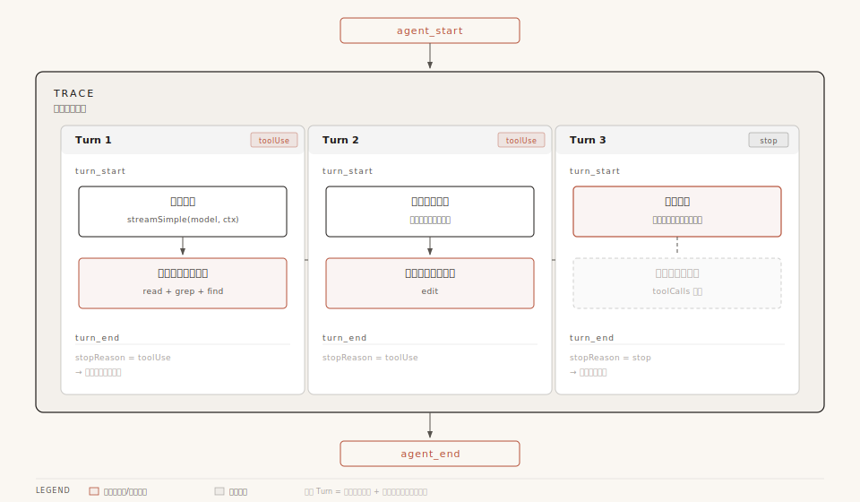
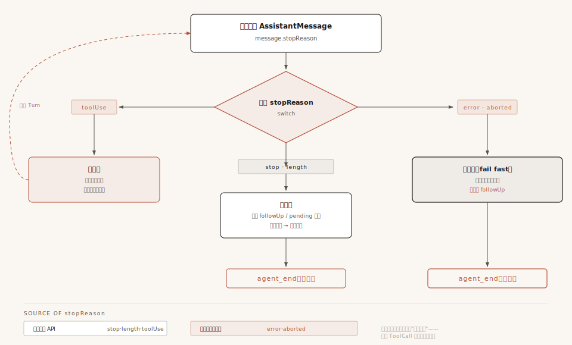
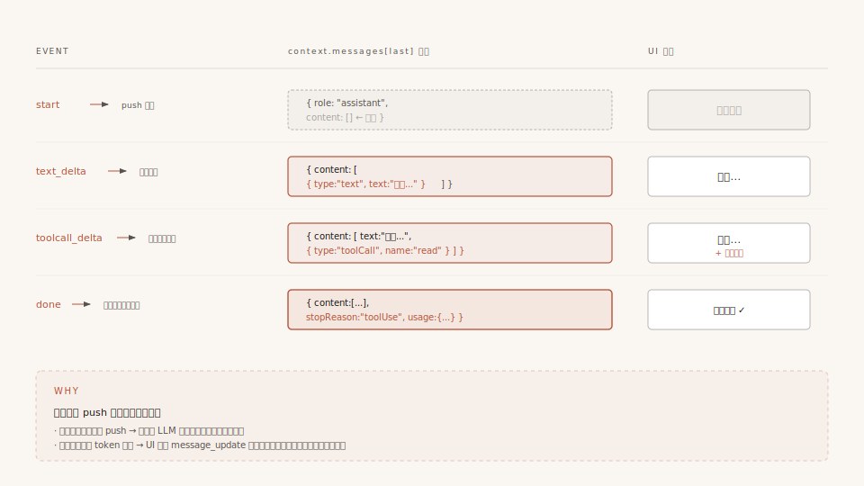
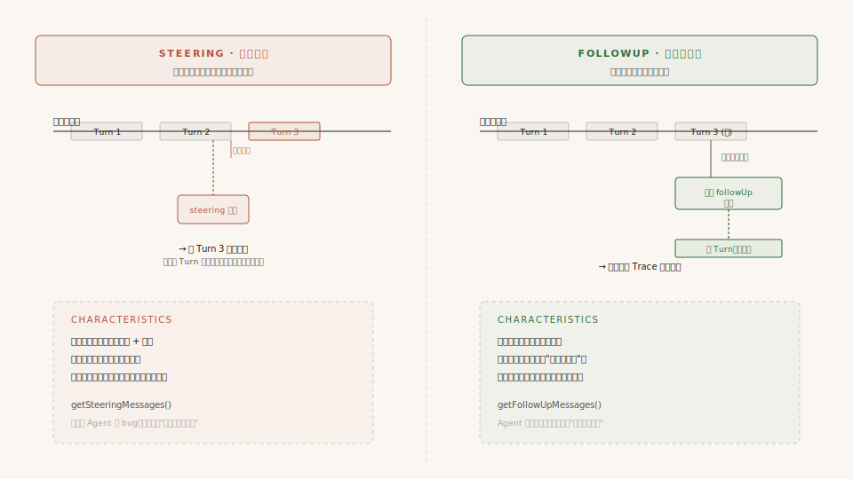
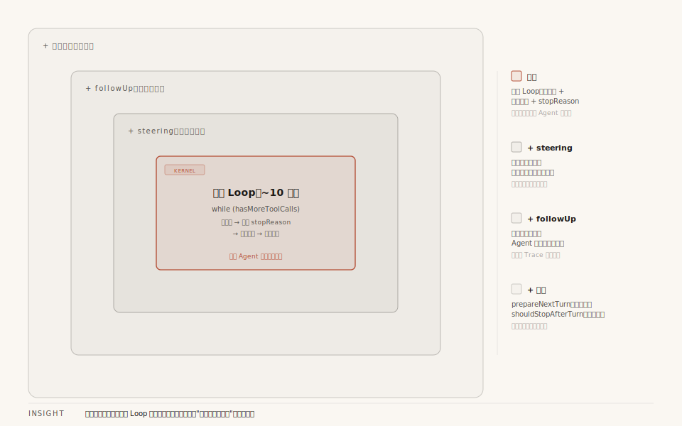

# 第3章：Agent Loop —— 让模型转动起来的引擎

> 前一章我们看了 Pi 的分层架构。架构只是"骨架"——Agent 真正的生命力来自"循环"。这一章，我们从最基础的问题出发：**为什么需要循环？循环怎么转？什么时候停？** 然后追踪一条用户消息的完整旅程，看清 Agent Loop 的每一次心跳。

---

## 一、引子：大模型的三种用法

在聊 Agent Loop 之前，我们先退一步，看看"使用大模型"这件事本身有几种模式。这对理解"为什么需要循环"至关重要。

### 模式 1：直接调用 —— "模型，回答我"

最原始、最直觉的用法。你构建好提示词，调用一次 API，拿到结果，完事。

```
用户输入 → 构建提示词 → 调模型 → 模型输出 → 展示结果
```

代码大概长这样：

```typescript
const response = await llm.chat({
  messages: [
    { role: "system", content: "你是一个翻译助手" },
    { role: "user", content: "把这段代码翻译成 Python" },
  ],
});
console.log(response.content);
```

**核心工作在于"构建提示词"**。提示词写得好，结果就好。一次调用，一次输出，没有来回。

适用场景：翻译、摘要、问答、代码补全——凡是"一问一答"能搞定的事。

### 模式 2：Workflow —— "模型，你先做第一步，我检查一下，再做第二步"

当任务变复杂，你发现一次性很难得到满意结果。于是你把大任务拆成多步，每步调一次模型，步骤之间由**你的代码**控制流转。

```
用户输入 → [步骤1: 调模型分析] → [你的代码: 提取关键信息]
         → [步骤2: 调模型生成草稿] → [你的代码: 检查质量]
         → [步骤3: 调模型润色] → 最终输出
```

每一步模型只负责自己的那份工作，**决策权在你手上**——你知道什么时候该进入下一步，模型只是流水线上的一环。

适用场景：文档生成流水线、代码审查自动化、RAG（检索增强生成）。

### 模式 3：Agent Loop —— "模型，你自己决定怎么做"

到了 Agent 模式，你把决策权交给了模型。

```
用户输入 → 调模型 → 模型说"我需要读文件" → 执行读文件 → 模型看结果
         → 模型说"还需要搜索代码" → 执行搜索 → 模型看结果
         → 模型说"我知道了，答案是..." → 输出 → 结束
```

关键区别：**步骤之间的流转不再由你写死，而是由模型的输出内容来驱动。** 你的代码只做两件事：
1. 把用户的输入和工具执行结果喂给模型
2. 如果模型输出的内容里包含了工具调用请求，就执行它；如果没有，就认为任务完成了

至于"该调什么工具"、"该调几次"——这些由模型的输出内容决定。"什么时候该停"——这是**人类定义的规则**：当模型的一次输出中不再包含工具调用时，我们就认为循环可以结束了。

用一个对比表格，三种模式的区别一目了然：

| 维度 | 直接调用 | Workflow | Agent Loop |
|------|---------|----------|------------|
| 决策者 | 用户 | 你的代码 | 模型 |
| 模型调用次数 | 1 次 | N 次（由代码控制） | 不确定（由模型控制） |
| 核心工作 | 写提示词 | 设计流程 | 定义工具和循环 |
| 模型角色 | 执行者 | 流水线环节 | 自主决策者 |
| 典型场景 | 翻译、摘要 | 文档流水线、RAG | 编程助手、自动化任务 |

---

## 二、先搞清楚几个概念：Trace、Turn

在深入源码之前，有两个概念必须分清楚。它们经常被混用，但在 Pi 的代码里，每个都有精确的含义。

### Trace（一次完整运行）

一个 Trace 是从用户按下回车、到 Agent 彻底停下来、发出 `agent_end` 事件的**整个过程**。一个 Trace 包含多个 Turn。

```
一个 Trace（一次 agent_start 到 agent_end）
│
├── Turn 1：调模型 → 模型返回 toolUse（要读文件）→ 执行 read 工具
│
├── Turn 2：带着工具结果再调模型 → 模型返回 toolUse（还要改文件）→ 执行 edit 工具
│
└── Turn 3：带着工具结果再调模型 → 模型返回 stop（改好了，没有工具调用）→ agent_end
```

### Turn（一个轮次）

一个 Turn 的定义非常精确：**一次模型调用 + 这次调用触发的所有工具执行。**

每个 Turn 由一对 `turn_start` 和 `turn_end` 事件包裹。关键点：**一个 Turn 只有一次模型调用。** 模型返回了 toolUse → 执行那批工具 → 发送 turn_end → 这个 Turn 就结束了。把工具结果喂回去再调模型，那是**下一个 Turn**。

看代码就更清楚了。内层循环每一圈的结构（后面会详讲）：

```
while (hasMoreToolCalls || ...) {
    if (!firstTurn) emit(turn_start);    // ← 新 Turn 开始

    处理 pendingMessages
    streamAssistantResponse()             // ← 一次模型调用
    检查 stopReason
    executeToolCalls()                    // ← 执行这个 Turn 触发的一批工具
    emit(turn_end);                       // ← 这个 Turn 结束

    prepareNextTurn / shouldStopAfterTurn / 检查 steering
}
```

**一圈内层循环 = 一个 Turn = 一次 turn_start → 一次模型调用 → 工具执行 → 一次 turn_end。**

如果模型在一个 Turn 中一口气要求了 3 个工具（read + grep + find），那这 3 个工具都在同一个 Turn 里执行——因为它们都是同一次模型调用的产物。但执行完毕后把结果喂回去再调模型的那一刻，就已经进入下一个 Turn 了。

### 所以 Trace 和 Turn 的关系就是

```
Trace（一次完整运行）
│  agent_start
│
├── Turn 1
│   │  turn_start
│   ├── 调模型 → toolUse → 执行工具（read + grep）
│   │  turn_end
│   │
├── Turn 2
│   │  turn_start
│   ├── 调模型 → toolUse → 执行工具（edit）
│   │  turn_end
│   │
├── Turn 3
│   │  turn_start
│   ├── 调模型 → stop → 没有工具
│   │  turn_end
│   │
│   agent_end
```

> 注意：首轮 Turn 的 `turn_start` 是在 `runAgentLoop()` 入口就发出的，然后 `runLoop()` 内用 `firstTurn` 标志跳过首圈的 turn_start，避免重复。



**配图说明**：一个 Trace 外壳内嵌 3 个 Turn，每个 Turn 都是"模型调用 + 工具执行"的完整闭环。注意 Turn 3 没有 ToolCall（虚线框），它的 stopReason = stop 触发循环退出。

---

## 三、全景：一条消息的旅程，以及循环怎么转

你输入了"帮我读一下 src/main.ts"并按下回车。从这一刻起发生了什么？让我们站在高处看一遍全过程，同时把"循环怎么转起来的"和"循环什么时候停"一并讲清楚。**不必纠结每个细节**——后面会逐段拆解源码。

> 途中你会遇到四个反复出现的"实体"：你的输入变成**消息（Message）**；Loop 调用**模型（Model）**来思考；模型要求的操作用**工具（Tool）**完成；每一步通过**事件（Event）**通知外部。驱动这四者反复运转的机制就是本章主角——**Agent Loop**。

### 流程全景

```
你按下回车："帮我读一下 src/main.ts"
│
│  ① 你的输入变成一条消息
│
UserMessage { role: "user", content: "帮我读一下 src/main.ts" }
│
│  ② 进入循环（agentLoop 入口）—— agent_start（一个 Trace 开始了）
│
└── runLoop()
    │
    │  ③ 消息转换（AgentMessage → LLM 认识的 Message）
    │
    │  ┌── Turn 1 ──────────────────────────────────────────┐
    │  │  turn_start                                         │
    │  │  ④ 调用 Model（每 Turn 仅一次模型调用）               │
    │  │  streamSimple(model, { systemPrompt, messages })    │
    │  │       ↓ 逐 token 流式返回                            │
    │  │  AssistantMessage {                                  │
    │  │      content: [ ..., ToolCall { name: "read", ... } ],│
    │  │      stopReason: "toolUse"  ← 有工具调用，继续转      │
    │  │  }                                                  │
    │  │  ⑤ 执行 Tool（工具的五步管道，详见第5章）              │
    │  │  ToolResultMessage { content: [{ text: "文件内容" }] }│
    │  │  turn_end                                            │
    │  └─────────────────────────────────────────────────────┘
    │
    │  循环判断：stopReason 是 toolUse → hasMoreToolCalls = true → 继续
    │
    │  ┌── Turn 2 ──────────────────────────────────────────┐
    │  │  turn_start                                         │
    │  │  ⑥ 第二次调用 Model（工具结果已追加到消息列表）         │
    │  │  streamSimple(model, { messages: [..., toolResult] })│
    │  │       ↓ 模型看到文件内容，开始解释                      │
    │  │  AssistantMessage {                                  │
    │  │      content: [ TextContent { text: "这个文件..." } ],│
    │  │      stopReason: "stop"  ← 没有工具调用，准备停        │
    │  │  }                                                  │
    │  │  turn_end                                            │
    │  └─────────────────────────────────────────────────────┘
    │
    │  循环判断：hasMoreToolCalls = false，pendingMessages 为空
    │  → 内层循环退出
    │  → 外层循环检查 followUp → 空 → 外层循环退出
    │
    └── agent_end（一个 Trace 结束，共 2 个 Turn）
```

### 循环怎么转：stopReason —— 唯一的信号灯

整个循环的"油门和刹车"集中在**一个字段**上：`stopReason`。模型每次返回的 `AssistantMessage` 里都带着它。

但在此之前，必须澄清一个关键认知：**模型不会说"我要停了"。** 模型只是个 token 预测器——给定上下文，猜下一个 token，如此反复。它不"知道"任务做完了没有。`stopReason` 这个字段虽然挂在模型的返回值上，但它的值来自**两个不同的地方**：

**模型 API 真正返回的三种：**

| stopReason | 含义 |
|------------|------|
| `"toolUse"` | 模型输出了工具调用 JSON，API 检测到后返回 |
| `"stop"` | 生成自然终止（遇到了结束标记），没有工具调用 |
| `"length"` | token 数达到 maxTokens 上限，被截断 |

**框架的流式层注入的两种**（模型 API 本身不会返回这两种值）：

| stopReason | 含义 | 谁注入的 |
|------------|------|----------|
| `"error"` | 调用过程异常（网络断了、API 报错等） | 流式层的 catch 块：`output.stopReason = "error"` |
| `"aborted"` | 用户主动中止（AbortSignal 触发） | 流式层的 catch 块：`output.stopReason = "aborted"` |

> 代码证据（`packages/ai/src/`）：当 `streamSimple` 内部的 API 调用抛出异常时，catch 块执行 `output.stopReason = options?.signal?.aborted ? "aborted" : "error"`。这不是模型说的，是框架替它"兜底"的。

### 一条规则驱动整个循环

Loop 实际上只看一件事——**模型输出里有没有工具调用**。这背后是一条**人类定义的工程约定**：

> 如果模型一次输出中没有工具调用，就认为本轮不需要更多操作，循环可以停了。

这不是模型的"智能决策"。换个说法：**不是模型在说"我完成了"，而是我们在说"你没要工具，那就当你完成了"。**

代码里最精炼的判断就是这个（伪代码示意，实际见 `agent-loop.ts:202-216`）：

```typescript
// 简化逻辑（实际见 agent-loop.ts:202-216）
const toolCalls = message.content.filter(c => c.type === "toolCall");
hasMoreToolCalls = false;
if (toolCalls.length > 0) {
  const executedToolBatch = await executeToolCalls(...);
  hasMoreToolCalls = !executedToolBatch.terminate;  // 任何一个工具 terminate 则停止
}
```

> **注意**：实际驱动循环的不是 `stopReason === "toolUse"`，而是 `toolCalls 数组长度 > 0 && !terminate`。这意味着：即使 `stopReason === "length"`（被截断），只要 content 里有 toolCall 块，循环仍会执行工具；反之，即使 `stopReason === "toolUse"`，如果所有工具结果都设置 `terminate: true`，循环也会停。

内层循环的条件是 `while (hasMoreToolCalls || pendingMessages.length > 0)`：

- 模型返回 toolCall 且工具未 terminate → `hasMoreToolCalls = true` → **继续转**：执行工具，把结果喂回去再调模型
- `stopReason === "stop"` 或 `"length"` 且无 toolCall → `hasMoreToolCalls = false` → **准备停**（看有没有 pendingMessages）
- `stopReason === "error"` 或 `"aborted"` → **硬停止**：立即退出整个循环，不检查 followUp

```
         ┌──────────────────────────────────┐
         │                                  │
         ▼                                  │
    ┌─────────┐  toolUse   ┌──────────┐    │
    │ 调模型   │ ─────────→ │ 执行工具  │    │
    └─────────┘            └──────────┘    │
         │                      │          │
         │ stop / length        │ 结果追加  │
         │                      ▼ 到消息    │
         ▼                 重新调模型 ──────┘
    ┌─────────┐
    │ 准备停   │   ← 不是模型决定的，是我们的规则
    └─────────┘

    error / aborted → 直接跳出整个循环（硬停止）
```

**为什么不让代码更智能地判断"任务完成没"？** 因为这正是 Agent 和 Workflow 的本质区别。Workflow 里你知道流程有几步，可以用代码判断进度。但 Agent 模式下，你不知道模型要读几个文件、改几处代码——你唯一能稳定依赖的信号就是：**输出里有没有工具调用。** 这既是局限，也是优雅——不需要任何"任务完成度"判断逻辑，代码只做最简单的那层判断。

### 循环的所有退出路径



**配图说明**：五种 stopReason 分三路处理——toolUse 让循环继续转；stop/length 准备正常停（仍检查 followUp）；error/aborted 硬停止（不检查 followUp）。注意 stopReason 的两个来源：三种来自模型 API，两种是框架流式层注入的兜底。

| 退出路径 | 触发条件 | 原因 |
|----------|----------|------|
| **正常退出** | `stop` / `length` + 无 followUp + 无 pendingMessages | 最常见。模型没要工具，也没追加任务 |
| **硬停止** | `error` / `aborted` | 模型调用本身出了问题，继续跑没意义，不检查 followUp |
| **外部钩子停** | `shouldStopAfterTurn()` 返回 true | 上下文快满了、达到最大 Turn 数等 |
| **工具终止** | 一批工具的执行结果全部 `terminate: true` | 所有工具都同意停止（是 `every` 不是 `some`） |

---

## 四、源码详解：基础 Loop 与 coding-agent 的叠加设计

§三 给了你概念全景：消息怎么流动、stopReason 怎么驱动循环、什么时候停。但那都是"**是什么**"。这一节走进代码，回答"**怎么做到的**"。

在看 Pi 的源码之前，先搞清楚一件事：**最简单的 Agent Loop 其实极其简短。**

### 最简 Loop：所有 Agent 的最小公约数

剥掉所有产品特性，一个能用的 Agent Loop 只需要这些：

```typescript
// 最简 Agent Loop（伪代码）
async function simpleLoop(messages, model, tools) {
    while (true) {
        // ① 调模型
        const response = await callModel(model, messages, tools);
        messages.push(response);

        // ② 没有工具调用 → 结束
        if (response.stopReason !== "toolUse") {
            return messages;
        }

        // ③ 有工具调用 → 执行，把结果喂回去
        for (const toolCall of response.toolCalls) {
            const result = await executeTool(toolCall);
            messages.push(result);
        }
    }
}
```

十几行代码。一个 while 循环，调模型、执行工具、再调模型，直到模型不再要求工具。这就是 §三 讲的那套逻辑的最小实现——**任何 Agent 都需要这个内核**。

### Pi 的 coding-agent 在此基础上叠加了什么

Pi 的 coding-agent 是一个**交互式编程助手**——用户在终端里跟它对话，它可能要读好几个文件、改代码、跑测试。这种产品场景比"最简 Loop"多出了真实的需求：

| 真实需求 | 叠加的设计 | 源码位置 |
|----------|-----------|----------|
| 用户在 Agent 工作期间又输入了新指令 | **steering 消息注入**：紧急消息可以在 Turn 之间插队 | 内层循环开头 |
| 系统在 Agent 完成后想追加后续任务（如"顺便跑个测试"） | **外层 followUp 循环**：内层停了但外层可以重启内层 | 外层 while(true) |
| 不同复杂度的任务想用不同档次的模型 | **prepareNextTurn 钩子**：每个 Turn 结束时可切换模型/上下文 | turn_end 之后 |
| 上下文窗口快满了需要触发压缩 | **shouldStopAfterTurn 钩子**：外部判断是否该停 | prepareNextTurn 之后 |

**关键认知**：这些叠加设计都是 coding-agent 的**功能选择**，不是 Agent 的通用法则。如果你做的是一个"一问一答带工具"的简单 Agent，上面这张表全是多余的——你只需要最简 Loop。

但理解 coding-agent 怎么叠加这些设计很有价值——你自己的产品场景很可能也需要类似机制。接下来，我们以 coding-agent 的完整源码为例，逐段走这些设计。跟着那条"帮我读一下 src/main.ts"的消息，走完从入口到结束的整段旅程。

### 4.1 入口：runAgentLoop() 收到了什么

> §三简要展示了流程全景，这里展开看代码细节——同一个过程，更深入的视角。

你按下回车后，调用链是：`Agent.prompt()` → `runPromptMessages()` → `runAgentLoop()`。停在入口：

```typescript
// agent-loop.ts:95-118
async function runAgentLoop(
    prompts: AgentMessage[],     // 你的消息
    context: AgentContext,       // 当前对话上下文（快照副本）
    config: AgentLoopConfig,     // 循环配置（模型、钩子、队列回调）
    emit: AgentEventSink,        // 事件发射器
    signal?: AbortSignal,        // 中止信号
    streamFn?: StreamFn,         // 流式函数（可替换）
): Promise<AgentMessage[]>
```

六个参数中最重要的三个：

**`prompts`** — 你的消息已经被包装成了标准格式：

```typescript
[{
  role: "user",
  content: [{ type: "text", text: "帮我读一下 src/main.ts" }],
  timestamp: 1748000000000
}]
```

**`context`** — 对话上下文快照。注意是**副本**（`agent.ts:414-420` 的 `createContextSnapshot()` 创建），Loop 运行期间对 context 的修改不会影响 Agent 类的原始状态：

```typescript
{
  systemPrompt: "You are a helpful coding assistant...",
  messages: [ /* 之前的对话历史 */ ],
  tools: [
    { name: "read", description: "...", parameters: Type.Object({...}), execute: ... },
    { name: "bash", description: "...", parameters: Type.Object({...}), execute: ... },
  ]
}
```

**`config`** — Loop 的行为配置。这里有一组关键钩子（都是函数，不是数据）：

```typescript
{
  model: Model,                    // 用哪个 LLM
  convertToLlm: Function,          // AgentMessage[] → Message[] 转换
  transformContext?: Function,      // 调 LLM 前的上下文预处理（如压缩）
  getSteeringMessages?: Function,   // 获取"紧急插队"消息
  getFollowUpMessages?: Function,   // 获取"追加任务"消息
  shouldStopAfterTurn?: Function,   // 每轮结束后是否该停
  beforeToolCall?: Function,        // 工具执行前钩子
  afterToolCall?: Function,         // 工具执行后钩子
  toolExecution: "parallel",        // 工具执行模式
}
```

这些钩子都是**函数**而非数据——Loop 在运行时调用它们来"拉取"最新状态。这让 Loop 和外部消息来源彻底解耦。

入口函数只做了三步准备：

```
Step 1: 创建 newMessages 数组
        → 收集本轮 Trace 产生的所有新消息

Step 2: 把 prompts 追加到 context.messages
        → context.messages = [...context.messages, ...prompts]

Step 3: 发初始事件
        → emit("agent_start")    ← Trace 开始
        → emit("turn_start")     ← 首轮 Turn 开始（入口就发，后续 Turn 在内层循环里发）
        → 对每条 prompt：emit("message_start") + emit("message_end")
        → 调用 runLoop()
```

数据变化：

```
入口前：
  context.messages = [user1, asst1, toolResult1]    ← 之前的对话
  newMessages = []

入口后：
  context.messages = [user1, asst1, toolResult1, user2]  ← 你的消息被追加
  newMessages = [user2]                                   ← 收集器开始记录
```

---

### 4.2 runLoop() 的骨架：先看内核，再看叠加

现在进入 `runLoop()`——整个系统最核心的代码。别被它的长度吓到，我们先看**内核**，再看**叠加**。

#### 内核：内层循环

如果只保留最简 Loop 的逻辑，`runLoop` 长这样：

```typescript
// 只保留内核的 runLoop（伪代码）
while (hasMoreToolCalls) {
    // 步骤 B：调 LLM
    // 步骤 C：检查 stopReason → error/aborted 就退出
    // 步骤 D：执行工具
    // 步骤 E：emit turn_end
}
// 结束 → emit agent_end
```

这就是最简 Loop——调模型、执行工具、turn_end，循环往复。内层循环的退出条件 `hasMoreToolCalls` 由 `toolCalls 数组长度 > 0 && !terminate` 驱动（§三讲过）。**这段是所有 Agent 都需要的内核。**

#### 叠加：coding-agent 加了两层外壳

但 coding-agent 作为交互式编程助手，需要在内核外面加两样东西：

**叠加 1：steering 消息注入**（内层循环开头 + 每圈结尾各检查一次）。用户在 Agent 工作时输入了新指令——这些消息不能等当前任务跑完，得在下一圈开头紧急注入。所以内层循环条件多了一个 `|| pendingMessages.length > 0`。

**叠加 2：外层 followUp 循环**（包在整个内层循环外面）。Agent 自然停了之后，系统可能还想追加任务（比如"顺便跑个测试"）。外层循环让这些追加任务在**同一个 Trace 内**继续跑，不需要重新启动一个新的 Loop。

把内核和两层叠加拼起来，才是完整的 `runLoop` 骨架：

```typescript
async function runLoop(currentContext, newMessages, config, signal, emit, streamFn) {

    // ① 首次 steering 检查（在进入内层循环之前！）
    let pendingMessages = (await config.getSteeringMessages?.()) || [];

    // ========== 叠加2：外层循环（followUp 续命）==========
    while (true) {
        let hasMoreToolCalls = true;
        let firstTurn = true;  // 首轮跳过 turn_start（入口已发）

        // ========== 内核 + 叠加1：内层循环 ==========
        while (hasMoreToolCalls || pendingMessages.length > 0) {
            //                                    ↑ 叠加1：steering 消息也驱动循环

            if (!firstTurn) {
                emit({ type: "turn_start" });
            }
            firstTurn = false;

            // 步骤 A：注入 pendingMessages（steering 消息）← 叠加1
            // 步骤 B：调 LLM → streamAssistantResponse()  ← 内核
            // 步骤 C：检查 stopReason                      ← 内核
            // 步骤 D：执行工具                              ← 内核
            // 步骤 E：emit turn_end                         ← 内核
            // 步骤 F：prepareNextTurn → shouldStopAfterTurn ← 叠加（钩子）
            //         → 再次检查 steering                    ← 叠加1
        }

        // ========== 内层循环结束 ==========
        // 叠加2：检查 followUp 队列
        const followUpMessages = (await config.getFollowUpMessages?.()) || [];
        if (followUpMessages.length > 0) {
            pendingMessages = followUpMessages;
            continue;  // 回到外层循环顶部，内层循环重开
        }

        break;  // 两个队列都空，真正退出
    }
}
```

现在我们逐步骤展开。每个步骤会标注"内核"还是"叠加"，方便你区分。

---

### 4.3 【叠加1 · 步骤A】steering 消息注入

> **什么是 steering？** 这是 coding-agent 的一个交互功能。想象你让 Agent 帮你修一个 bug，Agent 正在读文件、分析代码。这时候你突然想到一个补充："也检查一下测试文件"——你希望这条指令能**插队**，而不是等 Agent 把当前任务做完再说。

steering 就是这个"插队"机制。用户在 Agent 工作期间输入的新指令，会被放进 steering 队列。每圈内层循环开头，Loop 先检查这个队列，把紧急消息注入到当前对话中：

```typescript
if (pendingMessages.length > 0) {
    for (const message of pendingMessages) {
        await emit({ type: "message_start", message });
        await emit({ type: "message_end", message });
        currentContext.messages.push(message);
        newMessages.push(message);
    }
    pendingMessages = [];  // 消费完毕，清空
}
```

这段代码就是把紧急消息逐条注入到上下文和消息收集器中。

pendingMessages 的第一个来源是 `runLoop` 一进来就执行的首次 steering 检查（`agent-loop.ts:167`）。为什么要在进入循环**之前**就检查？因为用户在等待 LLM 首次响应时可能又输入了内容——这时候消息已经从外部排队了，但循环还没开始，如果不提前取出来，这批消息就漏掉了。

---

### 4.4 【内核 · 步骤B】streamAssistantResponse() — 调 LLM

这是整个 Loop 最重的一步——把消息发给模型、拿回流式响应。分为四个阶段。

#### 阶段 A：上下文预处理（可选）

```typescript
let messages = context.messages;
if (config.transformContext) {
    messages = await config.transformContext(messages, signal);
}
```

如果配置了 `transformContext`（如压缩算法），在此预处理消息。不配置就跳过。

#### 阶段 B：AgentMessage → Message 转换（两层消息的边界）

```typescript
const llmMessages = await config.convertToLlm(messages);
```

这一行站在 Agent 内核和 LLM 的**边界**上。要理解它为什么存在，得先知道"两层消息"的设计。

Agent 内部维护对话历史时，需要记录的不只是"用户说了什么、AI 回了什么"——它还需要记录**自己的内部状态**。比如 coding-agent 会记录：上下文被压缩过（`CompactionSummaryMessage`）、Bash 命令的执行详情（`BashExecutionMessage`）、分支切换的记录（`BranchSummaryMessage`）。这些是 Agent 自己用的"内部语言"，**LLM 根本不认识这些消息类型**——它只认三种标准消息：`UserMessage`、`AssistantMessage`、`ToolResultMessage`。

`convertToLlm` 就是站在这个边界上的**翻译官**：把 Agent 的内部语言翻译成 LLM 能理解的协议。默认实现就是一个 `.filter()`——只保留三种标准消息：

```typescript
function defaultConvertToLlm(messages: AgentMessage[]): Message[] {
    return messages.filter(
        (message) => message.role === "user"
                  || message.role === "assistant"
                  || message.role === "toolResult",
    );
}
```

数据变换：

```
转换前（AgentMessage[]）：
[
  { role: "user", content: "帮我读一下 src/main.ts", ... },    ← 保留
  { role: "assistant", content: [...], ... },                   ← 保留
  { role: "compactionSummary", summary: "之前的对话摘要..." },   ← 过滤掉
  { role: "toolResult", content: [...], ... },                  ← 保留
]

转换后（Message[]）：
[
  { role: "user", content: "帮我读一下 src/main.ts", ... },
  { role: "assistant", content: [...], ... },
  { role: "toolResult", content: [...], ... },
]
```

> 两层消息的完整设计，详见《第6章：消息系统》。

#### 阶段 C：构建 Context 并调用模型

```typescript
const llmContext: Context = {
    systemPrompt: context.systemPrompt,
    messages: llmMessages,
    tools: context.tools,
};

const streamFunction = streamFn || streamSimple;
const resolvedApiKey =
    (config.getApiKey ? await config.getApiKey(config.model.provider) : undefined)
    || config.apiKey;

const response = await streamFunction(config.model, llmContext, {
    ...config,
    apiKey: resolvedApiKey,
    signal,
});
```

**构建 Context 是这一步的主线。** 注意 `llmContext` 是一个**全新对象**，每圈内层循环都重建一次。它由三部分组成：

- **`systemPrompt`** —— 直接复用 Agent 上下文里的系统提示词，告诉模型"你是谁、该遵守什么规则"
- **`messages`** —— 就是上一步 `convertToLlm` 过滤后的 `llmMessages`，只含 LLM 认识的三种标准消息
- **`tools`** —— 工具列表（带 schema 定义），让模型知道"这次有哪些工具可以调"

注意一个细节：`llmContext.tools = context.tools` 是**引用赋值**——每圈虽然包了个新的 wrapper 对象，但 `tools` 数组本身是同一份引用，内容字节级稳定。`systemPrompt` 同理。只有 `messages` 真的在长（每圈追加新的 ToolResultMessage）。

那为什么还要每圈重建 `llmContext` 这个 wrapper？因为有的 Turn 确实会改这三者里的某一个：`prepareNextTurn` 钩子（§4.7）可能换过模型或改过 systemPrompt，扩展系统（§5）可能动态注册新工具。重建 wrapper 的成本可以忽略（一个 JS 对象），但能保证不会因为共享引用导致难以追踪的状态污染。

**这会不会破坏 prompt cache？** 不会。Anthropic 的 prompt cache 是**内容寻址**的——它看的是发过去的字节，不是请求的 identity。每次发的是新对象还是旧对象无所谓，只要 `system + tools` 的字节不变，cache 就命中。Pi 在 [anthropic-messages.ts](repo/packages/ai/src/api/anthropic-messages.ts) 里显式在**三个位置**打 `cache_control: { type: "ephemeral" }` 标记：

| 位置 | 源码行 | 作用 |
|------|--------|------|
| System prompt 末尾 | [L922/929/938](repo/packages/ai/src/api/anthropic-messages.ts#L922) | 系统提示词整体作为可缓存前缀 |
| **最后一个 tool** | [L1208](repo/packages/ai/src/api/anthropic-messages.ts#L1208) | 整个 tools 列表作为可缓存前缀 |
| **最后一条 user message** | [L1157-1178](repo/packages/ai/src/api/anthropic-messages.ts#L1157) | **rolling cache**——每 Turn 把 cache 推进到最新消息 |

第三条尤其精妙：cache breakpoint 不是固定在第一条消息上，而是**跟着最新 user message 走**。这样旧前缀继续命中、新追加的内容被写入，整个对话历史都享受 cache 收益。命中链路大致是：

```
Turn 1: 写入 [system + tools] → 写入 [messages §1]
Turn 2: 命中 [system + tools] → 命中 [messages §1] → 写入 [messages §2]
Turn 3: 命中 [system + tools] → 命中 [messages §1+§2] → 写入 [messages §3]
```

还有个容易误解的点：**tools 不是被塞到 messages 末尾**。Anthropic API 协议里 `tools` 是独立的顶层字段（位置在 messages 之前），这个协议设计本身就考虑了 cache——稳定的 tools 在前、变动的 messages 在后，prefix 越长越省。

OpenAI 体系走的是另一条路（[openai-completions.ts:554](repo/packages/ai/src/api/openai-completions.ts#L554)）：`prompt_cache_key: sessionId`，OpenAI 后端按 session 自动匹配前缀。DeepSeek、Qwen 等通过 `cacheControlFormat: "anthropic"` 兼容字段，也能复用 Anthropic 风格的 cache_control 标记（[L593](repo/packages/ai/src/api/openai-completions.ts#L593) 的 `applyAnthropicCacheControl`）。

#### 阶段 D：流式处理响应 —— 原地替换的妙用

`streamFunction` 返回的是 `AssistantMessageEventStream`——一个异步迭代器。这步有一个很精巧的设计：

```typescript
for await (const event of response) {
    switch (event.type) {
        case "start":
            // 拿到一个"空壳"消息，直接 push 到 context
            partialMessage = event.partial;
            context.messages.push(partialMessage);
            emit({ type: "message_start", ... });
            break;

        case "text_delta":       // 文本增量
        case "toolcall_delta":   // 工具调用增量
        case "thinking_delta":   // 思考增量
            partialMessage = event.partial;            // 更新后的部分消息
            context.messages[last] = partialMessage;    // ★ 原地替换！
            emit({ type: "message_update", ... });      // UI 收到增量更新
            break;

        case "done":
        case "error":
            finalMessage = await response.result();
            context.messages[last] = finalMessage;       // ★ 用最终完整消息替换
            emit({ type: "message_end", ... });
            return finalMessage;
    }
}
```

为什么要先 push 空壳再原地替换？注意"原地替换"的意思——不是往 `context.messages` 数组里 push 新条目，而是**用新内容覆盖最后一条**（`context.messages[last] = partialMessage`）。这样 context 的消息数量不变，但最后一条消息的内容在"长大"。

为了**UI 能实时展示**。如果等全部响应完成才 push 到 context，用户在 LLM 思考的几秒里盯着空白屏幕。通过"先放空壳、逐 token 替换"，UI 通过 `message_update` 事件拿到最新部分消息，能做到逐字渲染。



**配图说明**：四个时间点的 context.messages[last] 演变——start 时空壳、text_delta 时文字在长、toolcall_delta 时工具调用出现、done 时最终完整消息替换。每一步同步展示 UI 显示状态。

数据在流式响应期间，`context.messages[last]` 的演变：

```
start    → { role: "assistant", content: [] }                    ← 空壳 push
text_delta → { content: [{ type:"text", text:"好的..." }] }       ← 文字在长
toolcall   → { content: [{ text:"好的..." },                        ← 工具调用出现
                         { type:"toolCall", name:"read", arguments:{file_path:"src/main.ts"} }] }
done     → { content: [...], stopReason:"toolUse", usage:{...} } ← 最终完整消息替换
```

---

### 4.5 【内核 · 步骤C】检查 stopReason

§三详细讲了 `stopReason` 的来源和含义。这里看代码怎么处理它。拿到 `AssistantMessage` 后，立即做一次硬停止判断：

```typescript
// agent-loop.ts:196-200
if (message.stopReason === "error" || message.stopReason === "aborted") {
    await emit({ type: "turn_end", message, toolResults: [] });
    await emit({ type: "agent_end", messages: newMessages });
    return;   // ← 直接退出整个 runLoop，不检查 followUp
}
```

`error` 和 `aborted` 是"硬停止"——立即发 turn_end + agent_end，直接 return。连工具都不执行，连 followUp 都不检查。这是一种**快速失败**（fail fast）策略：既然模型调用本身就失败了（网络异常或用户中止），继续跑没有任何意义。

而 `stop`、`toolUse`、`length` 这三种，代码继续往下走——进入工具执行逻辑。区别在于：`stop` 和 `length` 时，`toolCalls` 数组为空，所以工具执行步骤什么也不干。

---

### 4.6 【内核 · 步骤D】executeToolCalls() — 执行工具

模型返回的 `AssistantMessage.content` 里，可能有多个 `type === "toolCall"` 的块（模型一口气要求了多个操作）。先过滤出来：

```typescript
const toolCalls = message.content.filter((c) => c.type === "toolCall");
```

然后决定这批工具**并行还是串行**执行：

```typescript
if (config.toolExecution === "sequential" || hasSequentialToolCall) {
    return executeToolCallsSequential(...);   // 串行
}
return executeToolCallsParallel(...);         // 并行
```

**"一票否决"策略**：只要这批工具中有**任何一个**声明了 `executionMode: "sequential"`，整批都串行。为什么这么保守？因为判断"哪些工具会冲突"很难——edit 和 edit 操作不同文件就安全吗？万一它们编辑的文件有依赖关系呢？所以 Pi 选择了"宁可多等，不可出错"。而 edit 工具内部还有第二道防线（`withFileMutationQueue`，对同一文件的编辑串行化），确保即使外层判断为并行，也不会互相覆盖。

两种执行模式的内部结构：

```
串行模式：
  ToolCall A: 准备 → 验证 → beforeHook → 执行 → afterHook → emit end
  ToolCall B: 准备 → 验证 → beforeHook → 执行 → afterHook → emit end
  （一个完全结束，才开始下一个）

并行模式（三阶段设计）：
  阶段1 - 准备（顺序）：  A 准备 → B 准备 → C 准备
      ↑ prepareToolCall 含验证和 beforeHook，必须顺序执行
  阶段2 - 执行（并行）：  A、B、C 同时执行（Promise.all）
      ↑ 只有 tool.execute 并行，省时间
  阶段3 - 事件（有序）：  end 按完成顺序发；result 按调用顺序发
      ↑ result 消息保持和 ToolCall 一致的顺序，LLM 收到的上下文才是正确的
```

注意并行模式的精妙之处：**准备阶段始终顺序**（因为验证和权限检查不能并行——万一 B 被拦截了，C 就不应该执行），**只有实际执行并行**。

每个工具的结果被包装成 `ToolResultMessage`，追加到 `context` 和 `newMessages`：

```
工具执行后：
  context.messages = [..., user2, assistantMessage, {
    role: "toolResult", toolCallId: "toolu_01", toolName: "read",
    content: [{ text: "文件内容..." }], isError: false
  }]
```

**terminate 机制**：工具可以在返回结果中设置 `terminate: true`，表示"我觉得不该继续了"。但 Loop 不会因为某一个工具喊停就停——它用的是 `every` 而非 `some`：**必须这批工具的全部结果都设置了 terminate 才真正退出**。这是保守策略：只要有一个工具还在正常工作，Loop 就不中断。

> 工具执行的完整五步管道（prepareArguments → Schema 验证 → beforeToolCall → execute → afterToolCall）详见《第5章：工具系统》。

---

### 4.7 【内核+叠加 · 步骤E~F】turn_end + 钩子 + 再次检查 steering

Turn 的核心工作做完了（调模型 + 执行工具），接下来是收尾。收尾分四步，其中前两步是内核，后两步是 coding-agent 叠加的扩展点：

```typescript
// ① emit turn_end —— 通知外部"这一轮结束了"（内核）
await emit({ type: "turn_end", message, toolResults });

// ② prepareNextTurn —— 给外部一个机会"改装"下一轮（叠加）
// 返回值可包含 context / model / thinkingLevel 三者之一的覆盖
const nextTurnSnapshot = await config.prepareNextTurn?.({...});
if (nextTurnSnapshot) {
    currentContext = nextTurnSnapshot.context ?? currentContext;
    config.model = nextTurnSnapshot.model ?? config.model;
    // thinkingLevel 也在此处覆盖（详见 agent-loop.ts 中 prepareNextTurn 处理逻辑）
}

// ③ shouldStopAfterTurn —— 外部判断是否该停了（叠加）
if (await config.shouldStopAfterTurn?.({...})) {
    await emit({ type: "agent_end", messages: newMessages });
    return;
}

// ④ 再次检查 steering —— 有没有新的紧急消息？（叠加1）
pendingMessages = (await config.getSteeringMessages?.()) || [];
```

**`prepareNextTurn`** —— 这是个容易被忽略但很强大的扩展点。它在每个 turn_end 之后、下一轮开始前被调用，允许外部**动态切换下一轮的配置**。具体例子：

```
场景：按任务复杂度切换模型

Turn 1: 用户问了一个简单问题 → 模型用 Haiku（快、便宜）
        turn_end → prepareNextTurn 检查到问题很简单
        → 返回 { model: haiku } → 下一轮继续用 Haiku

场景：中途发现任务变复杂了

Turn 1: 用户让"重构这个模块" → Haiku 开始读文件
        turn_end → prepareNextTurn 发现要改的文件很多
        → 返回 { model: opus } → 下一轮自动切到 Opus（强、贵）
```

除了换模型，它还能换 `context`（比如注入新的上下文信息）和 `thinkingLevel`（思考强度）。返回 `undefined` 表示"什么都不换，按原配置继续"。

**`shouldStopAfterTurn`** —— 外部注入的停止判断。coding-agent 层会用它来检查上下文窗口是否快满了（快满了就停下来触发压缩），或者是否达到了最大 Turn 数限制。这是产品层的"安全阀"，最简 Loop 不需要它。

**④再次检查 steering** —— 一圈内层循环结束，再看看 steering 队列有没有新积攒的紧急消息。如果有，下一圈继续跑。

---

### 4.8 回到循环顶部

工具执行完且收尾结束，代码回到内层 while 循环的条件判断。§三已经详细讲了 `hasMoreToolCalls` 由 `toolCalls 数组长度 > 0 && !terminate` 驱动——这里只看代码：

```typescript
while (hasMoreToolCalls || pendingMessages.length > 0)
```

两个条件任一为 true 就继续。`hasMoreToolCalls` 由模型输出里有没有 toolCall 块（且未全部 terminate）决定（内核），`pendingMessages` 由 steering 队列决定（叠加1）。两个都为 false 时，内层循环退出。

---

### 4.9 【叠加2 · 步骤G】外层循环：followUp 的续命机制

内层循环退出了——没有工具要执行，也没有紧急消息。但 coding-agent 的设计是：此时检查一下 `getFollowUpMessages()`，看看系统有没有追加任务：

```typescript
const followUpMessages = (await config.getFollowUpMessages?.()) || [];
if (followUpMessages.length > 0) {
    pendingMessages = followUpMessages;   // 塞进 pending，触发新 Turn
    continue;                              // 回到外层循环顶部
}
break;  // 两个队列都空了，真正退出
```

如果有 followUp 消息，它们被塞进 `pendingMessages`，`continue` 回到外层循环顶部，内层循环检测到 `pendingMessages` 不为空，**在同一个 Trace 内**继续跑。这比重新启动一个新的 `runAgentLoop()` 好在哪？——连续性：同一个 `newMessages` 数组、同一个事件序列，不需要额外合并。

§四开头已经说过：如果你做的是简单 Agent，外层循环是多余的——内层循环退出后直接 `break` + `emit agent_end` 就行了。

---

### 4.10 steering vs followUp：一张表看清两种干预

本章出现了两种"外部消息注入"机制。虽然 §四开头已经分别介绍过，但放在一起对比更能看清它们的差异：

| 维度 | steering（叠加1） | followUp（叠加2） |
|------|----------|----------|
| **检查时机** | runLoop 开始前 + 内层循环**每圈**结尾 | 内层循环**全部结束**后 |
| **语义** | "紧急插队"——在工具执行间隙中插入 | "排队等叫号"——等当前任务全部完成 |
| **典型场景** | 用户在 Agent 工作时输入了新指令 | 系统在 Agent 完成后追加"顺便跑个测试" |

生活类比：steering 是你正在开会，有人敲门递了张纸条——"紧急，先看这个"。followUp 是开完会翻了翻信箱——"不急，但需要处理"。



**配图说明**：左红右绿对照——steering 在每圈内层循环开头+结尾检查、紧急插队；followUp 在内层循环全部结束后检查、续命重启。底部列出各自时机/来源/影响/典型场景。

---

## 五、总结：Loop 的四条核心设计

回顾从按下回车到 Agent 完成的整段旅程：

### 1. ReAct 循环模式

Loop 的本质是 Reason（模型思考）→ Act（执行工具）→ Observe（观察结果）→ Reason（再次思考）的循环。模型的输出内容决定"该调什么工具"——这是 Agent 区别于 Workflow 的核心。但"什么时候停"不是模型的决策，而是我们人类定义的规则：**模型不再输出工具调用时，就认为本轮结束。**

### 2. stopReason 驱动机制

整个循环由一个字段驱动：`stopReason`。但实际驱动循环的不是 stopReason 本身，而是模型输出里有没有 toolCall 块且未全部 terminate——`"有 toolCall"` = 继续转；没有 toolCall 或全部 terminate = 准备停（或立即停）。**"是否继续"不靠代码的复杂判断，只靠一条简单规则：模型的输出中有没有工具调用。** 这是 Agent 架构的核心设计原则——把决策外包给模型输出模式，代码只做最简单的信号判断。

### 3. 内核 + 叠加的架构思路

Agent Loop 的内核极其简短——十几行代码就能实现一个能用的循环。Pi 的 coding-agent 在内核上叠加了 steering（紧急插队）、followUp（任务追加）、prepareNextTurn（动态切模型）、shouldStopAfterTurn（安全阀）等设计。**内核是所有 Agent 的通用法则，叠加是产品功能的按需选择。** 做自己的 Agent 时，先搭内核，再按场景加叠加。



**配图说明**：从里到外的四层洋葱——最内核是最简 Loop（~10 行通用法则）；外层依次叠加 steering（紧急插队）、followUp（任务追加）、钩子（切模型/安全阀）。剥掉任何一层，里层仍能跑——这是判断"内核是否被污染"的试金石。

---

## 六、下一站

Loop 跑起来了——我们知道它怎么调用模型、怎么执行工具。但 Loop 调用的"模型"到底是什么？Pi 是怎么用同一套代码调用 OpenAI、Claude、Gemini 等 30+ 家不同供应商的？`streamSimple()` 内部做了什么？

下一章，我们拆开 Pi 的模型调用层：《第4章：模型调用 —— 一行代码驾驭多个模型》。

---

> **本章关键源码索引**（v0.80.2 实际行号）：
> - `agent-loop.ts:95-118` — `runAgentLoop()` 入口
> - `agent-loop.ts:155-269` — `runLoop()` 双层循环完整实现
> - `agent-loop.ts:167` — steering 首次检查（进入内层循环之前）
> - `agent-loop.ts:175-179` — turn_start 的首轮跳过机制
> - `agent-loop.ts:196-200` — stopReason 硬停止判断
> - `agent-loop.ts:275-368` — `streamAssistantResponse()` 流式响应
> - `agent-loop.ts:313-357` — 流式处理中的原地替换
> - `agent-loop.ts:373-516` — `executeToolCalls()` 并行/串行调度
> - `agent-loop.ts:218-253` — turn_end + prepareNextTurn + shouldStopAfterTurn
> - `agent-loop.ts:253` — steering 每圈二次检查
> - `agent.ts:118-152` — `PendingMessageQueue` 和 drain 模式
> - `agent.ts:451-474` — `runWithLifecycle()` 生命周期管理
