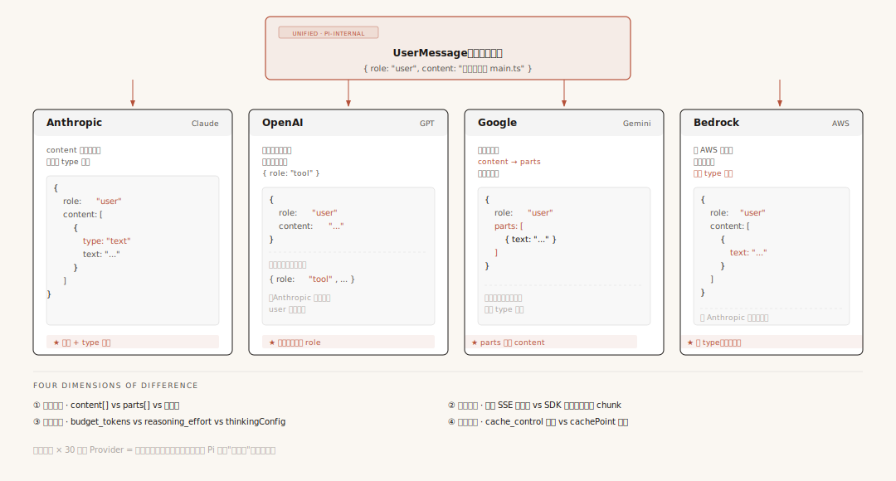
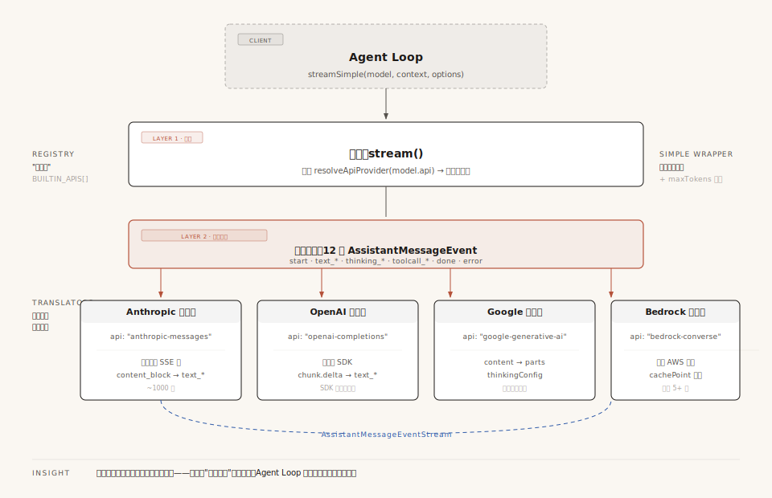
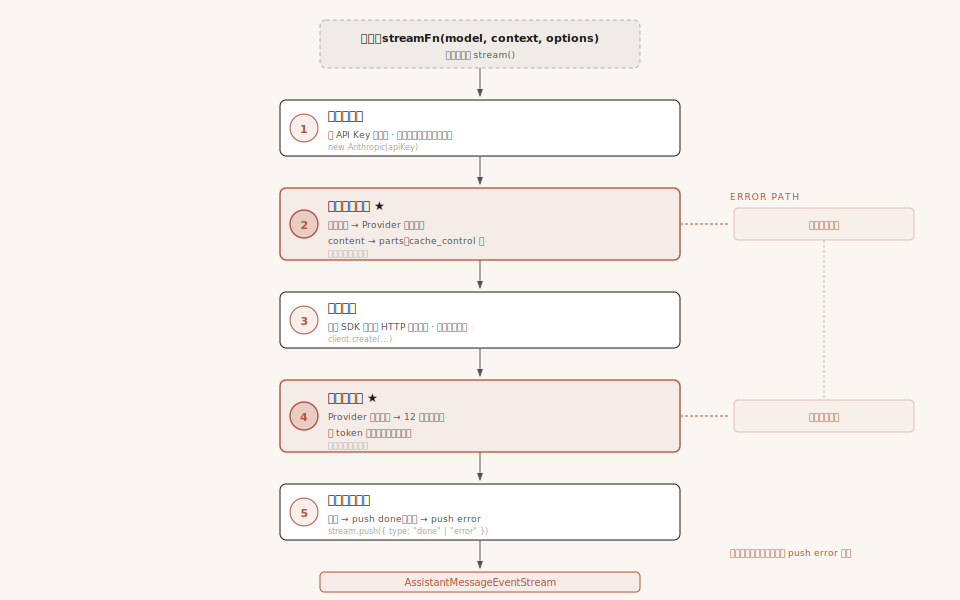
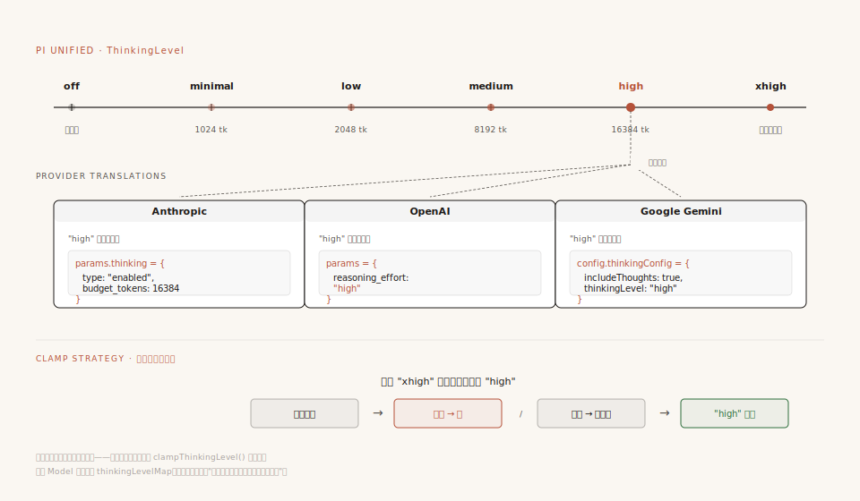

# 第4章：模型调用 —— 一行代码驾驭多个模型

第 3 章我们追踪了 Agent Loop 的完整运转过程。其中最关键的一步是"调用模型"——Loop 把消息发给 LLM，拿到回复，根据回复决定继续还是停止。

但当时我们用了一行代码就跳过了：

```typescript
const stream = streamSimple(model, context, options);
```

这行代码看起来平平无奇。但如果你打开 `packages/ai/src/api/` 目录，会发现里面有几十个文件、10 种 API 翻译器（含 1 个 images 专用），每个都上千行代码。**一行调用的简洁背后，是整个 AI 抽象层的精心设计。**

这一章就来拆开这一行代码：Pi 怎么做到用同一个接口调用 30 多个不同的模型？如果你想接入一个新模型，需要做什么？

---

## 一、问题：同一段对话，不同模型要"翻译"成不同格式

先说清楚要解决什么问题。

Agent Loop 要调用模型，但市面上有几十家模型供应商——Anthropic（Claude）、OpenAI（GPT）、Google（Gemini）、AWS Bedrock、Mistral……每家都有自己的 API 规范，用不同的字段名、不同的数据结构来描述同一件事情。

这个差异有多大？我们看一个最简单的例子。假设用户对 Agent 说了一句话：

> "帮我读一下 main.ts"

这条消息在 Pi 内部是这样存的（统一格式）：

```typescript
{ role: "user", content: "帮我读一下 main.ts", timestamp: 1748697600000 }
```

但要把这条消息发给不同模型，就必须"翻译"成各家要求的格式。同样是这一句话，四个 Provider 要求的长相完全不同：

**Anthropic（Claude）**——消息内容必须是数组，每项带 `type` 字段：

```typescript
{ role: "user", content: [{ type: "text", text: "帮我读一下 main.ts" }] }
```

**OpenAI（GPT）**——格式看起来差不多，但字段语义有细微差异（比如工具结果消息的处理方式完全不同）：

```typescript
{ role: "user", content: "帮我读一下 main.ts" }
// 但如果消息里包含工具结果，OpenAI 要求单独的 { role: "tool" } 消息，
// 而 Anthropic 把工具结果合并到 user 消息里
```

**Google（Gemini）**——字段名从 `content` 变成了 `parts`，结构更扁平：

```typescript
{ role: "user", parts: [{ text: "帮我读一下 main.ts" }] }
```

**Bedrock（AWS）**——在 AWS 自己的结构上又包了一层：

```typescript
{ role: "user", content: [{ text: "帮我读一下 main.ts" }] }
// 注意：Bedrock 的 text 没有 type 字段，和 Anthropic 不一样
```

**连最简单的纯文本消息都有四种写法。** 字段名不同（`content` vs `parts`），结构不同（有的要 `type` 字段，有的不要）。



**配图说明**：顶部是 Pi 内部统一格式，下面四个并排列出同一条消息在 Anthropic/OpenAI/Google/Bedrock 下的真实长相。每张卡片底部用红色标出"这家独特的地方"——数组+type、独立 role、parts 替换 content、无 type 等。底部还列出四个差异维度的全景。

### 不只是消息格式——四个维度全都不一样

消息格式只是冰山一角。Provider 之间的差异是全方位的，主要在四个维度上：

| 维度 | 差在哪 | 举个例子 |
|------|--------|---------|
| **消息格式** | 同一条消息，字段名和结构不同 | Anthropic 用 `content[]`，Google 用 `parts[]` |
| **流式传输** | 模型的"逐字返回"机制不同 | Anthropic 发原始 SSE 文本要自己解析，OpenAI 的 SDK 直接返回结构化 chunk |
| **思考模式** | "让模型深度思考"的参数完全不同 | Anthropic 用 `thinking.budget_tokens`，OpenAI 用 `reasoning_effort` |
| **缓存控制** | "标记不变内容"的方式不同 | Anthropic 打 `cache_control` 标记，Bedrock 插入 `cachePoint` 节点 |

每个维度单独看都不复杂，但四个维度乘以 30 多个 Provider，组合起来的差异量是巨大的。

现在问题来了：**Agent Loop 只有一行 `streamSimple(model, context)`，它不可能为每个 Provider 写一套不同的逻辑。那它怎么应对这么多差异？**

---

## 二、解法：三层架构，各管一件事

你可能会想到一个直觉的答案：给所有 Provider 做一层封装，让它们看起来都一样——输入相同、输出相同。

**没错，Pi 正是这么做的。** 但具体怎么"让它们看起来都一样"？Pi 的方案是把这件事拆成三层，每层有明确的分工：

```
第一层 · 统一入口    →  "接收请求，查出该找谁处理"
第二层 · 事件协议    →  "约定输出格式——不管谁处理，交回来的都是这个样子"
第三层 · 翻译器      →  "真正干活的人——每个翻译器精通一种 Provider 的方言"
```

用一个类比来理解。想象一个国际翻译公司：

- **第一层（前台）**：客户进门，前台问"你要翻译什么语言？"，然后查通讯录找到对应的翻译员，把工作派给他
- **第二层（标准报告模板）**：不管翻译员翻译的是法语、日语还是阿拉伯语，最终交出来的报告都必须用公司统一的格式——封面、正文、审签栏，格式固定
- **第三层（翻译员们）**：每个翻译员精通一种语言，内部怎么翻译是他们的事，但输出必须符合第二层的标准格式

**关键点：前台（第一层）和翻译员（第三层）之间靠标准报告（第二层）连接。前台不需要懂外语，翻译员不需要懂公司流程。**

Agent Loop 就是那个"客户"——它把请求交给前台（第一层），拿到标准格式的报告（第二层），从不直接接触翻译员（第三层）。



**配图说明**：从上到下四层——客户（Agent Loop）→ 前台（stream）→ 标准报告协议（12 种事件）→ 翻译员们（4 个 Provider）。左侧标"通讯录"（注册表），右侧标 streamSimple 是入口的便捷包装。所有翻译员最终都要吐出统一事件流回 Agent Loop。

下面逐层展开。

### 第一层：统一入口

入口函数叫 `stream()`，代码极其简单：

```typescript
// compat.ts
export function stream(model, context, options?) {
  const provider = resolveApiProvider(model.api);  // 查表：这个model该找谁？
  return provider.stream(model, context, options);  // 把工作派给翻译器
}
```

就两步：**查表，派活。** `model.api` 是一个字符串（如 `"anthropic-messages"`），系统启动时已经把所有翻译器注册进了一个"通讯录"（查表）。

这个"通讯录"长这样：

```typescript
const BUILTIN_APIS = [
  ["anthropic-messages",       anthropicMessagesApi()],      // Claude 的翻译器
  ["openai-completions",       openAICompletionsApi()],      // GPT 的翻译器
  ["google-generative-ai",     googleGenerativeAIApi()],     // Gemini 的翻译器
  ["bedrock-converse-stream",   bedrockConverseStreamApi()], // Bedrock 的翻译器
  // ... 还有 5 个
];
```

左边是 key（"工号"），右边是翻译器（"翻译员"）。`model.api` 的值就是 key——拿 key 查表，找到翻译器，调用它。整个入口层不处理任何业务逻辑，纯粹是一个路由器。

### 第二层：事件协议

翻译器把请求发给模型后，模型会流式返回内容（一个字一个字地"吐"出来）。如果每个翻译员都按自己的方式吐，前台就疯了。所以第二层约定了一套统一的输出格式。

Pi 规定：不管底层是哪家模型，翻译器都必须输出**统一的事件流**，事件类型一共 12 种：

```
AssistantMessageEvent（12 种）
│
├── start                              ← 流开始了
│
├── text_start → text_delta → ... → text_end       ← 模型在输出文字
├── thinking_start → thinking_delta → ... → thinking_end  ← 模型在思考
├── toolcall_start → toolcall_delta → ... → toolcall_end  ← 模型要调工具
│
├── done   (reason: stop / length / toolUse)   ← 正常结束
└── error  (reason: error / aborted)           ← 出错了
```

你不需要记住全部 12 种。只需要理解模式：**模型回复的内容分三类（文字、思考、工具调用），每类都有"开始→逐字增量→结束"三步，再加上流开始和流结束两个信号。**

每类内容为什么是三步？因为这是流式输出——翻译器先告诉你"文字要开始了"（text_start），然后逐字推送（text_delta，可能有很多个），最后告诉你"文字结束了"（text_end）。这样 Agent Loop 可以做到逐字渲染——你看到的 AI 回复一个字一个字蹦出来，就是这个机制。

还有一个重要约定：每个事件都携带 `partial: AssistantMessage`——当前消息的完整快照。第 3 章讲的"原地替换"就是这个：每次收到事件，用 `partial` 覆盖 context 中最后一条消息，不用自己拼接增量。

### 第三层：翻译器

翻译器是真正干活的角色。每个翻译器对应一种 API（如 Anthropic、OpenAI），负责把统一格式翻译成该 Provider 的私有格式，再把响应翻译回统一事件。

所有翻译器都遵循同一个 5 步工作流程：



**配图说明**：垂直 5 步管道——创建客户端→构建请求参数→发送请求→处理响应流→发送终止事件。第 2 步和第 4 步是工作量所在（红色边框高亮）。右侧失败分支汇聚成统一 error 事件。

```
翻译器(model, context, options)
│
├── 1. 创建客户端
│      用 API Key 初始化连接。就像翻译员确认自己带了字典。
│
├── 2. 构建请求参数
│      把统一格式的消息、工具定义、系统提示，翻译成 Provider 的私有格式。
│      比如 Google 要 content → parts，这一步就做这个转换。
│
├── 3. 发送请求
│      通过 SDK 或直接 HTTP 发给模型。等模型开始响应。
│
├── 4. 处理响应流
│      模型流式返回内容。翻译器把 Provider 的私有事件格式，
│      翻译成第二层要求的 12 种统一事件。
│
└── 5. 发送终止事件
       成功 → push done；失败 → push error。流必须终止。
```

第 2 步（请求翻译）和第 4 步（响应翻译）是核心工作量所在，也是每个翻译器上千行代码的主要原因。

以 Anthropic 为例，第 4 步的翻译规则（把 Anthropic 的私有事件名翻译成 Pi 的统一事件名）：

```
Anthropic 私有事件                     →  Pi 统一事件
─────────────────                    ────────────
content_block_start (type: "text")    →  text_start
content_block_delta (text_delta)      →  text_delta
content_block_start (type: "tool_use") →  toolcall_start
content_block_delta (input_json)      →  toolcall_delta
message_delta (stop_reason)           →  done（映射终止原因）
```

注意终止原因的映射：Anthropic 的 `"end_turn"` → Pi 的 `"stop"`，`"tool_use"` → `"toolUse"`。每个 Provider 的命名都不一样，Pi 统一成了自己的术语。第 3 章讲 Agent Loop 检查 `stopReason` 决定是否继续循环，那些值就是经过这层翻译后的统一术语。

### StreamFunction：翻译器的"入职要求"

前面说的三层架构要运转起来，有一个前提：**所有翻译器必须遵守同一套规则。** Pi 用一个 TypeScript 类型来定义这套规则——它叫 `StreamFunction`，是整个抽象层的"宪法"：

```typescript
export type StreamFunction<TApi extends Api, TOptions> = (
  model: Model<TApi>,       // 用哪个模型
  context: Context,         // 对话上下文（系统提示 + 消息 + 工具）
  options?: TOptions,       // 可选配置（思考级别、缓存等）
) => AssistantMessageEventStream;  // ← 必须返回统一事件流
```

这个签名定义了三条规则：

1. **输入相同**：所有翻译器接受同样的三个参数（model、context、options）
2. **输出相同**：必须返回 `AssistantMessageEventStream`——不管底层是原始 SSE 还是 SDK 流，对外都是这个类型
3. **错误不抛异常**：API 调用失败时，不发 `throw`，而是发一个 `{ type: "error" }` 事件

第 3 条呼应了第 3 章的"永不抛出"原则。回忆一下：第 3 章说的 `stopReason: "error"` 和 `"aborted"` 不是模型返回的，而是**翻译器的 catch 块在异常时注入的**。具体来说，翻译器把异常信息包装成一个 `error` 事件，推进事件流里。Agent Loop 收到后用同一套机制处理成功和失败，循环永远不会被异常打断。

有了 StreamFunction 这套规则，"前台"（第一层）可以放心地把工作派给任何翻译器——因为它们保证了同样的输入格式、同样的输出格式、同样的错误处理方式。

---

## 三、怎么用：从调用到接入新模型

理解了三层架构，现在看实际使用。分两个场景：**怎么调用**已有模型，和**怎么接入**一个新模型。

### 场景一：调用模型

Agent Loop 实际调用的不是 `stream()`，而是 `streamSimple()`。为什么有两个版本？

`stream()` 是底层入口——它只做"查表 + 派活"，不管思考级别翻译。`streamSimple()` 是在 `stream()` 之上包了一层便捷功能——自动处理思考级别（ThinkingLevel）翻译、自动调整 token 上限等。简单说：

- **`stream()`**：最底层，什么便利功能都没有。你直接用它需要自己处理很多翻译细节
- **`streamSimple()`**：帮你处理好思考级别等翻译工作，是实际开发中常用的入口

Agent Loop 使用 `streamSimple()` 的典型代码：

```typescript
const stream = streamSimple(model, context, { reasoning: "high" });
//                                          ↑ 告诉它"用高级别思考"
//                                            streamSimple 会自动翻译成各 Provider 的具体参数

for await (const event of stream) {
  // 事件会按顺序到达：
  // start → thinking_start/delta/end → text_start/delta/end → done
  switch (event.type) {
    case "text_delta":
      // 文字增量，显示到终端
      break;
    case "toolcall_end":
      // 模型要调工具，拿到完整的工具调用信息
      break;
    case "done":
      // 本轮模型调用结束，看 stopReason 决定是否继续循环
      break;
    case "error":
      // 出错了（网络超时、API错误等），errorReason 是 "error" 或 "aborted"
      break;
  }
}
```

**Agent Loop 不需要关心底层是哪个模型。** 不管 model 是 Claude、GPT 还是 Gemini，`streamSimple` 返回的都是同一种事件流，消费方式完全一样。

### 场景二：接入一个新模型

假设你要接入一个 Pi 还不支持的新模型——比如某个国产大模型。你要做什么？

**三步**，每步对应前面讲的三层架构：

**第 1 步：写一个翻译器**（对应第三层）

翻译器的本质就是一个符合 `StreamFunction` 签名的函数。你要做的是：

- 把 Pi 的统一消息格式，翻译成你的模型的 API 格式（请求方向）
- 把你的模型返回的流式响应，翻译成 Pi 的 12 种统一事件（响应方向）
- 出了异常不要 throw，而是 push 一个 `error` 事件

这一步是工作量最大的——你需要读你的模型的 API 文档，搞清楚它的消息格式、流式协议、错误码。但这是"一次性工作"——写完就不用再改了。

**第 2 步：注册翻译器**（对应第一层）

```typescript
registerApiProvider({
  api: "your-model-api",           // 给你的翻译器起个名字
  stream: yourStreamFunction,       // 你写的翻译器
  streamSimple: yourSimpleFunction, // 便捷版本
});
```

这一步就是往"通讯录"里加一条记录。系统启动后，第一层的 `resolveApiProvider()` 就能查到你的翻译器。

**第 3 步：配置模型信息**

```typescript
const yourModel: Model = {
  id: "your-model-id",
  api: "your-model-api",     // ← 指向第 2 步注册的名字
  provider: "your-provider",
  baseUrl: "https://api.your-model.com",
  // ... 其他元数据（上下文窗口大小、是否支持思考等）
};
```

这一步告诉系统"有这样一个模型存在"。`api` 字段指向第 2 步注册的名字，第一层就是靠这个字段查表路由的。

**完成。** Agent Loop 一行都不用改。事件系统、会话管理、压缩算法——全部自动适配。这就是三层架构的价值：**新模型的接入成本被限制在了"写一个翻译器"这一个点，不需要动其他任何地方。**

---

## 四、【进阶】翻译器内部：SSE 解析与思考模式方言

> 前三节覆盖了 AI 抽象层的核心设计。以下内容属于工程实现细节——如果你不需要自己写翻译器，可以跳过这一节。

### 流式传输：为什么 Anthropic 和 OpenAI 的解析方式完全不同？

第 3 章讲过，模型回复是流式的——一个字一个字"吐"出来。但"怎么吐"各家不同：

**OpenAI** 的 SDK 封装得很好。你调用 `client.chat.completions.create()`，它直接返回一个结构化的 chunk 流。每个 chunk 里的 `choices[0].delta` 就是解析好的数据，拿来就能用。

**Anthropic** 返回的是原始的 SSE（Server-Sent Events）文本流。需要自己逐行读 `event:` 和 `data:` 字段，自己做 JSON 解析（还包含容错处理——有些 chunk 的 JSON 可能不完整）。

```
Anthropic 的解析链路（翻译器自己做脏活）：
  原始 HTTP 响应 → 逐行读取 → 分离 event 和 data → JSON 解析(含容错) → 内部事件

OpenAI 的解析链路（SDK 帮你做了脏活）：
  client.chat.completions.create() → 直接返回 AsyncIterable<Chunk> → 就是结构化数据
```

**为什么不用统一 SDK？** 因为不是所有 Provider 都有成熟的 SDK。有些 SDK 不支持流式，有些不支持自定义事件。Pi 的策略是——有 SDK 就用（OpenAI、Google），没 SDK 就自己解析（Anthropic）。但不管内部怎么实现，最终都翻译成统一的 12 种事件。

### 思考模式：四种"思考"，四种参数

不同 Provider 对"让模型深度思考"这件事，概念和参数完全不同：

```typescript
// Anthropic：给一个 token 预算，让模型在这个预算内思考
params.thinking = { type: "enabled", budget_tokens: 16384 };

// OpenAI：给一个努力程度（low/medium/high）
params.reasoning_effort = "high";

// Google：用 thinkingConfig 配置
config.thinkingConfig = { includeThoughts: true, thinkingLevel: "high" };
```

甚至 Anthropic 自己都有两种模式——新版模型用"自适应思考"（模型自己决定思考多少），旧版模型用"预算思考"（给固定 token 上限）。

### Pi 怎么统一：ThinkingLevel 五级刻度

Pi 定义了一套统一的思考级别枚举：



**配图说明**：顶部数轴展示 off/minimal/low/medium/high/xhigh 六级，每级标注 token 上限。下方三家 Provider 的"high"对应的不同参数。底部展示 clamp 回退策略：先向上找，找不到再向下。

```
  off    minimal    low    medium    high    xhigh
  │        │         │       │        │        │
 不思考  1024 tk   2048 tk  8192 tk  16384 tk  模型最大值
```

上层代码只需说 `reasoning: "high"`，翻译器自己查表翻译成各 Provider 的具体参数。每个 `Model` 对象自带一个 `thinkingLevelMap`（翻译表），声明"我这台模型，每个级别对应什么参数"。

如果请求的级别模型不支持（比如请求 `xhigh` 但只支持到 `high`），`clampThinkingLevel()` 函数做回退——**先向上找**（思考更多通常比更少安全），找不到再向下找。

`streamSimple()` 就是帮你自动完成这套翻译的便捷函数——查表 + clamp + 调整 maxTokens，然后调用底层 `stream()`。

---

## 五、【进阶】缓存控制与错误处理

### 缓存控制：让模型"算更少"

Agent 对话是"有状态的"——每轮都把之前的完整历史发给模型。如果你和 Agent 聊了 50 轮，每轮都重新计算前 49 轮的内容。缓存就是告诉模型服务器："这些内容没变，别重新算了。"

但"怎么标记"各 Provider 不同：Anthropic 在消息块上追加 `cache_control` 标记，Bedrock 插入独立的 `cachePoint` 节点。

Pi 把缓存控制抽象成三个语义级别：

```typescript
type CacheRetention = "none" | "short" | "long";
```

上层只说"我要 long 缓存"，翻译器自己翻译成各 Provider 的具体标记方式。这和 ThinkingLevel 是同一种"统一枚举 + 各家翻译表"的套路，但比思考级别更有意思——**四家对"怎么标记不变内容"这件事，思路完全不同**。源码里的对照表大致是这样：

| Provider | `none` | `short` | `long` | 打点位置 |
|---------|--------|---------|--------|---------|
| **Anthropic** | 不打标记 | `cache_control: { type: "ephemeral" }`（默认 5 分钟 TTL） | 加 `ttl: "1h"`（仅新模型支持） | system 末尾 + 最后一个 tool + 最后一条 user message（rolling） |
| **Bedrock** | 不插节点 | 在消息流里插一个独立对象 `{ cachePoint: { type: DEFAULT } }` | 加 `ttl: ONE_HOUR` | system 块后面 + 最后一条消息后面 |
| **OpenAI Responses** | 不发 cache key | 发送 `prompt_cache_key: sessionId` | 加 `prompt_cache_retention: "24h"` | 不打点——OpenAI 按 session key 自动匹配前缀 |
| **OpenAI 兼容（DeepSeek/Qwen 等）** | 不打标记 | 按 Anthropic 风格打 `cache_control` | 加 `ttl: "1h"`（如支持） | 复用 Anthropic 的三处策略 |

源码引用：Anthropic 的三处打点在 [anthropic-messages.ts:922/929/938](repo/packages/ai/src/api/anthropic-messages.ts#L922) + [L1208](repo/packages/ai/src/api/anthropic-messages.ts#L1208) + [L1157](repo/packages/ai/src/api/anthropic-messages.ts#L1157)；Bedrock 的 cachePoint 节点在 [bedrock-converse-stream.ts:696/885](repo/packages/ai/src/api/bedrock-converse-stream.ts#L696)；OpenAI Responses 的 prompt_cache_key 在 [openai-responses.ts:229](repo/packages/ai/src/api/openai-responses.ts#L229)。

这里有个值得停下来想一下的对比：同样是"告诉服务器这段内容不变"，四家给出了**四种完全不同的协议设计**——

- **Anthropic 的做法像"贴便签"**：在原有的内容块上附加一个 `cache_control` 字段。内容还是那些内容，只是多了一个"这段不变"的标签
- **Bedrock 的做法像"插路标"**：在消息流的特定位置插入一个**独立的、不含业务数据**的 cachePoint 对象。它不依附在任何内容上，自己就是一个占位
- **OpenAI 原生的做法像"按会员卡号查记录"**：你压根不打标记，只是每次请求带一个 `prompt_cache_key`（Pi 用 sessionId 当 key），OpenAI 后端自己识别前缀重合度
- **OpenAI 兼容厂商的做法最朴素**：直接抄 Anthropic 的便签协议（`cacheControlFormat: "anthropic"`），所以 Pi 用同一套 `applyAnthropicCacheControl` 函数处理它们

第 3 章我们讨论过"Pi 为什么每圈重建 llmContext 但不会破坏 cache"——答案就在这张表里。`cacheRetention` 一旦设定，整个 Trace 内每圈都用同样的策略打同样的标记（system/tools 内容不变，user message 是 rolling）。Anthropic 后端按内容字节做 prefix 匹配，命中就是命中，跟"你是第几圈调用"无关。

**为什么 Anthropic 选三个特定位置打点？** 不是随便选的——`system + tools` 是整条 Trace 内最稳定的前缀，`最后一条 user message` 是 rolling 的"截止线"。Anthropic 规定每个请求最多 4 个 cache breakpoint，这三个位置覆盖了"完全不变 + 最近滚动"两段，是收益最大化又不超限额的最优解。

缓存的经济价值很高：缓存命中的 token 按缓存读取价计费，通常是正常输入价的 1/10。一个 200K token 的对话历史，缓存后能省约 90% 的输入成本。

### 错误处理：编码到流里，不打断循环

所有翻译器的错误处理都遵循同一个模式：

```typescript
try {
  // ... 正常流程：构建请求、发送、解析响应
  stream.push({ type: "done", reason: output.stopReason, message: output });
} catch (error) {
  // 错误不抛出，而是编码到流中
  output.stopReason = options?.signal?.aborted ? "aborted" : "error";
  output.errorMessage = error.message;
  stream.push({ type: "error", reason: output.stopReason, error: output });
}
```

**这就是第 3 章说的 `stopReason: "error"` 和 `"aborted"` 的注入点。** 模型 API 本身不会返回这两个值——它们是翻译器的 catch 块在异常时设置的。可能是网络超时、可能是 API Key 过期、可能是用户主动取消。不管什么原因，异常都被包装成事件，Agent Loop 收到后可以重试、降级、或报告给用户，循环不停。

还有一个隐蔽的问题：**上下文溢出**。有时候请求没报错，但模型返回空输出——因为输入 token 太多被服务端静默截断了。Pi 有一个 `isContextOverflow()` 函数做三重检测（错误消息模式匹配、token 数对比、输出为零+length停止），把不同 Provider 的各种溢出表现统一捕获。

---

## 六、回到那一行代码

回到开头的问题：`streamSimple(model, context)` 这一行代码背后发生了什么？

用一句话概括：**Agent Loop 说了一句"给我用这个模型处理这段对话"，前台查出该找哪个翻译器，翻译器把请求翻译成 Provider 的格式发给模型，再把模型的流式响应翻译成统一事件返回——Agent Loop 自始至终只看到了统一事件流，不知道中间发生了多少翻译。**

```
Agent Loop：streamSimple(model, context, { reasoning: "high" })
    │
    │  ① streamSimple 处理思考级别翻译（查表 → clamp → 调整maxTokens）
    │
    │  ② 调用 stream() → 前台查表 → 找到翻译器
    │
    │  ③ 翻译器工作：
    │     · 统一格式 → Provider 私有格式（请求翻译）
    │     · 发给模型
    │     · Provider 私有响应 → 12种统一事件（响应翻译）
    │
    │  ④ 返回 AssistantMessageEventStream
    │
    └── Agent Loop：for await (event of stream) { ... }  ← 消费统一事件
```

**Agent Loop 看到的只有 ④ ——一个干净的事件流。** 这就是三层架构的力量：复杂度被封装在翻译器里，外部接口保持简洁。

### 设计精华

三条核心思路值得带走：

**1. "协议 > 实现"设计法。** Pi 没有设计一个 `BaseProvider` 抽象类让所有翻译器继承，而是定义了一套事件协议（12 种事件）和一个函数签名（`StreamFunction`）。为什么不用继承？因为翻译器之间几乎没有共同点——继承需要找共同代码，但 Anthropic 和 Google 在"发消息"这件事上连字段名都不一样。协议只约定"输入什么、输出什么"，不管中间怎么处理。

**2. "统一枚举 + 映射表"策略。** ThinkingLevel 是统一枚举（5 级），ThinkingLevelMap 让每个 Model 自带翻译表。上层说 `"high"`，底层自己查表。比"取所有 Provider 的交集"灵活（交集可能只剩 `"off"`），也比"暴露各 Provider 的原生参数"简洁（上层不需要知道 20 种参数名）。

**3. "语义统一，实现分散"。** `cacheRetention`（none/short/long）是语义接口——上层说"我要长期缓存"，不管底层是打标记还是插节点。语义接口描述"做什么"，机制接口描述"怎么做"。

---

## 七、下一站

AI 层把模型差异封装得干干净净——Agent Loop 完全不知道底层用的是什么模型。

但 Agent 怎么"做事"？模型返回了 `ToolCall`，谁来执行？执行过程中怎么保证参数正确（模型可能传了错误类型的参数）、怎么保证安全（模型可能要求执行危险命令）？第 3 章把这个过程当作黑盒跳过了。

下一章，我们打开这个黑盒——工具系统。

---

> **本章关键源码索引**：
> - `packages/ai/src/compat.ts:237-247` — `stream()` 入口（第一层·底层）
> - `packages/ai/src/compat.ts:258-268` — `streamSimple()` 入口（第一层·便捷封装）
> - `packages/ai/src/compat.ts:172-206` — Provider 注册（"通讯录"）
> - `packages/ai/src/types.ts:304-308` — `StreamFunction` 签名（"宪法"）
> - `packages/ai/src/types.ts:453-465` — 12 种 `AssistantMessageEvent`（第二层·事件协议）
> - `packages/ai/src/api/anthropic-messages.ts` — Anthropic 翻译器（第三层·5 步骨架）
> - `packages/ai/src/api/openai-completions.ts` — OpenAI 翻译器
> - `packages/ai/src/types.ts:74-76` — `ThinkingLevel` / `ThinkingLevelMap`
> - `packages/ai/src/models.ts:410-429` — `clampThinkingLevel` 回退策略
> - `packages/ai/src/utils/overflow.ts:126-155` — `isContextOverflow` 三重检测
