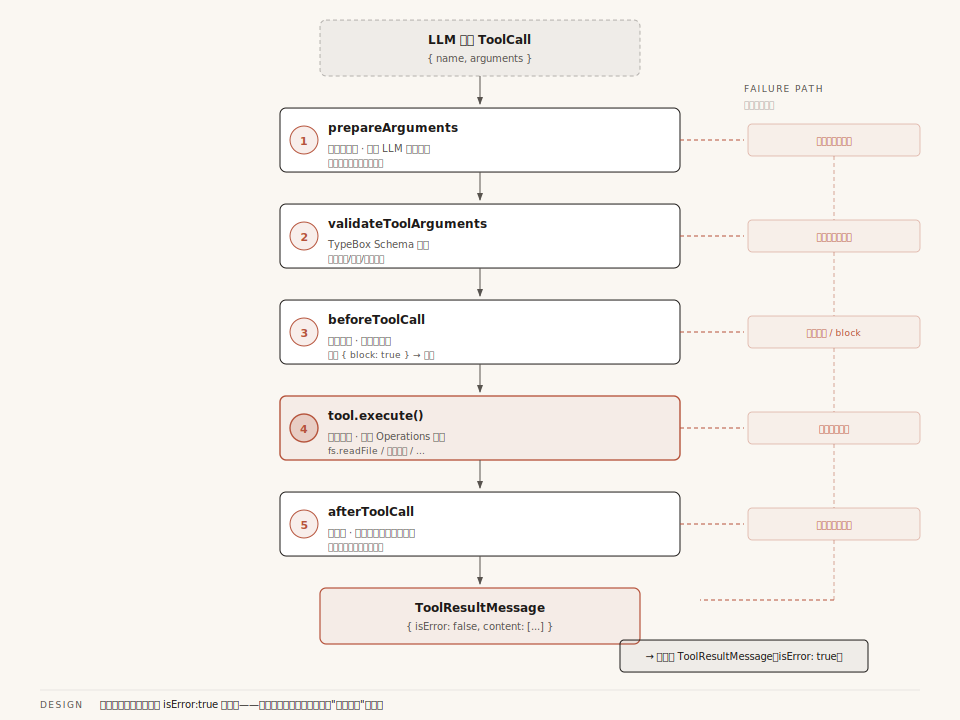
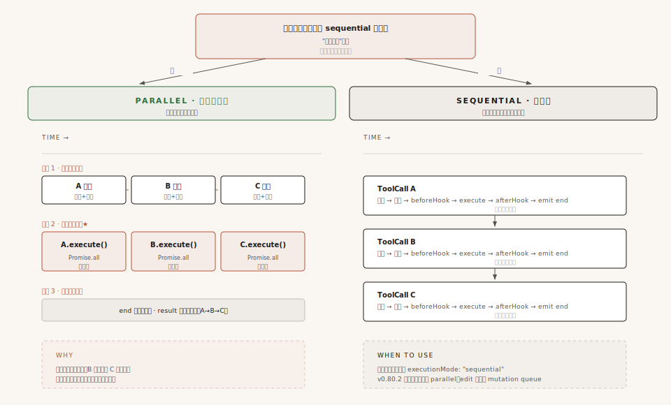

# 第5章：工具系统 —— Agent 的手脚是怎么被管住的

第 3 章讲 Agent Loop 时，我们追踪了"模型决定调用 read 工具"到"工具结果回到模型面前"这段旅程。但当时把它当黑盒跳过了——只说了"Loop 执行工具"，没说具体怎么执行的。

这一章就来打开这个黑盒。

当模型的回复里出现了这样一条指令：

```json
{ "type": "toolCall", "id": "call_abc123", "name": "read", "arguments": { "path": "src/main.ts" } }
```

从这条指令到文件内容回到模型面前，中间经历了什么？

你的第一反应可能是：找到 read 工具，读文件，把内容塞进消息，完事。但现实中没这么简单——模型可能传了错误类型的参数（`path: 12345` 而不是 `"src/main.ts"`），模型可能要求执行危险命令（`rm -rf /`），工具执行时可能抛异常（文件不存在）。

Pi 用一条**五步管道**来解决这些问题：参数预处理 → Schema 验证 → 权限拦截 → 工具执行 → 结果后处理。每一步都有明确的职责，每一步的错误都不会"炸掉"整个循环。

但在讲管道之前，得先搞清楚一个更基础的问题：**工具到底是怎么定义的？** 为什么 Pi 要设计三层类型来描述"一个工具"？

---

## 一、三层类型：为什么"一个工具"要分三层来定义？

### 第一层：Tool——一张"名片"

打开 `packages/ai/src/types.ts`，你会看到工具的最底层定义：

```typescript
// packages/ai/src/types.ts:433-437
export interface Tool<TParameters extends TSchema = TSchema> {
    name: string;            // 工具名，如 "read"、"bash"
    description: string;     // 给 LLM 看的工具描述
    parameters: TParameters; // 参数的 JSON Schema（用 TypeBox 定义）
}
```

三个字段。工具就是一个有名字、有描述、有参数 Schema 的东西。

这个接口住在 `pi-ai` 层——纯模型适配层。它唯一关心的事情是：**怎么把工具的信息告诉模型。** `name` 和 `description` 会出现在发给模型的 API 请求里，`parameters` 告诉模型"你可以传哪些参数"。

在这个层面，工具只是**一张名片**。能描述自己，但不能执行任何操作。

### 第二层：AgentTool——加上了"执行能力"

Agent Loop 要执行工具调用，光有名片不够。它需要知道**怎么执行**这个工具、这个工具**能不能并行执行**、参数格式要不要**预处理**。

于是 `pi-agent-core` 层在 Tool 基础上扩展了 `AgentTool`：

```typescript
// packages/agent/src/types.ts:371-394
export interface AgentTool<TParameters, TDetails>
    extends Tool<TParameters>          // 继承 Tool 的三个字段
{
    label: string;                     // 给人看的标签（不同于给 LLM 的 description）
    prepareArguments?: (args: unknown) => Static<TParameters>;  // 兼容性垫片
    execute: (                         // 执行函数
        toolCallId: string,
        params: Static<TParameters>,
        signal?: AbortSignal,
        onUpdate?: AgentToolUpdateCallback<TDetails>,
    ) => Promise<AgentToolResult<TDetails>>;
    executionMode?: "sequential" | "parallel";  // 执行模式
}
```

从 Tool 到 AgentTool，新增了 4 个字段。每个都有明确用途：

- **`label`**：模型看到的是 `name`（"read"），UI 看到的是 `label`（"读取文件"）
- **`prepareArguments`**：兼容层，处理不同模型输出的参数怪癖（后面详讲）
- **`execute`**：真正干活的函数——模型说"读文件"，这个函数去读
- **`executionMode`**：标记这个工具能否和其他工具并行执行

### 第三层：ToolDefinition——产品层再加东西

到了 `pi-coding-agent` 层（产品运行层），工具还需要更多能力：自定义渲染（read 工具在终端里怎么显示？edit 工具怎么展示 diff？）、提示词注入（有些工具需要在系统提示词里加一段使用指南）。

于是出现了第三层 `ToolDefinition`。它的 `execute` 函数比 `AgentTool` 多了一个参数——`ctx: ExtensionContext`，让工具执行时可以访问当前会话状态：

```
AgentTool.execute:     (toolCallId, params, signal, onUpdate) => ...
ToolDefinition.execute: (toolCallId, params, signal, onUpdate, ctx) => ...
                                                                   ^^^
                                                    多了 ExtensionContext（会话上下文）
```

ToolDefinition 还新增了 `promptSnippet`（系统提示词片段）、`renderCall`（调用时渲染）、`renderResult`（结果时渲染）等 UI 相关字段。

### 桥接两层：wrapToolDefinition

Agent Loop 只认识 `AgentTool`，但产品层的工具都是 `ToolDefinition`。谁来把 ToolDefinition 变成 AgentTool？

答案是一个只有十几行的包装器函数：

```typescript
// packages/coding-agent/src/core/tools/tool-definition-wrapper.ts
export function wrapToolDefinition(definition, ctxFactory?) {
    return {
        name: definition.name,
        label: definition.label,
        description: definition.description,
        parameters: definition.parameters,
        prepareArguments: definition.prepareArguments,
        executionMode: definition.executionMode,
        // 关键：重写 execute，通过闭包注入 ExtensionContext
        execute: (toolCallId, params, signal, onUpdate) =>
            definition.execute(toolCallId, params, signal, onUpdate, ctxFactory?.()),
    };
}
```

注意最后一行。AgentTool 的 execute 只有 4 个参数，但 ToolDefinition 的 execute 有 5 个。包装器通过闭包捕获了 `ctxFactory`，在调用时动态创建 `ExtensionContext` 并注入第 5 个参数。**Agent Loop 永远不知道 ExtensionContext 的存在。**

### 为什么非要分三层？

把所有字段塞进一个 `Tool` 接口，加几个可选字段不就行了？

不行。原因是**每层有独立的依赖范围**。`pi-ai` 层的 `Tool` 接口只依赖 TypeBox 的 `TSchema`。如果在这个接口里加了 `renderCall`（返回终端 UI 组件），`pi-ai` 就得依赖终端 UI 渲染库。但 `pi-ai` 是纯模型适配层——它的工作只是"把工具信息格式化成 API 请求"，不应该知道终端 UI 长什么样。

三层递进的本质是：**每一层只加自己这个层级需要的能力，不越界。** `Tool` 管"我能描述自己"，`AgentTool` 管"我能被执行"，`ToolDefinition` 管"我能被展示和扩展"。

---

## 二、五步管道：工具调用不是"调个函数就完了"

类型定义搞清楚了，现在看工具调用的实际执行过程。



**配图说明**：从 ToolCall 到 ToolResultMessage 的五步垂直管道——prepareArguments→validate→beforeToolCall→execute→afterToolCall。每一步右侧都有失败分支（虚线箭头），但所有失败最终都汇聚成 isError:true 的消息，循环不被异常打断。

### 为什么不能直接调函数？

最简单的处理方式：找到 read 工具 → 读文件 → 把内容塞进 ToolResultMessage → 完事。一行函数调用，很直觉。

但模型的输出并不总是规规矩矩的：

- **参数格式不对**：Edit 工具期望 `edits` 是一个数组，但某些模型会把数组序列化成字符串 `"[{...}]"` 传过来
- **参数类型错误**：Read 工具的 `path` 参数是 string，但模型可能传个数字 `12345`
- **危险操作**：模型要求执行 `rm -rf /`，你的 Agent 真的去执行吗？

这些问题意味着"直接调函数"是不够的。你需要在执行前加几道关卡。

### Pi 的答案：五步管道

```
LLM 输出 ToolCall
    │
    ▼
┌──────────────────────────────────────────────────┐
│ 第 1 步：prepareArguments（参数预处理）           │
│   处理 LLM 的参数怪癖                            │
│   如：把字符串化的数组解析回真正的数组             │
├──────────────────────────────────────────────────┤
│ 第 2 步：validateToolArguments（Schema 验证）     │
│   用 TypeBox Schema 做运行时类型检查              │
│   如：path 是 string，不是 number                │
├──────────────────────────────────────────────────┤
│ 第 3 步：beforeToolCall（前置钩子）              │
│   产品层的权限拦截，可以阻止执行                   │
│   返回 { block: true, reason: "危险命令"}         │
├──────────────────────────────────────────────────┤
│ 第 4 步：tool.execute（实际执行）                 │
│   调用工具的 execute 函数                         │
│   支持 onUpdate 流式进度回调                      │
├──────────────────────────────────────────────────┤
│ 第 5 步：afterToolCall（后置钩子）               │
│   产品层的结果后处理，可以修改返回值               │
│   可以替换 content、details、isError              │
└──────────────────────────────────────────────────┘
    │
    ▼
ToolResultMessage
```

每一步都有明确的职责和退出机制。前 3 步是"准备工作"——任何一步失败都不会执行工具。第 4 步是"真正干活"。第 5 步是"收尾"。我们逐步展开。

### 第 1 步：prepareArguments——兼容性垫片

不同模型的 API 在序列化工具参数时有微妙的差异。`prepareArguments` 就是为这些差异准备的兼容层。

比如 Edit 工具期望 `edits` 是数组：

```typescript
// 模型实际传来的（某些模型把 JSON 数组序列化成了字符串）
{ edits: "[{\"oldText\":\"hello\",\"newText\":\"world\"}]" }

// 经过 prepareArguments 处理后
{ edits: [{ oldText: "hello", newText: "world" }] }
```

如果工具没定义 `prepareArguments`，参数直接透传。这一步的代码很简单——有就用，没有就跳过。

**为什么不在 Schema 验证里一起处理？** 因为它们关注的事情不同。`prepareArguments` 是"我知道某个模型会犯什么错"的兼容层——只处理特定模型的已知问题。`validateToolArguments` 是"不管谁调我都得验"的安全层——保证参数类型正确。一个是兼容性，一个是正确性，混在一起会让代码很难维护。

### 第 2 步：validateToolArguments——Schema 验证

经过预处理后，参数还要过一道 TypeBox 的运行时类型检查。比如 `path` 定义为 string，但模型传了 number：

```
Before：{ path: 12345 }
After： 验证失败 → 报错 → 不执行工具
```

验证错误会被 `prepareToolCall` 的 try-catch 捕获，生成一个错误 ToolResultMessage。**工具永远不会收到类型错误的参数。**

### 第 3 步：beforeToolCall——前置钩子（可阻止执行）

参数验证通过后，在执行之前，产品层还有一次拦截机会。`beforeToolCall` 是一个回调函数，可以检查命令是否危险：

| 返回值 | 效果 |
|--------|------|
| `undefined` | 放行，继续执行工具 |
| `{ block: true, reason: "危险命令" }` | 阻止执行，生成错误 ToolResultMessage |

**注意**：即使工具被阻止，结果仍然是一条正常的 `ToolResultMessage`，只是 `isError: true`。模型会看到这条错误消息，知道命令被拒绝了，然后决定下一步怎么做（换一个命令，或者跟用户解释为什么不能执行）。**整个过程不会抛异常，不会打断循环。**

### 第 4 步：tool.execute——实际执行

前 3 步都通过后，工具的 `execute` 函数被真正调用。回头看一下它的签名：

```typescript
execute: (toolCallId, params, signal, onUpdate) => Promise<AgentToolResult>
```

四个参数——`toolCallId` 是这次调用的 ID，`params` 是验证过的参数，`signal` 是用于取消的 AbortSignal（用户按 Ctrl+C 时触发）。第四个 `onUpdate` 是什么？

**它解决的是"长任务的进度感知"问题。** 假设 Bash 工具要跑一个 30 秒的命令——如果只有"开始执行"和"执行完成"两个时刻能向外界报告，用户在这 30 秒里只能盯着加载动画。`onUpdate` 让工具能**边执行边向外推消息**：Bash 工具每 100ms 推送一次当前的终端输出，Grep 工具每找到一批匹配就推送一次，Read 工具读取大文件时可以分段报告进度。这些推送被包装成 `tool_execution_update` 事件，最终流向 UI。

简单说：**没有 `onUpdate`，工具执行就是黑盒；有了它，工具执行是"可观察的"。** 这是工具能向用户实时汇报进度的关键机制。

但有个边角问题需要处理。工具的 `execute` 是异步函数，它 `return` 之后，内部可能还有没结束的异步操作——比如 Bash 工具的子进程在主命令返回后还在异步打印最后几行日志。如果这些延迟回调还往 `onUpdate` 推数据，就会污染一个**已经结束**的工具调用，让 UI 上下文错乱。Pi 用一个 `acceptingUpdates` 标志位解决：`execute` 一旦返回（或抛异常），立即把标志位关掉，之后所有 `onUpdate` 调用一律静默丢弃。这是工程上的防御性细节，不复杂，但必须要有。

`onUpdate` 推出的消息最终流向哪里？这个问题很重要——它是下一章"消息系统"的核心议题，那里会展开。这里只需要记住：工具执行不是黑盒，进度可观察。

如果 `tool.execute()` 抛出异常怎么办？别担心，§四 会详细讲这是怎么处理的——剧透一句：异常会被翻译成一条 `isError: true` 的消息发给模型。

### 第 5 步：afterToolCall——后置钩子（可修改结果）

工具执行完毕后，产品层还有一次修改结果的机会。`afterToolCall` 可以做这些事情：

| 场景 | 做什么 | 怎么做 |
|------|--------|--------|
| 脱敏 | 把工具返回的敏感信息替换掉 | 返回 `{ content: [{type:"text", text:"[已脱敏]"}] }` |
| 审计 | 记录工具调用的详细信息 | 读取 result，写日志，返回 `undefined`（不改结果） |
| 修错 | 把工具的错误结果修正为正常结果 | 返回 `{ isError: false, content: [...] }` |
| 早停 | 让 Agent 在当前批次后停止 | 返回 `{ terminate: true }` |

合并语义是字段级覆盖——提供了就替换，没提供就保留原值。

### 管道的终点：ToolResultMessage

五步走完，不管中间出了什么状况，最终产物都是一条 `ToolResultMessage`：

```typescript
{
    role: "toolResult",
    toolCallId: "call_abc123",      // 关联到原始 ToolCall
    toolName: "read",
    content: [{ type: "text", text: "1│ import { Agent }..." }],
    details: { language: "typescript" },  // 给 UI 的元数据
    isError: false,                  // 是否为错误结果
    timestamp: 1700000000000,
}
```

这条消息会被追加到对话历史中，在下一轮循环里作为上下文发给模型。模型看到"文件内容是这样的"，然后决定下一步——可能要编辑，可能要再读别的文件，可能直接回答用户。

**所有错误最终都变成了同一种东西：一条 `isError: true` 的 ToolResultMessage。** 模型看到错误消息，知道出错了，然后自己决定怎么处理。这个设计为什么是最佳实践？§四 会详细展开。

---

## 三、并行 vs 串行：一个批次的工具不是"一起跑就完了"



**配图说明**：顶部"一票否决"决策——只要有一个工具声明 sequential，整批串行。左侧绿色三阶段（顺序准备→并行执行→有序事件），右侧黑色瀑布式串行。底部解释"为什么准备阶段必须顺序"和"何时用串行"。

### 模型经常一次调用多个工具

Agent Loop 的内层循环中，模型的一次回复可能包含多个 ToolCall：

```
assistantMessage.content = [
    { type: "text", text: "我来查一下文件" },
    { type: "toolCall", id: "call_1", name: "read", arguments: {path: "a.ts"} },
    { type: "toolCall", id: "call_2", name: "grep", arguments: {pattern: "TODO"} },
    { type: "toolCall", id: "call_3", name: "find", arguments: {pattern: "*.test.ts"} },
]
```

三个 ToolCall，都是只读操作。直觉告诉我们应该并行执行——用 `Promise.all` 一起跑，省时间。

### 但并行不是无脑 Promise.all

如果三个 ToolCall 中有两个是 edit（修改同一个文件），并行执行就会互相覆盖：

```
ToolCall 1: edit { path: "app.ts", oldText: "v1", newText: "v2" }
ToolCall 2: edit { path: "app.ts", oldText: "v3", newText: "v4" }
                     ^^^^^^^^
                     同一个文件！并行执行 → ToolCall 1 的修改被 ToolCall 2 覆盖
```

所以 Pi 需要一种机制来判断"哪些工具能并行，哪些必须串行"。

### Pi 的调度策略：一票否决

Pi 的策略很简单——**只要有一个工具标记为 sequential，整个批次都串行执行**：

```typescript
// 检查是否有串行工具
const hasSequentialToolCall = toolCalls.some(
    (tc) => tools?.find((t) => t.name === tc.name)?.executionMode === "sequential",
);

// 有串行工具 → 整批串行；没有 → 并行
if (config.toolExecution === "sequential" || hasSequentialToolCall) {
    return executeToolCallsSequential(...);
}
return executeToolCallsParallel(...);
```

**为什么一票否决而不是只串行冲突的工具？** 因为"哪些工具会冲突"很难精确判断。edit 和 edit 操作不同文件就可以并行？万一它们编辑的文件有依赖关系呢？Pi 选择了保守策略：**宁可多等，不可出错。**

### 并行执行的三阶段设计

当判定可以并行时，Pi 不是简单地 `Promise.all` 跑完就完——它把执行分成了三个阶段：

```
阶段 1 - 准备（顺序执行）：
  ToolCall 1: emit_start → prepareArguments → validate → beforeToolCall
  ToolCall 2: emit_start → prepareArguments → validate → beforeToolCall
  ToolCall 3: emit_start → prepareArguments → validate → beforeToolCall
  // 准备阶段必须顺序，因为 beforeToolCall 可能有副作用（如修改全局状态）

阶段 2 - 执行（并行）：
  ToolCall 1: execute ────────────────┐
  ToolCall 2: execute ───────────────┤ Promise.all
  ToolCall 3: execute ───────────────┘
  // 只有 tool.execute() 并行

阶段 3 - 事件发送（有序）：
  ToolCall 2: emit_end    ← 先完成的先发 tool_execution_end
  ToolCall 1: emit_end
  ToolCall 3: emit_end
  ToolCall 1: emit_result ← 但 ToolResultMessage 按调用顺序发
  ToolCall 2: emit_result
  ToolCall 3: emit_result
```

为什么这么设计？因为**准备阶段可能有副作用**（beforeToolCall 可能修改共享状态），必须顺序执行。而**结果消息的顺序模型依赖调用顺序**（模型先要求 read 再要求 grep，消息就得按这个顺序排列），所以 ToolResultMessage 必须有序。只有 `tool.execute()` 这一步真正并行。

> 还有一个细节：v0.80.2 的 7 个内置工具（read/write/edit/bash/grep/find/ls）**都没有显式声明 `executionMode`**，默认全部 `"parallel"`（`ToolExecutionMode` 类型见 `agent/src/types.ts:41`，运行时只在 `agent-loop.ts:382` 判断是否 `"sequential"`，未显式声明即按并行处理）。那 Edit 工具怎么保证文件安全？答案是工具内部的 `withFileMutationQueue`（文件变更队列，`file-mutation-queue.ts:32-61`）——Edit 在 `edit.ts:312` 调用了它，确保对**同一个文件**的编辑操作串行化。这是工具自己做的第二道防线，无需依赖外层 `executionMode` 声明。**扩展工具如果需要串行，可以显式声明 `executionMode: "sequential"`**。

---

## 四、永不抛出：工具出错也是一条消息

前面 §二 的五步管道里，每一步出错都被编码成了 `isError: true` 的 ToolResultMessage。看起来错误已经被处理了。

但你可能会问：万一 `tool.execute()` 内部抛了一个未捕获的异常呢？工具开发者写代码时什么情况都可能发生——文件不存在、权限拒绝、命令超时、JSON 解析失败。这些异常如果不处理，就会一路穿透管道，打断 Agent Loop。

这一节就来回答：**工具执行出错时，Pi 是怎么处理的？为什么这种处理方式是"最佳实践"？**

### 错误的统一出口：6 种错误，1 种产物

回看整个五步管道，工具调用的每一步都可能出错。但你会发现一个惊人的规律：**不管哪一步出错，最终产物都是同一种东西——一条 `isError: true` 的 ToolResultMessage。**

| 哪一步出错 | 怎么处理 | 最终产物 |
|-----------|---------|---------|
| 工具未找到 | 直接返回错误结果，不进入管道 | `ToolResultMessage { isError: true, content: "Tool xxx not found" }` |
| prepareArguments 抛异常 | 被 try-catch 捕获 | `ToolResultMessage { isError: true, content: 异常信息 }` |
| Schema 验证失败 | 被 try-catch 捕获 | `ToolResultMessage { isError: true, content: 验证错误描述 }` |
| beforeToolCall 阻止 | 返回阻止结果 | `ToolResultMessage { isError: true, content: 阻止原因 }` |
| **tool.execute 抛异常** | 被 executePreparedToolCall 的 try-catch 捕获 | `ToolResultMessage { isError: true, content: 异常信息 }` |
| afterToolCall 抛异常 | 被 finalizeExecutedToolCall 的 try-catch 捕获 | `ToolResultMessage { isError: true, content: 异常信息 }` |

注意表格的右列——**所有错误的最终形态都是 ToolResultMessage**。没有一种错误会以"抛异常"的形式逃出管道。

### 关键代码：tool.execute 的双重防护

其中最关键的一层在 `executePreparedToolCall()`——它包住了 `tool.execute()` 这个最容易出错的环节：

```typescript
// packages/agent/src/agent-loop.ts:628-669
async function executePreparedToolCall(prepared, signal, emit) {
    const updateEvents: Promise<void>[] = [];
    let acceptingUpdates = true;          // 工具 Promise settle 后关闭

    try {
        const result = await prepared.tool.execute(
            prepared.toolCall.id,
            prepared.args,
            signal,
            (partialResult) => {
                if (!acceptingUpdates) return;     // settle 后的孤儿回调直接忽略
                updateEvents.push(/* ... 发 tool_execution_update ... */);
            },
        );
        acceptingUpdates = false;
        await Promise.all(updateEvents);
        return { result, isError: false };

    } catch (error) {
        acceptingUpdates = false;
        // 关键：先等所有进度事件发完，再把异常编码成消息
        await Promise.all(updateEvents);
        return {
            result: createErrorToolResult(
                error instanceof Error ? error.message : String(error)
            ),
            isError: true,
        };
    } finally {
        acceptingUpdates = false;          // 兜底：无论如何都关闭闸门
    }
}
```

这段代码做了三件事，每一件都对应一个工程上的关键决策：

**1. 异常被 catch，不穿透**。`tool.execute()` 抛什么异常都会被这里的 catch 接住——文件不存在的 `ENOENT`、权限拒绝的 `EACCES`、命令超时的 `TIMEOUT`、JSON 解析失败的 `SyntaxError`，统统在这里止步。

**2. 异常被"翻译"成正常结果**。catch 块里调用 `createErrorToolResult(error.message)`，把异常对象转成一个 `AgentToolResult`——长得跟正常结果一模一样，只是 `content` 里装的是错误描述文本。从这一刻起，它就不再是"异常"，而是"一条带错误标记的消息"。

**3. 进度事件先发完，再编码错误**。catch 块里的 `await Promise.all(updateEvents)` 不是可有可无——它保证工具执行过程中已经发出的 `tool_execution_update` 事件全部送达后，才发出错消息。否则事件乱序，UI 会看到"工具先报错，再吐出最后一行进度"的诡异画面。

### 异常 → 消息：编码前后对比

下面这个对比能让你看清"异常被翻译成消息"的本质：

```
工具抛出的原始异常（catch 之前）：        编码后的 ToolResultMessage（catch 之后）：
Error: ENOENT: no such file or dir       {
  → 一路穿透管道                            role: "toolResult",
  → 打断 Agent Loop                         toolCallId: "call_abc",
  → 事件序列不完整，UI 卡死                  toolName: "read",
                                            content: [{
                                              type: "text",
                                              text: "ENOENT: no such file or dir"
                                            }],
                                            isError: true   ← 唯一标记
                                          }
                                          → 追加到对话历史
                                          → 下一轮发给模型
                                          → 模型看到后自己决定怎么办
```

异常和消息的区别不在于"内容是什么"——两者描述的是同一件事——而在于**接收者是谁**。异常的接收者是调用栈（外层框架），它会打断循环；消息的接收者是模型，它会消化错误然后继续。Pi 选择了把异常翻译成消息，让"工具出错"成为模型可见的、可处理的正常信息流。

### 为什么"伪装成消息"是最佳处理方式？

你可能会想：异常抛出去给外层统一处理不也行吗？为什么要费劲翻译成一条"长得像正常结果"的消息？

答案的核心是：**让模型自己决定下一步，比框架替它决定更好。**

考虑这几种真实的工具错误场景：

| 错误场景 | 模型看到错误消息后的合理反应 |
|---------|---------------------------|
| `read("/path/a.ts")` 报"文件不存在" | 模型可能先 `ls` 看看目录里有什么，找到正确文件名再读 |
| `edit` 报"oldText 在文件中找不到匹配" | 模型可能先 `read` 文件查看实际内容，调整 oldText 后重试 |
| `bash("npm run build")` 报"模块未找到" | 模型可能 `npm install` 后再 build |
| `bash("rm -rf /")` 被 beforeToolCall 阻止 | 模型看到阻止原因，换一种安全的写法或向用户解释 |

每种场景下，**正确的下一步动作都不同，而且只有模型有足够的上下文判断该走哪条路**。框架不知道"文件不存在"是因为路径写错了还是因为应该换个文件；模型知道——它知道自己刚才想干什么，知道项目的文件结构（前面的 read/grep 结果都在对话历史里），知道用户的真实意图。

如果框架直接抛异常打断循环，等于放弃了模型的所有自我纠错能力——用户只能在 Agent 崩溃后手动重启。但如果把错误编码成消息发给模型，模型就有机会像上面的表格那样**自己想出补救方案**。这是 Agent 比传统脚本程序更"智能"的关键之一：错误不会终止流程，而是成为下一步决策的输入。

**所以，Pi 的工具错误处理哲学可以总结成一句：错误信息是给模型的反馈，不是给框架的终止信号。**

### 关键细节：错误描述越具体，模型纠错能力越强

到这里你可能会产生一个误解——"反正框架会把异常编码成消息，那我工具内部随便 throw 个 `Error("failed")` 不就行了？"

**绝对不行。** 错误消息的内容直接决定模型能不能纠错。比较下面两种情况：

```
模糊错误（不可取）：                      具体 error.message（推荐）：
{                                        {
  content: [{ text: "Read failed" }]       content: [{
  isError: true                              text: "Offset 200 is beyond end of file (100 lines total)"
}                                          }]
                                           isError: true
                                         }
```

模型看到 "Read failed"，只能盲目重试或放弃；看到 "Offset 200 is beyond end of file (100 lines total)"，能立刻明白"哦，文件只有 100 行，我 offset 给错了"，下次直接给 `offset: 50` 就成了。**具体的错误描述等于给模型一份"怎么改才对"的提示**。

### Pi 的真实做法：两层错误处理，分层负责

回源码看 Pi 自己的工具是怎么做的，你会发现它**绝不靠框架兜底**，而是工具内部就把错误描述写得很具体：

**Read 工具**（`read.ts:275`）——越界时附上文件总行数：

```typescript
if (startLine >= allLines.length) {
    throw new Error(`Offset ${offset} is beyond end of file (${allLines.length} lines total)`);
}
```

**Edit 工具**（`edit.ts:330`）——附上文件路径和原始错误：

```typescript
throw new Error(`Could not edit file: ${path}. ${errorMessage}.`);
```

**Bash 工具**（`bash.ts:390-407`）——这段是教科书级别的"主动识别 + 重新包装"：

```typescript
} catch (err) {
    const snapshot = await finishOutput();              // 先把已经输出的内容固定下来
    const { text } = formatOutput(snapshot, "");
    if (err instanceof Error && err.message === "aborted") {
        throw new Error(appendStatus(text, "Command aborted"));
        //                  ^^^^^^^^^^^^^^^^^^^^^^^^^^^^^^
        //                  重新包装：附上"中止前的输出" + "中止状态"
    }
    if (err instanceof Error && err.message.startsWith("timeout:")) {
        const timeoutSecs = err.message.split(":")[1];
        throw new Error(appendStatus(text, `Command timed out after ${timeoutSecs} seconds`));
    }
    if (exitCode !== 0 && exitCode !== null) {
        throw new Error(appendStatus(outputText, `Command exited with code ${exitCode}`));
    }
    throw err;    // ← 关键：识别不了的异常，原样抛出，交给框架兜底
}
```

注意 Bash 的策略——它**主动识别**已知的错误类型（中止、超时、非零退出码），每种都用 `appendStatus(text, ...)` 把"已经输出的内容"和"具体原因"打包成新的 Error。只有遇到实在识别不了的异常，才 `throw err` 原样抛出。

这就是 Pi 的真实设计：**两层错误处理，分层负责**。

```
第一层（工具内部，主动）：识别已知错误类型，包装成具体可读的描述
└── Read/Edit/Bash 都是这样——Bash 甚至把"已输出的内容"附在错误里
└── 目的：给模型提供"为什么失败、怎么改才对"的具体线索

第二层（框架兜底，被动）：executePreparedToolCall 的 catch
└── 只在工具没识别出来时生效
└── 不创造新的错误描述，只把 error.message 原样透传给模型
└── 目的：保证任何异常都不会穿透到 Agent Loop
```

`executePreparedToolCall` 里的兜底 catch 用的就是工具自己抛的 `error.message`：

```typescript
} catch (error) {
    return {
        result: createErrorToolResult(error instanceof Error ? error.message : String(error)),
        //                                                   ^^^^^^^^^^^^^^^^
        //                              工具内部包装好的具体描述，框架不动它，只搬运
        isError: true,
    };
}
```

`createErrorToolResult` 函数体只有三行（`agent-loop.ts:716-721`），它不做任何"统一描述"——工具写的 message 是什么，模型就看到什么。**所以工具内部包装得越具体，模型看到的错误信息就越有用。**

### 写自定义工具时的最佳实践

借鉴 Bash 工具的写法，自定义工具的 `execute` 应该长这样：

```typescript
execute: async (id, params, signal, onUpdate) => {
    try {
        // ... 业务逻辑
        return { content: [...], details: {...} };
    } catch (err) {
        // 第 1 步：识别已知错误类型，重新包装成具体描述
        if (err instanceof MyKnownErrorA) {
            throw new Error(`具体的描述A：${err.message}。建议的修复方法...`);
        }
        if (err instanceof MyKnownErrorB) {
            throw new Error(`具体的描述B：${err.message}。可能的原因...`);
        }
        // 第 2 步：实在识别不了的异常，原样抛出，让框架兜底
        throw err;
    }
}
```

**两个关键原则**：

1. **能识别的错误一定要包装**：附上"是什么错、为什么、怎么办"的线索。比如"文件不存在"比"操作失败"强 10 倍；"文件 /a.ts 不存在，目录下有 [b.ts, c.ts]"比"文件不存在"又强 10 倍。
2. **识别不了的不要硬编码描述**：直接 `throw err`，让框架兜底 catch 把 `err.message` 透传出去。**不要写 `throw new Error("操作失败")` 这种笼统描述**——那等于把所有未知错误都涂成同一种颜色，模型无法区分。

**这就是为什么"即便未知错误也要变成一条消息"**——不是说"对未知错误统一描述成'出错了'"，而是说"让框架兜底 catch 接管，至少保证未知异常也被翻译成 `isError: true` 的消息发给模型，而不是穿透打断循环"。错误描述本身还是要尽量具体；只有真的无从识别时，才让 `err.message` 原样透传给模型。

### 一句话总结

工具执行出错时，Pi 不抛异常打断循环，而是把错误编码成一条 `isError: true` 的 ToolResultMessage 发给模型。这里的关键是**两层分工**：工具内部尽量识别已知错误，包装成"为什么错、怎么改"的具体描述（参考 Bash 工具的 try-catch）；框架兜底层只在工具没识别出来时接管，把 `error.message` 原样透传给模型。模型拿到具体的错误信息后，自己决定下一步——重试、换路径、向用户解释。这就是为什么 Pi 的 Agent Loop 能在工具频繁失败的真实场景下保持稳定运行。

---

## 五、【进阶】Operations 抽象：工具执行不等于系统调用

> 这一节属于软件工程的实现技巧，和 Agent 本身关系不大。如果你只关心 Agent 的运行机制，可以跳过。

### 问题：工具代码写死了系统调用

Read 工具要读文件，最直觉的写法：

```typescript
const content = fs.readFileSync(path, "utf-8");
```

但如果你想**在测试中 Mock 文件系统**呢？如果你想让工具**通过 SSH 读远程文件**呢？如果你想让工具**在 Docker 容器里执行**呢？

`fs.readFileSync` 是写死的——它只认本地文件系统。想换执行环境，就得改工具代码。

### 解法：工具不直接调系统 API，而是调接口

Pi 的每个工具都不直接调用 `fs`、`child_process` 等系统 API。它定义一个最小化的接口，工具只依赖接口，不依赖具体实现。

以 Read 工具为例：

```typescript
export interface ReadOperations {
    readFile: (absolutePath: string) => Promise<Buffer>;
    access: (absolutePath: string) => Promise<void>;
    detectImageMimeType?: (absolutePath: string) => Promise<string | null>;
}
```

Read 工具的 execute 函数里，所有文件操作都通过 `ops` 对象调用：

```typescript
execute: async (toolCallId, params, signal, onUpdate, ctx) => {
    const ops = options?.operations ?? defaultReadOperations;
    await ops.access(absolutePath);        // 通过接口检查权限
    const buffer = await ops.readFile(absolutePath);  // 通过接口读文件
    // ...
}
```

**关键区别：**

```
直接调 fs（硬编码）：               通过 Operations 接口（可替换）：
┌──────────────────────┐            ┌──────────────────────┐
│ Read 工具             │            │ Read 工具             │
│ fs.readFile(path)    │            │ ops.readFile(path)   │
│ 只能读本地文件        │            │ 本地 / SSH / Mock     │
│ 测试必须创建真实文件   │            │ 注入什么就调什么      │
└──────────────────────┘            └──────────────────────┘
```

Operations 在**工具创建时**被闭包捕获。后续每次执行都用同一套实现。不同环境注入不同的 Operations 实现，工具代码一行不用改：

```typescript
// 本地执行（默认）
const tool = createReadToolDefinition(cwd);  // 用 defaultReadOperations

// 单元测试（Mock）
const tool = createReadToolDefinition(cwd, {
    operations: {
        readFile: () => Buffer.from("mock file content"),  // 不需要创建真实文件
        access: () => {},  // 不抛异常就是文件存在
    }
});

// 远程执行（SSH，假设）
const tool = createReadToolDefinition(cwd, {
    operations: {
        readFile: (path) => sshExec(`cat ${path}`),
        access: (path) => sshExec(`test -r ${path}`),
    }
});
```

### 每个工具定义自己需要的最小接口

一个有趣的细节：**接口是按工具需求裁剪的，不是大一统的。**

| 工具 | 接口 | 方法 |
|------|------|------|
| Read | `ReadOperations` | `readFile`, `access`（另含可选 `detectImageMimeType`） |
| Write | `WriteOperations` | `writeFile`, `mkdir` |
| Edit | `EditOperations` | `readFile`, `writeFile`, `access` |
| Bash | `BashOperations` | `exec` |
| Grep | `GrepOperations` | `isDirectory`, `readFile` |
| Find | `FindOperations` | `exists`, `glob` |
| Ls | `LsOperations` | `exists`, `stat`, `readdir` |

Read 工具不需要写文件，所以 `ReadOperations` 没有 `writeFile`。Grep 工具只需要判断路径和读文件内容来显示上下文，所以它的接口最精简。**每个工具只声明自己需要的方法，不多不少。**

> 代码来源：`read.ts:43-50` / `write.ts:25-30` / `edit.ts:74-81` / `bash.ts:40-58` / `grep.ts:51-56` / `find.ts:41-46` / `ls.ts:32-39`

---

## 六、方法论提炼

回顾整个工具系统，有四个设计模式值得在自己的 Agent 项目中复用：

**1. 分层接口递进法**：基础层只管"能描述"（Tool），运行时层加"能执行"（AgentTool），产品层加"能展示和扩展"（ToolDefinition）。通过包装器桥接层间差异。

**2. 管道+钩子模式**：核心流程是一条管道（prepare → validate → execute），管道前后各有一个钩子（before/after），可以拦截或修改。管道内的每一步出错都不抛异常，统一编码为正常消息。

**3. 错误即消息原则**：工具执行的每一步出错，都统一编码成一条 `isError: true` 的 ToolResultMessage 发给模型。模型自己根据错误信息决定下一步——重试、换路径、向用户解释。即便未知异常也用 `String(error)` 兜底成消息，绝不让原始异常穿透打断 Agent Loop。

**4. Operations 抽象法**：工具不直接调用系统 API，而是通过最小化的 Operations 接口间接调用。测试可以 Mock，远程可以 SSH，不改工具代码。

---

## 七、收尾

回到开场的问题："当模型说'读取这个文件'，到底发生了什么？"

现在你有完整答案了：

```
模型输出 ToolCall { name: "read", arguments: { path: "src/main.ts" } }
    │
    ├── 第 1 步：prepareArguments 处理模型怪癖
    ├── 第 2 步：validateToolArguments 做 Schema 验证
    ├── 第 3 步：beforeToolCall 检查权限
    ├── 第 4 步：tool.execute 通过 Operations 接口读文件
    │              └── ops.readFile() → 不直接调 fs
    └── 第 5 步：afterToolCall 做结果后处理
    │
    ▼
ToolResultMessage { content: 文件内容, isError: false }
    │
    ▼ 追加到对话历史，下一轮发给模型
```

工具不是简单的函数调用，而是一条受控管道。参数验证挡住垃圾数据，钩子拦截住危险操作，Operations 抽象让同一份代码既能本地跑也能远程跑。所有工具错误——从参数验证失败到 execute 抛出的未知异常——都被翻译成一条 `isError: true` 的 ToolResultMessage 发给模型，让模型自己决定下一步，循环永远不会因为工具出错而崩。

但还有一个问题：工具执行时发出的 `tool_execution_start`、`tool_execution_update`、`tool_execution_end` 事件，到底是谁在监听？Agent 内核为什么完全不需要知道 UI 的存在？

下一章，我们打开 Agent 的"记忆系统"——消息系统。不，等等——在那之前，还有一个更基础的问题：这些消息到底长什么样？工具结果消息、模型回复消息、用户输入消息，它们的结构是什么？Agent 内部的消息和发给模型的消息一样吗？

---

> **本章关键源码索引**：
> - `packages/ai/src/types.ts:433-437` — Tool（第一层）
> - `packages/agent/src/types.ts:371-394` — AgentTool（第二层）
> - `packages/coding-agent/src/core/extensions/types.ts:435-482` — ToolDefinition（第三层）
> - `packages/coding-agent/src/core/tools/tool-definition-wrapper.ts:5-18` — wrapToolDefinition（包装器）
> - `packages/agent/src/agent-loop.ts:562-626` — prepareToolCall（五步管道的前 3 步）
> - `packages/agent/src/agent-loop.ts:628-669` — executePreparedToolCall（第 4 步 + 框架兜底 catch）
> - `packages/agent/src/agent-loop.ts:671-714` — finalizeExecutedToolCall（第 5 步）
> - `packages/agent/src/agent-loop.ts:716-721` — createErrorToolResult（错误消息搬运函数）
> - `packages/coding-agent/src/core/tools/bash.ts:390-407` — Bash 工具内部主动识别错误的典范
> - `packages/coding-agent/src/core/tools/read.ts:275` — Read 工具附加文件总行数
> - `packages/coding-agent/src/core/tools/edit.ts:330` — Edit 工具附加文件路径
> - `packages/coding-agent/src/core/tools/read.ts:43-50` — ReadOperations（Operations 抽象）
