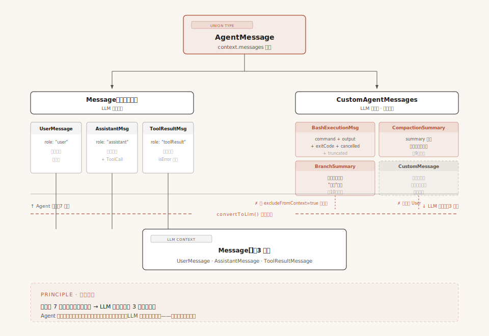
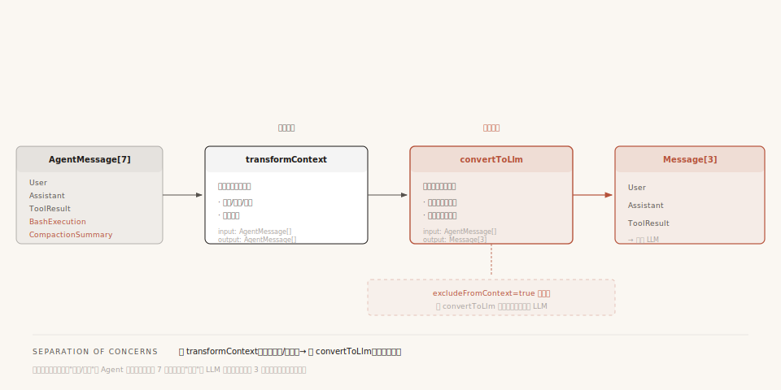

# 第6章：消息系统 —— Agent 的记忆如何组织与传递

上一章我们学了工具系统——模型说"读文件"，Agent Loop 通过五步管道执行 read 工具，最终产生一条 `ToolResultMessage`。但你有没有注意到：我们一直在说"消息"这个词，却从来没拆开看过它到底长什么样。

UserMessage、AssistantMessage、ToolResultMessage——这三个名字反复出现在前五章里。第 3 章说"消息在 Loop 中流转"，第 4 章说"消息发给模型"，第 5 章说"工具结果是一条消息"。

但消息到底是什么？它的数据结构长什么样？Agent 内部的消息和发给模型的消息一样吗？

这一章就来回答这些问题。你会看到 Pi 消息系统最核心的设计——**两层消息**：Agent 内部用丰富的格式自由表达，到了 LLM 边界翻译回严格的标准格式。

---

## 一、开场：一条 Bash 命令的消息之旅

先从一个具体场景说起。

你在 Pi 的终端里输入了一条 Bash 命令 `!ls -la`，回车执行。命令跑完了，输出了一堆文件列表。

这条命令的信息，在 Pi 内部会变成一条 **BashExecutionMessage**——它有 `command` 字段记录命令原文、`output` 字段记录输出内容、`exitCode` 字段记录退出码。这些结构化字段让 UI 可以用专用渲染器漂亮地展示终端输出。

但问题来了：当 Agent Loop 准备调用 LLM 时，LLM 的 API 根本不认识什么 `BashExecutionMessage`。它只认识三种消息格式：`user`（用户说的）、`assistant`（AI 回的）、`toolResult`（工具返回的）。BashExecutionMessage 不属于这三种中的任何一种。

那这条消息是怎么被 LLM 看到的？中间经历了什么变化？

这一章我们就跟着这条 BashExecutionMessage，从它的诞生走到 LLM 看到它的那一刻。

---

## 二、第一层：LLM 认识的消息只有三种

在了解消息怎么变换之前，先搞清楚"变换的目标"长什么样。LLM 能理解的消息格式，在 Pi 里叫做 **Message** 类型，定义在最底层的 `packages/ai/src/types.ts` 里。

它只有三个成员：

```
Message 联合类型（LLM 标准格式）
│
├── UserMessage        ← 用户说的话 / 发的图片
├── AssistantMessage   ← LLM 的回复（含思考、工具调用）
└── ToolResultMessage  ← 工具执行后的结果
```

### 每种消息的具体数据结构

**UserMessage**——最简单的一种，用户输入：

```typescript
{
    role: "user",
    content: string | (TextContent | ImageContent)[],  // 纯文本或内容块数组
    timestamp: number                                    // Unix 毫秒时间戳
}
```

content 可以是一个纯字符串，也可以是一个内容块数组。这意味着用户消息既能发文字，也能发图片。

**AssistantMessage**——LLM 的回复，字段最多：

```typescript
{
    role: "assistant",
    content: (TextContent | ThinkingContent | ToolCall)[],  // 三种内容块
    api: Api,                   // 使用的 API 类型（如 "anthropic-messages"）
    provider: ProviderId,       // 提供商（如 "anthropic"）
    model: string,              // 模型名（如 "claude-sonnet-4-6"）
    usage: Usage,               // token 用量统计
    stopReason: StopReason,     // 停止原因（第3章讲过的5种值）
    errorMessage?: string,      // 错误信息
    timestamp: number
}
```

这里最值得关注的是 content 字段——它不是字符串，而是一个**内容块数组**，可以包含三种东西：

```
AssistantMessage 的 content 内容块
│
├── TextContent       ← 普通文本
│     { type: "text", text: "..." }
│
├── ThinkingContent   ← 思考过程（第3章讲过，模型"在想"但不直接告诉用户的部分）
│     { type: "thinking", thinking: "..." }
│
└── ToolCall          ← 工具调用（第5章讲过，触发五步管道的入口）
      { type: "toolCall", id: "...", name: "read", arguments: { path: "..." } }
```

**一条助手消息可能同时包含文本和工具调用。** 比如 LLM 一边说"让我帮你看看这个文件"，一边发出一个 Read 工具调用——这两个内容会放在同一个 AssistantMessage 的 content 数组里。第 3 章讲的"模型回复中包含 ToolCall"就是这个结构。

> **进阶细节**：content 块里还有一些 `*Signature` 字段（`textSignature`、`thinkingSignature` 等），是某些 Provider（OpenAI、Google）要求的不透明签名 ID，下一轮请求必须原样回传。被安全过滤器编辑过的内容密文也存在这里。日常理解不需要深究，知道它是"Provider 之间的上下文连续性机制"即可。

**ToolResultMessage**——工具执行的结果（第 5 章的五步管道终点产物）：

```typescript
{
    role: "toolResult",
    toolCallId: string,                             // 对应哪个 ToolCall
    toolName: string,                               // 工具名
    content: (TextContent | ImageContent)[],        // 结果内容
    details?: TDetails,                             // 结构化详情（给 UI 看的）
    isError: boolean,                               // 是否执行失败（第5章的"永不抛出"产物）
    timestamp: number
}
```

ToolResultMessage 通过 `toolCallId` 字段和 AssistantMessage 里的 ToolCall 对应起来。第 3 章提到的"工具结果必须精准关联回调用请求"就是靠这个字段。`details` 字段携带结构化信息给 UI 渲染用，LLM 通常不需要看这个字段。

### 一个完整的对话示例

把这三种消息串起来，一个典型的对话片段长这样：

```
messages 数组：
│
├── [0] UserMessage
│       role: "user"
│       content: "帮我看看 auth.ts"
│
├── [1] AssistantMessage
│       role: "assistant"
│       content: [
│           { type: "text", text: "让我帮你看看这个文件" },
│           { type: "toolCall", id: "tc_001", name: "read", arguments: { path: "auth.ts" } }
│       ]
│       stopReason: "toolUse"     ← 第3章讲过：调了工具，循环继续
│
├── [2] ToolResultMessage
│       role: "toolResult"
│       toolCallId: "tc_001"      ← 和上面的 id 对应
│       content: [{ type: "text", text: "import { auth } from '...' ..." }]
│       isError: false            ← 第5章讲过：正常结果
│
└── [3] AssistantMessage
        role: "assistant"
        content: [{ type: "text", text: "auth.ts 是一个认证模块..." }]
        stopReason: "stop"        ← 没调工具，循环结束
```

这就是 LLM 能理解的世界——用户说了什么、AI 回了什么、工具返回了什么，就这么三种。

---

## 三、矛盾：Agent 里的消息不止三种

好，现在回到开头的场景。你执行了 `!ls -la`，Pi 内部需要记录这次执行的信息。

这里其实藏着一个更普遍的问题：**Agent 内部除了"LLM 对话"这件事，还有大量功能性数据要管理**——Bash 命令的执行记录、上下文被压缩后的摘要、Git 分支切换的记录、用户上传的附件元信息……

这些功能性数据有**两个独立的读者**，两个读者的需求是冲突的：

- **UI 端**需要结构化字段——Bash 执行要分别拿到 `command`、`output`、`exitCode`、`cancelled`、`truncated`，才能在终端里漂亮地渲染（命令用高亮、输出用等宽字体、退出码用颜色标识）
- **LLM 端**只需要看一段扁平文本——"用户执行了 `ls -la`，输出是 `file1.txt\nfile2.txt\n...`"，这一段文本塞进 `UserMessage.content` 就够用了

冲突点在哪？**如果为了 LLM 把字段提前拍扁存进 `UserMessage`，UI 就再也拿不回结构化数据了**——你已经搅成一锅粥。反过来，如果只存结构化的自定义消息、不进 LLM 上下文，那 LLM 就会失忆——下一轮它不知道用户刚才执行了什么。

Pi 的设计是**两边都不妥协**：**以结构化的形式存进 `context.messages`**（满足 UI/持久化），**在调用 LLM 的边界上做一次翻译**（满足 LLM）。这样 UI 永远有完整的结构化数据可用，LLM 也能看到它需要的扁平版本。翻译是在最后一刻发生的、有损的、单向的——损失掉的结构化字段，UI 早就用过了，无所谓。

**Pi 的解法是：允许应用自定义消息类型。** `pi-agent-core` 在 AgentMessage 联合类型里预留了一个扩展点（叫 `CustomAgentMessages`，下一节会展开它的实现原理），应用通过 TypeScript 的声明合并往里加自己的消息类型。每个应用只注册自己需要的——核心包零依赖，应用层全栈类型安全。

以 pi 自带的 coding-agent 为例，它在 [packages/coding-agent/src/core/messages.ts](repo/packages/coding-agent/src/core/messages.ts) 里定义了 4 种自定义消息：

```
coding-agent 的自定义消息类型
│
├── BashExecutionMessage       ← Bash 命令执行记录
├── CustomMessage              ← 扩展注入的通用消息
├── BranchSummaryMessage       ← 分支切换时的摘要
└── CompactionSummaryMessage   ← 上下文压缩后的摘要
```

每种都有自己的结构化字段。以 BashExecutionMessage 为例：

```typescript
{
    role: "bashExecution",
    command: string,          // 命令原文："ls -la"
    output: string,           // 输出内容："file1.txt\nfile2.txt\n..."
    exitCode: number | undefined,  // 退出码：0
    cancelled: boolean,       // 是否被取消
    truncated: boolean,       // 输出是否被截断
    fullOutputPath?: string,  // 截断时的完整输出文件路径
    timestamp: number,
    excludeFromContext?: boolean  // 是否排除在 LLM 上下文之外
}
```

结构化字段全保留下来了。但这里要停下来强调一下——**自定义消息不只是"翻译给 LLM 用的中间格式"那么简单，它本身带来了三个独立的能力**：

**1. UI 专用渲染**。UI 根据 `role` 字段做分派——`bashExecution` 用终端样式渲染、`compactionSummary` 用摘要卡片渲染，命令、输出、退出码各占一行，互不干扰。如果没有自定义消息，UI 只能拿到一段扁平文本，所有渲染花样都得退回到"全是大段文字"。

**2. 持久化恢复**。session 文件存的是完整的结构化数据。下次启动 Agent 时，UI 能精确还原上次的渲染状态——退出码仍然有颜色、命令仍然高亮、截断标识仍然在。如果只存翻译后的扁平文本，这些信息重启后就永久丢失了。

**3. 精细化可见性控制**。因为自定义消息有自己的 `role`，可以在 `convertToLlm` 翻译时做特殊处理——比如给它加一个 `excludeFromContext = true` 字段，LLM 就完全看不到这条消息，但 UI 照常渲染。**标准消息做不到这一点**——一旦进了 `messages` 数组，convertToLlm 就一定会翻译它发给 LLM，没有"对 UI 可见但对 LLM 不可见"的余地。

所以后面 §五 讲到 `convertToLlm` 翻译、§七 讲到 `excludeFromContext` 过滤时，请记住：**这两件事不是自定义消息带来的"麻烦"，恰恰相反——它们是自定义消息赋予的能力**。翻译是为了让 LLM 看到扁平版本，过滤是为了让某些消息对 LLM 隐身。没有自定义消息，这两件事都做不了。

但这里有个根本性的问题：**Message 联合类型是封闭的——只有 UserMessage、AssistantMessage、ToolResultMessage 三种。** 这 4 种自定义消息不属于 Message 类型。那它们怎么被 Agent 系统接受并处理的？

---

## 四、第二层：AgentMessage —— 内富外严的双层设计

这就是 Pi 消息系统的核心设计：**不用一种格式打天下，而是用两层——内层丰富、外层严格。**



**配图说明**：顶部 AgentMessage 联合类型一分为二——左支 Message（3 种标准）、右支 CustomAgentMessages（4 种扩展）。中间红色虚线是 convertToLlm() 翻译边界。底部 LLM 只看到 3 种标准消息，自定义消息要么被过滤、要么被翻译成 UserMessage。

### AgentMessage 联合类型

在 `packages/agent/src/types.ts:314` 有一行关键代码：

```typescript
export type AgentMessage = Message | CustomAgentMessages[keyof CustomAgentMessages];
```

翻译成人话：**AgentMessage = LLM 标准消息 + 自定义消息。** 它是 Message（三种标准格式）和 CustomAgentMessages（自定义扩展）的联合类型。

用一张图看最清楚：

```
AgentMessage（Agent 内部使用的消息格式）
│
├── Message（可直接发送给 LLM 的标准消息）
│   │
│   ├── UserMessage          ← role: "user"
│   ├── AssistantMessage     ← role: "assistant"
│   └── ToolResultMessage    ← role: "toolResult"
│
└── CustomAgentMessages（仅 Agent 内部使用的扩展消息）
    │
    ├── BashExecutionMessage      ← role: "bashExecution"
    ├── CustomMessage             ← role: "custom"
    ├── BranchSummaryMessage      ← role: "branchSummary"
    └── CompactionSummaryMessage  ← role: "compactionSummary"
```

Agent 内部的 `context.messages` 数组里放的是 `AgentMessage[]`——它可以混合存放标准和自定义消息。一条消息到底是标准还是自定义的，看 `role` 字段就能判断。

### CustomAgentMessages：默认为空的扩展点

关键在 `CustomAgentMessages` 这个接口：

```typescript
export interface CustomAgentMessages {
    // Empty by default - apps extend via declaration merging
    // 默认为空 - 应用通过声明合并扩展
}
```

注意：**这个接口在核心包（pi-agent-core）里是空的。** 核心包完全不知道有什么 BashExecutionMessage、CompactionSummaryMessage 这些东西。它只提供了一个"插槽"，让应用层往里插。

### 声明合并：类型安全的扩展魔法

应用层怎么"插"？靠 TypeScript 的**声明合并**（Declaration Merging）。coding-agent 通过 `declare module` 语法把自己的 4 种消息类型"注入"进去：

```typescript
declare module "@earendil-works/pi-agent-core" {
    interface CustomAgentMessages {
        bashExecution: BashExecutionMessage;
        custom: CustomMessage;
        branchSummary: BranchSummaryMessage;
        compactionSummary: CompactionSummaryMessage;
    }
}
```

这段代码的效果是：**编译器自动把这 4 种类型加入 AgentMessage 联合类型。** 以后在 coding-agent 项目里，`AgentMessage` 就变成了 7 种消息的联合（3 种标准 + 4 种自定义），TypeScript 会帮你做完整的类型检查。

**为什么不直接用继承或者泛型？** 因为继承需要修改基类——你改不了 `pi-agent-core` 包。泛型需要到处传参数——每个用到 `AgentMessage` 的函数签名都要加泛型参数。声明合并的好处是：**核心包完全不知道扩展的存在（零依赖），扩展包却能获得完整的类型安全。**

不同的应用可以有不同的自定义消息。比如 Web UI 就注册了自己的消息类型（`user-with-attachments`、`artifact`）。**每个应用只看到自己需要的消息类型。**

---

## 五、转换边界：convertToLlm —— 一切自定义消息终将变成 User

现在我们知道 Agent 内部用 7 种消息类型自由表达。但每次调用 LLM 时，LLM 只接受 3 种标准格式。怎么办？

**答案是：在调用 LLM 之前的最后一刻，做一次翻译。** 这个翻译器就是 `convertToLlm` 函数。

### 翻译发生在什么时候？

在 `streamAssistantResponse` 函数里（第 3 章讲过的"调用模型"那一步），翻译发生的时机非常精确：

```
每次 LLM 调用前的消息处理管道：

context.messages: AgentMessage[]        ← Agent 内部的消息（最多 7 种类型）
        │
        ▼
[1] transformContext (可选)             ← AgentMessage[] → AgentMessage[]
        │                                  裁剪旧消息、注入外部上下文
        ▼
[2] convertToLlm (必须)                 ← AgentMessage[] → Message[]
        │                                  自定义消息翻译成标准格式
        ▼
llmContext.messages: Message[]          ← LLM 看到的消息（只有 3 种类型）
        │
        ▼
streamFunction(model, llmContext, ...)  ← 调用 LLM（第4章讲过）
```

注意顺序：**先 transformContext（同层变换），再 convertToLlm（跨层翻译）。** 为什么分两步？后面会讲。

### 转换规则：所有自定义消息都变成 User

coding-agent 的 `convertToLlm` 核心逻辑是一个 switch 语句，按 `role` 字段分派处理：

| role | 怎么处理 |
|------|---------|
| `"user"` | 直接透传，不做任何修改 |
| `"assistant"` | 直接透传 |
| `"toolResult"` | 直接透传 |
| `"bashExecution"` | `excludeFromContext=true` → 过滤掉；否则 → 转换成 UserMessage |
| `"custom"` | 转换成 UserMessage |
| `"branchSummary"` | 转换成 UserMessage（加 XML 标签包裹） |
| `"compactionSummary"` | 转换成 UserMessage（加 XML 标签包裹） |

关键洞察：**所有自定义消息都被转换成了 `user` 角色的消息。**

为什么都变成 `user`？因为 LLM API 对角色顺序有严格要求——对话格式是 `user → assistant → user → ...` 交替的，不能连续出现两个 `assistant`。自定义消息本质上是"系统注入的信息"（Bash 执行结果、压缩摘要、分支摘要），放在 `user` 角色中最安全。

### 具体例子：BashExecutionMessage 的转换

回到开头的场景。一条 `BashExecutionMessage` 从创建到被 LLM 看到，数据结构发生了这样的变化：

**Before —— BashExecutionMessage（Agent 内部格式）：**

```typescript
{
    role: "bashExecution",
    command: "ls -la",
    output: "total 32\ndrwxr-xr-x  5 user  staff  160 May 30 10:00 .\n...",
    exitCode: 0,
    cancelled: false,
    truncated: false,
    timestamp: 1748568000000
}
```

**After —— UserMessage（LLM 看到的格式）：**

```typescript
{
    role: "user",
    content: [{
        type: "text",
        text: "Ran `ls -la`\n```\ntotal 32\ndrwxr-xr-x  5 user  staff  160 May 30 10:00 .\n...\n```"
    }],
    timestamp: 1748568000000
}
```

变化总结：
- `role`：`"bashExecution"` → `"user"`
- `command`、`output`、`exitCode` 等结构化字段 → 被格式化成一段文本
- 丢失的信息：`cancelled`、`truncated` 等布尔标志被融合进文本描述里，不再是独立字段

其他自定义消息（CompactionSummary、BranchSummary）的转换模式完全一样——把摘要文本用 `<summary>` 标签包裹，前面加一句说明，变成 UserMessage 的 content。

---

## 六、两阶段管道：为什么 transformContext 和 convertToLlm 分开？



**配图说明**：横向数据流——AgentMessage[7] → transformContext（同层变换，类型不变）→ convertToLlm（跨层翻译）→ Message[3] 发给 LLM。下方标注 excludeFromContext 过滤分支。

回到管道图，有一个设计细节值得追问：**为什么分两步，而不是一步到位？**

答案是**职责分离**：

- **transformContext** 处理的是 **AgentMessage 级别的操作**：裁剪太旧的消息、注入外部上下文、触发压缩算法。它处理前后都是 `AgentMessage[]`，类型不变。
- **convertToLlm** 处理的是 **跨类型翻译**：把 AgentMessage 翻译成 Message。处理前是 `AgentMessage[]`，处理后是 `Message[]`，类型变了。

分开的好处是：**你可以只替换其中一个，互不影响。**

- 换了**上下文管理策略**（比如从"删最旧消息"改成"压缩成摘要"），只需要改 `transformContext`——它处理"如何裁剪"的策略。`convertToLlm` 不需要动。
- 换了**应用类型**（比如把 coding-agent 改造成一个 Web 客服 Agent，自定义消息从 `BashExecution`/`CompactionSummary` 变成 `TicketEvent`/`OrderNote` 这类业务消息），只需要改 `convertToLlm`——它处理"如何把自定义消息翻译成 UserMessage"。`transformContext` 不需要动。

这里有一个容易混淆的点要强调：**换了 LLM 提供商（比如从 Claude 换成 GPT），convertToLlm 不需要动**。为什么？因为 `convertToLlm` 的输出是统一的 `Message[]`（3 种标准消息），它已经把"自定义消息 → 标准消息"这件事做完了。再往下，**把 Message 翻译成各家 Provider 的私有格式**是 pi-ai 层（第 4 章讲过）的工作——那一层有自己的翻译器（anthropic-messages、openai-completions 等），跟 convertToLlm 是完全独立的两层。换句话说：**Pi 把"消息类型翻译"和"Provider 协议翻译"放在了两层不同的抽象里，互不干扰**。

---

## 七、过滤机制：有些消息 LLM 不该看

到目前为止，所有自定义消息最终都变成了 UserMessage 被 LLM 看到。但有些情况下，消息应该只给 UI 看、不给 LLM 看。

### excludeFromContext：一个布尔字段的过滤力

Pi 的 Bash 工具有个功能：当你用 `!!` 前缀执行命令时（比如 `!!secret_cmd`），这条命令的执行结果对 LLM 不可见。

实现方式非常简单——BashExecutionMessage 有一个 `excludeFromContext` 字段。在 convertToLlm 里，检查这个字段：

```typescript
case "bashExecution":
    if (m.excludeFromContext) {
        return undefined;   // 直接返回 undefined，后续被 filter 掉
    }
    // ... 否则正常转换
```

注意：`excludeFromContext = true` 的消息**仍然存在于 `context.messages` 中**。UI 仍然可以看到它、渲染它。只是在调用 LLM 的那一刻，这条消息被"隐身"了。

这就是"UI 能看、LLM 不能看"的机制——一个布尔字段，在翻译边界做过滤，数据本身不需要删除。

### 三种消息可见性级别

综合以上分析，Pi 的消息系统其实有三种可见性级别：

| 可见性级别 | LLM 是否看到 | UI 是否看到 | 实现方式 | 典型消息 |
|-----------|------------|------------|---------|---------|
| 全可见 | 是 | 是 | convertToLlm 正常转换 | 普通的 BashExecution、User、Assistant |
| LLM 不可见 | 否 | 是 | `excludeFromContext = true` | `!!` 前缀的 Bash 执行 |
| 仅持久化 | 否 | 否 | UI 渲染时跳过，convertToLlm 也过滤掉 | Web UI 的 ArtifactMessage |

---

## 八、完整数据流：从用户操作到 LLM 看到的消息

把全章内容串起来，一条消息从诞生到被 LLM 看到的完整路径：

```
用户在终端输入 !ls -la
        │
        ▼
[1] 创建消息
    BashExecutionMessage { role: "bashExecution", command: "ls -la", output: "...", ... }
        │
        ▼
[2] 存入 context.messages: AgentMessage[]
    [...原有消息, 新的 BashExecutionMessage]
        │
        ▼
[3] Agent Loop 准备调用 LLM（第3章讲过的内层循环）
        │
        ▼
[4] transformContext（可选）
    输入/输出都是 AgentMessage[]
    裁剪、注入、压缩（第8章详讲 transformContext、第9章详讲 Compaction）
        │
        ▼
[5] convertToLlm（必须）
    AgentMessage[] → Message[]
    BashExecutionMessage → UserMessage
    excludeFromContext → 过滤掉
        │
        ▼
[6] LLM 收到
    llmContext.messages = [
        ...之前的消息,
        { role: "user", content: "Ran `ls -la`\n```\n...\n```" }
    ]
        │
        ▼
[7] LLM 回复
    → 产生新的 AssistantMessage
    → 可能触发工具调用 → ToolResultMessage（第5章的五步管道）
    → 回到 [2]，继续循环
```

**核心规律**：Agent 内部用 7 种消息类型自由表达，但到了 LLM 边界，所有自定义消息都被翻译回 3 种标准格式。这个"内富外严"的设计让 Agent 拥有无限扩展能力，同时永远不破坏 LLM 兼容性。

---

## 九、总结

### 一条主线：数据结构要同时照顾两个读者

回看整章，Pi 的消息系统所有设计都围绕一个朴素的思想——**在设计数据结构时，要同时考虑模型要用的、和功能层面要用的，然后根据需求自定义、用合理的架构把两者组合起来**。

具体到消息系统，这两个"读者"的需求是分裂的：

- **模型这边**只要三种标准消息（User/Assistant/ToolResult）——这是 LLM API 协议强制的，不能改
- **功能这边**（UI、持久化、可见性控制）需要丰富的结构化字段——每多一种字段就多一种能力

如果只为模型设计，结构化字段全丢，功能层退化；如果只为功能设计，模型看不懂，对话就断了。Pi 的方案是**两层各管各的**：

| 层 | 关心谁 | 数据形式 | 怎么实现 |
|----|--------|---------|---------|
| **AgentMessage（内层）** | 功能层 | 7 种消息（3 标准 + 4 自定义），字段丰富 | 用联合类型 + 声明合并，让核心包零依赖、应用层全栈类型安全 |
| **Message（外层）** | 模型 | 3 种标准消息，字段精简 | 在 LLM 调用边界做一次 `convertToLlm` 翻译，**有损、单向、最后一刻发生** |

这一章的所有具体设计——三层类型递进（Tool → AgentTool → ToolDefinition）、声明合并扩展点、transformContext / convertToLlm 两阶段管道、excludeFromContext 可见性控制——都是这条主线的具体实现。**主线是"两个读者，两层架构"，实现手段可以千变万化。**

### 把这条主线用到自己的项目里

下次你设计一个对接外部协议的系统（不只是 Agent，可以是任何"对外有协议约束、对内有丰富需求"的场景），可以套用这三步：

**第一步：识别"两个读者"分别要什么。** 协议规定什么（不能改的部分）？功能层需要什么（可以自定义的部分）？把它们列出来，明确各自的需求。

**第二步：以内层结构化为"源"，外层翻译为"流"。** 存储和功能层用原始的、结构化的数据（不丢字段、不拍扁）；到协议边界再做一次有损翻译。**不要为了协议方便而提前拍扁数据**——一旦拍扁，UI 和持久化就再也拿不回结构。

**第三步：用类型系统的扩展点做"核心 + 应用"分层。** 核心包定义协议接口（封闭）、留一个空的扩展插槽；应用包通过声明合并注入自己的具体类型。这样核心包零依赖，应用包全栈类型安全——不需要继承，不需要泛型参数污染。

> 本章讲到的「Tool → AgentTool → ToolDefinition」三层递进（第 5 章）也是同样的思想：每一层只加自己这个层级需要的能力，不越界。识别"分层点"、给每层划清职责边界，是这种设计法的核心。

---

## 十、下一站

前六章到此结束——你已经建立了对 Pi-Agent 核心机制的完整理解。

> **建议**：在进入进阶章节之前，可以花 5 分钟看一下原版文字教程里的《中场总结：前六章核心机制全景图》（位于 `分析文档/项目原理-二次整理版/中场总结-前六章核心机制全景图.md`，本插图版暂未迁移），确认你把各章的知识点串起来了。

从第 7 章开始进入进阶章节。回看前五章，有一个东西反复出现但我们始终没深入：**事件**。第 3 章说"Agent Loop 每做一步都发事件让 UI 实时更新"，第 5 章说"工具执行时发出 `tool_execution_start`、`tool_execution_update`、`tool_execution_end` 事件"。这些事件是怎么从 Agent 内部传到外部的？UI 怎么订阅这些事件？为什么 Agent 发完事件后要"同步等待"监听器处理完？

下一章，我们打开 Agent 的"神经系统"——事件驱动架构。

---

> **本章关键源码索引**：
> - `packages/ai/src/types.ts:322-408` — Message 联合类型 + 三种消息接口
> - `packages/agent/src/types.ts:305-314` — CustomAgentMessages + AgentMessage
> - `packages/coding-agent/src/core/messages.ts:70-77` — coding-agent 声明合并
> - `packages/agent/src/agent-loop.ts:275-308` — 转换管道（transformContext → convertToLlm）
> - `packages/coding-agent/src/core/messages.ts:82-195` — 自定义转换规则
> - `packages/coding-agent/src/core/messages.ts:38-39` — excludeFromContext 字段
