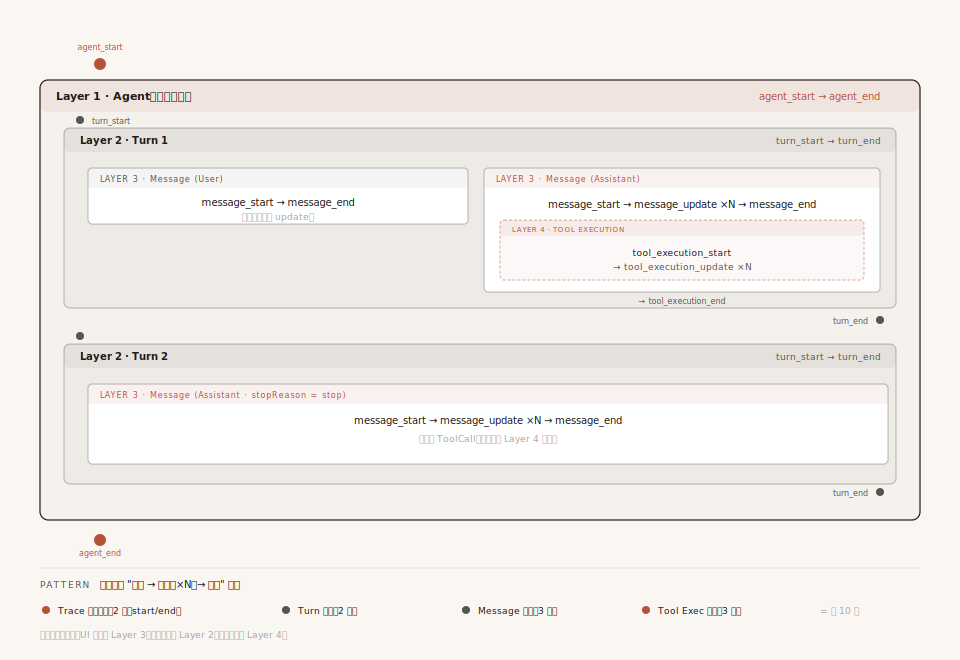
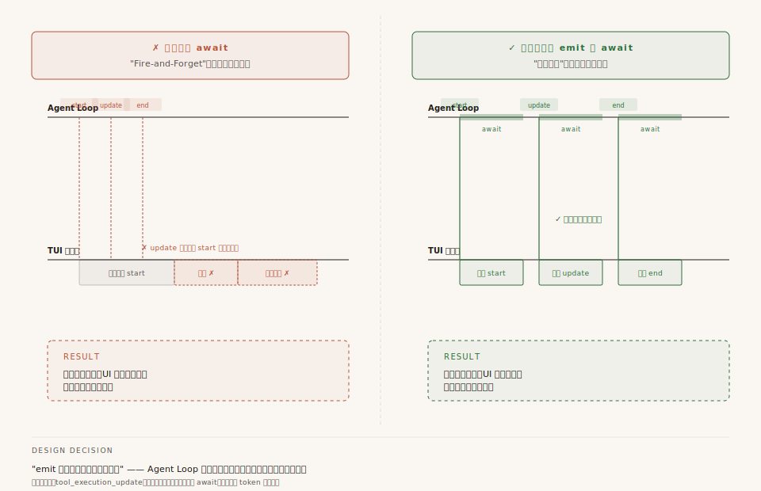
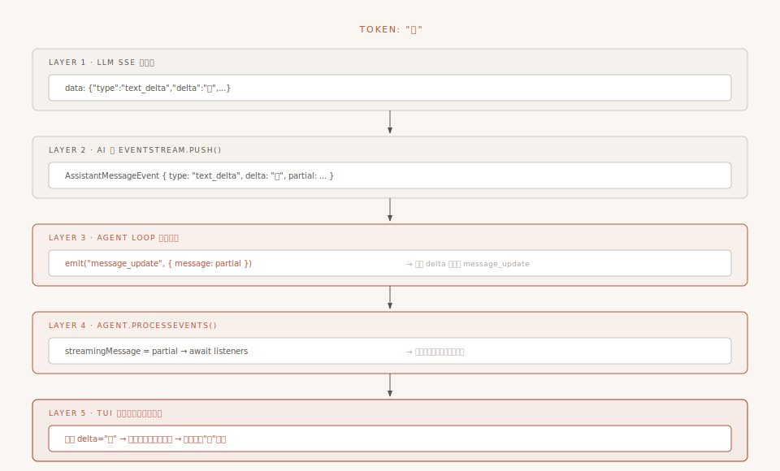

# 第7章：事件驱动 —— Agent 的神经系统

前六章里，有一个东西反复出现但我们始终没深入——**事件**。

第 3 章说"Agent Loop 每做一步都发事件让 UI 实时更新"。第 5 章说"工具执行时发出 `tool_execution_start`、`tool_execution_update`、`tool_execution_end` 事件"。第 6 章里事件到处携带 `AgentMessage`。

但我们始终没回答：事件到底是怎么从 Agent 内部传到外部的？谁在监听？为什么 Agent 发完事件后要"等"监听器处理完才能继续？

这一章就打开 Agent 的"神经系统"。

> 本章起为进阶章节。前六章建立了对 Pi-Agent 运行机制的整体理解，从这里开始深入工程化议题。

---

## 一、为什么需要事件系统？

### 一个直觉：从外卖追踪说起

你在美团上点了一份外卖。下单后，App 会给你推送一连串状态更新："商家已接单" → "骑手已取餐" → "骑手距你 500 米" → "已送达"。每一个状态更新就是一个**事件**——它告诉你"发生了一件事"。你不需要一直盯着骑手的位置看，只需要在收到事件时看一眼。

Pi-Agent 的事件就是这个意思：Agent 运行过程中不断产生"发生了某事"的快照——消息开始了、消息更新了、工具开始执行了——然后把这些快照推给所有关心它的人。

### 不用事件会怎样？

假设你要给 Agent 加一个"工具调用日志"功能：每次调工具时打印一行 `[LOG] 调用了 read，参数：main.ts`。

**不用事件系统**：你得改 Agent 源码，在 `tool.execute()` 前后各加一行 `console.log`。然后 Pi 更新了，你 merge 上游代码时发现冲突——你加的日志和上游新增的逻辑撞在一起了。手动解决冲突，下周又更新，又冲突……

**用事件系统**：

```typescript
session.subscribe((event) => {
    if (event.type === "tool_execution_end") {
        console.log(`[LOG] 调用了 ${event.toolName}，结果：${event.isError ? "失败" : "成功"}`);
    }
});
```

六行代码。不碰 Agent 一行源码。Agent 更新你只需要 `npm update`，日志逻辑不受影响。

这就是事件驱动最核心的价值：**把"发生了什么"和"谁关心什么"彻底分离。** Agent 只管发事件，它不知道也不关心谁在听。

### 发布-订阅 vs 直接调用

用编程术语说，事件驱动实现的是**发布-订阅模式**。和直接函数调用做个对比：

```
直接调用（打电话）：
  Agent ──调用──→ 终端渲染
       ──调用──→ 文件存储
       ──调用──→ 日志记录
  Agent 需要知道所有消费者的存在，每加一个新功能就要改 Agent

发布-订阅（广播）：
  Agent ──emit事件──→ 📡 事件总线
                          ├──→ 终端渲染（订阅了）
                          ├──→ 文件存储（订阅了）
                          ├──→ 日志记录（订阅了）
                          └──→ （新功能只需订阅，Agent 不需要知道）
```

一句话：**直接调用是"我亲自找你"；发布-订阅是"我对着空气喊了一声，谁听到算谁的"。** 在 Pi 里，"对着空气喊"就是 `emit(event)`，"谁听到算谁的"就是 `subscribe(listener)`。

---

## 二、10 种事件，4 层嵌套

Agent 内核层定义了 10 种 `AgentEvent`，它们构成了 Agent 运行的完整"脉搏"：



**配图说明**：从外到内 4 层嵌套——Agent（Trace）→ Turn → Message → Tool Execution。每层都是"开始 → 更新（×N）→ 结束"配对。注意 Turn 2 没有 ToolCall 所以没有 Layer 4 嵌套。底部图例标注每层的事件数（2+2+3+3=10 种）。

```typescript
export type AgentEvent =
  // 第1层：Agent 生命周期（整个运行）
  | { type: "agent_start" }
  | { type: "agent_end"; messages: AgentMessage[] }

  // 第2层：Turn 生命周期（一轮模型调用 + 工具执行）
  | { type: "turn_start" }
  | { type: "turn_end"; message: AgentMessage; toolResults: ToolResultMessage[] }

  // 第3层：Message 生命周期（一条消息）
  | { type: "message_start"; message: AgentMessage }
  | { type: "message_update"; message: AgentMessage; assistantMessageEvent: AssistantMessageEvent }
  | { type: "message_end"; message: AgentMessage }

  // 第4层：Tool Execution 生命周期（一次工具执行）
  | { type: "tool_execution_start"; toolCallId: string; toolName: string; args: any }
  | { type: "tool_execution_update"; toolCallId: string; toolName: string; args: any; partialResult: any }
  | { type: "tool_execution_end"; toolCallId: string; toolName: string; result: any; isError: boolean };
```

10 种看着不少，但规律很清楚——它们是 **4 层嵌套的生命周期**，每层都有"开始→更新→结束"的配对：

```
Agent 运行
├── agent_start ───────────────────── Agent 开始
│
├── Turn 1（第3章讲过：一次模型调用 + 它触发的工具执行）
│   ├── turn_start ────────────────── Turn 开始
│   │
│   ├── Message（LLM 的响应）
│   │   ├── message_start
│   │   ├── message_update ×N ────── 流式增量（逐 token 更新）
│   │   └── message_end
│   │
│   ├── Tool Execution（工具执行）
│   │   ├── tool_execution_start
│   │   ├── tool_execution_update ×N  工具进度（如 Bash 的输出）
│   │   └── tool_execution_end
│   │
│   └── turn_end ──────────────────── Turn 结束
│
├── Turn 2 ...
│
└── agent_end ──────────────────────── Agent 结束
```

回忆第 3 章的概念：**一个 Turn = 一次模型调用 + 这次调用触发的所有工具执行。** turn_start 到 turn_end 之间，模型被调用了恰好一次。

**为什么要 4 层？** 因为不同消费者关心不同粒度。TUI（终端界面）需要逐 token 渲染文字，所以它订阅 `message_update`；而 Session 管理器只关心一轮对话结束了没有，所以它只看 `turn_end`。4 层嵌套让每种消费者都能在刚刚好的粒度上响应。

---

## 三、emit 不是"通知"，是"同步屏障"

认识了 10 种事件后，来看怎么发出它们。这一节包含 Pi 事件系统最重要的设计决策。



**配图说明**：左红右绿对照——左边假设 emit 不 await（事件堆积、状态错乱），右边是 Pi 实际设计（每次 emit 都 await，监听器处理完才继续）。底部的 await 阻塞块就是"同步屏障"。这是事件系统最重要的设计决策。

### 每次发事件都带 await

事件是在 Agent Loop 里发出的。发出动作本身是一个函数——名叫 `emit`。看它的类型定义：

```typescript
export type AgentEventSink = (event: AgentEvent) => Promise<void> | void;
```

注意返回值——`Promise<void>`。emit 可以是异步的。

如果你写过 Node.js 的 `EventEmitter`，你熟悉的 emit 是同步的、fire-and-forget 的——发了就继续，不管谁在听。但 Pi 的 Agent Loop 里每次调用 emit 都带着 `await`：

```typescript
await emit({ type: "agent_start" });
await emit({ type: "turn_start" });
await emit({ type: "message_start", ... });
await emit({ type: "message_update", ... });
await emit({ type: "message_end", ... });
```

每一个 `await` 都在说：**"等这个事件被完全处理完，再继续。"**

这跟传统的发布-订阅不一样——传统是"我喊了一声就走"。Pi 偏偏不这样做：它每发一个事件，都要站着等所有人处理完，然后才走下一步。

为什么？接下来解释。

### processEvents：先更新状态，再等监听器

`emit` 的实体是 Agent 类的 `processEvents` 方法，做了三件事：

```typescript
private async processEvents(event: AgentEvent): Promise<void> {
    // 第一步：根据事件类型更新内部状态
    switch (event.type) {
        case "message_start":
            this._state.streamingMessage = event.message;   // 开始追踪流式消息
            break;
        case "message_update":
            this._state.streamingMessage = event.message;   // 更新流式消息内容
            break;
        case "message_end":
            this._state.streamingMessage = undefined;       // 清空临时工位
            this._state.messages.push(event.message);       // 搬入正式档案
            break;
        // ... tool_execution_start/end 更新 pendingToolCalls 等
    }

    // 第二步：拿 AbortSignal
    const signal = this.activeRun?.abortController.signal;

    // 第三步：同步等待所有监听器完成
    for (const listener of this.listeners) {
        await listener(event, signal);   // ← 一个一个等！
    }
}
```

关键在第三步：**Agent 按订阅顺序，逐一 await 所有监听器。**

你可能会问：这跟"在循环里直接调用函数"有什么区别？区别在于 **Agent 的 `this.listeners` 是一个外部的 Set，它不知道里面是谁。** Agent 只负责"遍历并等待"，而谁在 Set 里、谁不在，完全由外部通过 `subscribe()` 控制。Agent 内核代码里没有任何一行 `updateTerminal()` 或 `appendToFile()`——它甚至不知道 TUI 和文件存储的存在。

### 为什么非要 await？

假设不 await，看看会发生什么：

```
假设 emit 是 fire-and-forget（不等待）：

Agent Loop:  emit(start)  emit(update)  emit(end)
                ↓             ↓              ↓
TUI 监听器:   [开始渲染...]  [还没处理完    [三个事件堆在一起了]
                              start...]

问题：TUI 还没处理完 message_start，message_update 就来了。
      UI 可能显示空消息，也可能显示过时的内容——状态不一致。
```

```
实际设计（await，同步屏障）：

Agent Loop:  emit(start)──await──→  emit(update)──await──→  emit(end)──await──→
                ↓                      ↓                       ↓
TUI 监听器:    [处理完毕，返回]       [处理完毕，返回]          [处理完毕，返回]

保证：Agent 在监听器返回前不会发出下一个事件。
```

一句话总结：**`await` 不是为了"通知"，而是为了"同步协商"——确保所有消费者都跟上了，Agent 才走下一步。** 这就是"同步屏障"的含义。

代价是性能（必须等最慢的消费者），换来的是正确性（状态永远一致）。

### 一个例外：tool_execution_update 不等

如果每个事件都要 await，那 `tool_execution_update` 呢？工具执行过程中可能输出大量进度（Bash 执行时的每一行输出），每次都 await 不会太慢吗？

确实，Pi 对这种高频事件做了特殊处理——**先收集、后批量等待**：

```typescript
const updateEvents: Promise<void>[] = [];   // 收集箱
let acceptingUpdates = true;

const result = await tool.execute(id, args, signal, (partialResult) => {
    if (!acceptingUpdates) return;   // 工具已结束，丢弃迟到 update
    // 不 await！先把 emit 的 Promise 收集起来
    updateEvents.push(emit({ type: "tool_execution_update", ... }));
});

acceptingUpdates = false;             // 关闭闸门
await Promise.all(updateEvents);      // 一次性等所有 update 处理完
```

这不矛盾。**同步屏障的规则不松，但对进度更新类事件开了个口子。** 进度更新是"高频、低价值、可合并"的——多发一条少发一条不影响最终状态。而生命周期事件（start/end）是"低频、高价值"的——错过了 message_start 就没机会了。

还有一个设计细节：`acceptingUpdates` 闸门。工具的 `execute` 是 async 函数，它内部的进度回调可能在 Promise resolve 之后还异步触发（残留定时器/延迟回调）。没有这道闸门，迟到的 `partialResult` 会在 `tool_execution_end` 之后又发出 `tool_execution_update`，让监听器看到"工具已经结束了却还在更新"的错乱序列。

---

## 四、错误处理：监听器异常直接冒泡

`processEvents` 的监听器循环有一个容易忽略的细节：**没有 try-catch。**

```typescript
for (const listener of this.listeners) {
    await listener(event, signal);   // 没有 try-catch！
}
```

如果某个监听器抛异常，异常会一路冒泡到 `runWithLifecycle`，触发整个 Agent 运行失败。**一个 UI 渲染的 bug 能把 Agent 干掉。** 听起来很危险。

为什么不包 try-catch？

因为 Pi 的设计哲学是：**监听器出错，运行就停下来，问题立刻可见。** 如果静默吞掉异常，Agent 看起来"正常"运行，但 UI 已经乱套了——你调试时根本找不到问题。

这就像电路里的保险丝——保险丝烧断了，你立刻知道哪里出了问题。如果每个元件都有自己的保护但从不报错，整个系统看起来"正常"但可能已经坏了一半。

**实践建议**：如果你基于 Pi 写自己的 UI/扩展监听器，**务必在 listener 里自己 try-catch**——Agent 不会替你兜底。

但有一个例外：**扩展系统**。第三方扩展的回调由框架自己做 try-catch 隔离，单个扩展崩溃不会拖垮整个 session。原则是——对内层受信任的监听器（自己写的代码），让异常直接暴露；对外层不受信任的监听器（第三方扩展），由框架做隔离。

---

## 五、你能用事件系统做什么？

前面讲的是"机制"。理解了机制之后，真正的问题是：**你能用这套事件系统做什么？**

下面是几个代表性场景：

### 场景1：实时观测 Agent 在干什么

```typescript
session.subscribe((event) => {
    if (event.type === "tool_execution_start") {
        console.log(`🔧 ${event.toolName}(${JSON.stringify(event.args).slice(0, 50)})`);
    }
    if (event.type === "tool_execution_end") {
        console.log(`   └─ ${event.isError ? "❌ 失败" : "✅ 成功"}`);
    }
});
```

Pi 的 TUI 本身就是通过订阅事件实现的观测面板。你看到的所有终端输出都来自事件消费。

### 场景2：工具调用拦截

通过扩展系统的 `tool_call` 事件，扩展可以返回 `{ block: true, reason: "生产环境禁止删除操作" }`，工具就不会被执行。第 5 章讲的五步管道中第 3 步 `beforeToolCall`，就是由这个机制实现的。

### 场景3：上下文预处理

扩展可以在 LLM 调用之前修改消息列表——注入当前时间、Git 状态、或上一轮对话的摘要。这是第 6 章讲的 `transformContext` 钩子的实现方式。

### 场景4：流式转发到 Web 前端

```typescript
// 服务端
session.subscribe((event) => {
    if (event.type === "message_update") {
        res.write(`data: ${JSON.stringify({ type: "delta", text: extractText(event.message) })}\n\n`);
    }
    if (event.type === "agent_end") {
        res.end();
    }
});
```

Agent 运行在服务器上，用户通过浏览器访问。订阅事件流，通过 SSE 推给浏览器——这就是 Web 集成的核心。

### 小结

这些场景有一个共同特点：**新增任何功能都不需要修改 Agent 内核。** 你只需要 `subscribe`，然后在回调里做你想做的事。事件驱动架构的真正威力不是"通知机制"，而是**开放扩展机制**。

---

## 六、案例：追踪一个 text_delta 的完整旅程

把前面学到的知识串起来，追踪一个 `text_delta` 事件——从 LLM 返回的第一个字符，到你的终端屏幕。



**配图说明**：5 层数据流——LLM SSE → AI 层 EventStream.push → Agent Loop 转换为 message_update → Agent.processEvents 同步屏障 → TUI 监听器写终端。每一层只关心自己的转换。

假设 LLM 正在生成"你好"两个字。一个 "你" 字从产生到显示，经历了 5 步：

```
触发端：LLM SSE 网络流
  │  data: {"type":"text_delta","delta":"你",...}
  │
  ▼ 中转1：AI 层 EventStream.push()
  │  异步队列，AssistantMessageEvent { type: "text_delta", delta: "你" }
  │  （第4章讲过的12种事件之一）
  │
  ▼ 中转2：Agent Loop 事件转换
  │  AI 层 text_delta → Agent 层 message_update
  │  原始事件通过 assistantMessageEvent 字段透传
  │
  ▼ 中转3：Agent.processEvents()（同步屏障）
  │  更新 streamingMessage 内部状态
  │  await 所有 listeners
  │
  ▼ 中转4：AgentSession._handleAgentEvent()
  │  通知扩展系统 → 分发给 Session 监听器 → 持久化
  │
  ▼ 终点：TUI 监听器
  │  提取 delta "你" → 渲染到终端
  │
  ▼
你看到了 "你" 字出现
```

整条链路上，每一层都只关心自己的事：AI 层只管解析 SSE 和构建消息；Agent Loop 只管 emit 事件和处理工具；Agent 只管更新状态和 await 监听器；Session 只管分发和持久化；TUI 只管渲染。**没有任何一层直接调用另一层的内部方法，它们之间唯一的通信协议就是"事件"。**

这里有一个关键的数据变换值得注意：**AI 层的多种 delta 事件（text_delta、thinking_delta、toolcall_delta）被统一映射为 Agent 层的 `message_update`。** AI 层的原始事件通过 `assistantMessageEvent` 字段被附在 `message_update` 上透传。Agent Loop 不关心 delta 的具体类型——它只关心"消息更新了"。但消费者可能关心，所以原始事件被保留而不是丢弃。

---

## 七、Session 层扩展了什么

前六节讲的是 Agent 内核的事件系统——10 种事件。但 Pi 不只有 Agent 层，上面还有一层 `AgentSession`（产品会话层）。

AgentSession 需要处理的事比 Agent 内核多得多：上下文压缩、自动重试、队列状态管理……这些概念在 Agent 内核里不存在。就像你在 Linux 内核里找不到"蓝牙已连接"的通知——内核只管进程调度和内存管理，蓝牙是上层的事。

### 内核 10 种 + Session 7 种

AgentSession 用联合类型扩展了事件：

```
AgentSessionEvent =
    基础 10 种（agent_end 被重载，增加 willRetry 字段）
  + Session 新增 7 种：
      queue_update           ← steering/followUp 队列变化
      compaction_start/end   ← 上下文压缩（第9章详讲）
      auto_retry_start/end   ← LLM 调用失败自动重试
      session_info_changed   ← 会话名称变更
      thinking_level_changed ← 思考深度切换
```

这些事件只和"产品级体验"有关，和"Agent 内核逻辑"无关。所以它们被放在了 Session 层而不是 Agent 层。

**这就是"两层事件"的设计思路：内核只管内核的事（生命周期），产品在上面按需扩展（用户体验）。** 判断标准很简单：如果去掉某个事件后内核还能正常运行，它就属于外层。

---

## 八、总结：三个设计决策

### 决策1：同步屏障

`processEvents` 中 `await` 所有监听器，不用 fire-and-forget。确保消费者永远看到一致的状态。代价是性能，但 `tool_execution_update` 的"先收集后批量等待"策略缓解了高频事件的性能问题。

### 决策2：异常直接暴露

监听器循环不加 try-catch。监听器出错 → 运行失败 → 问题立刻可见。对内层受信任的监听器（自己的代码）不加保护；对外层不受信任的监听器（第三方扩展）由框架做隔离。

### 决策3：两层事件

Agent 内核只定义 4 层生命周期的 10 种事件。Session 层用联合类型扩展 7 种产品级事件。如果去掉某个事件后内核还能正常运行，它就属于外层。

---

## 九、下一站

本章我们看到，事件系统让 Agent 和外部世界彻底解耦——UI、日志、持久化、扩展，全部通过订阅事件工作。

但有一个和事件密切相关的机制我们只提了一句：**`transformContext`**。第 6 章讲消息系统时说它在 `convertToLlm` 之前执行，负责裁剪旧消息、注入外部上下文。当对话越来越长，消息越来越多，最终会超出模型的上下文窗口。这时候 `transformContext` 需要做一件更激进的事——**压缩对话历史**。

接下来两章我们就打开 Pi 的上下文工程全貌。第 8 章先讲全景——从输入侧的工具输出截断、系统提示词组装，到历史侧的 Compaction 与分支摘要，让你看清 Pi 在多个环节布置的防线；第 9 章再深入其中最核心的压缩算法（Compaction），看 Pi 怎么在上下文窗口快满时把 50 轮对话压缩成一段结构化摘要，让 Agent 继续"记住"之前发生了什么。

---

> **本章关键源码索引**：
> - `packages/agent/src/types.ts:413-428` — 10 种 `AgentEvent` 定义
> - `packages/agent/src/agent-loop.ts:25` — `AgentEventSink` 类型（emit 签名）
> - `packages/agent/src/agent.ts:509-556` — `processEvents`（同步屏障实现）
> - `packages/agent/src/agent.ts:168,231-233` — `subscribe` 和 `listeners`
> - `packages/agent/src/agent-loop.ts:628-669` — `executePreparedToolCall`（update 特殊处理）
> - `packages/coding-agent/src/core/agent-session.ts:126-150` — `AgentSessionEvent`（17 种事件）
