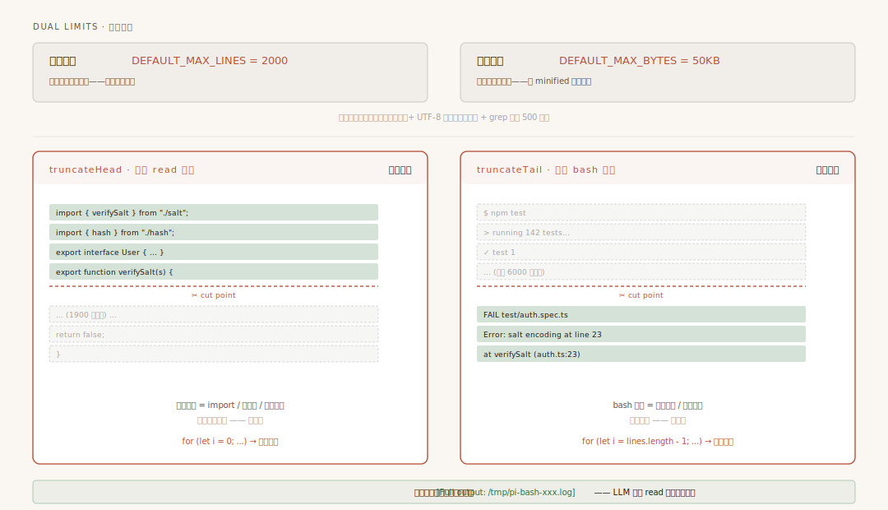
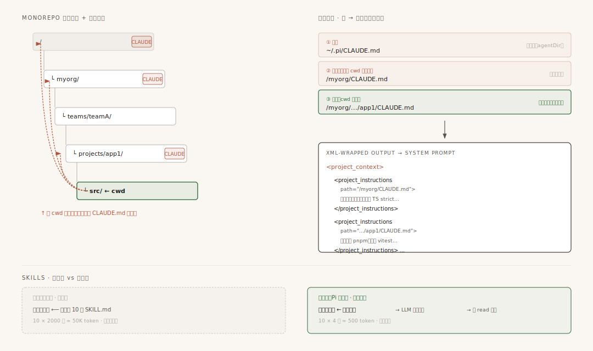
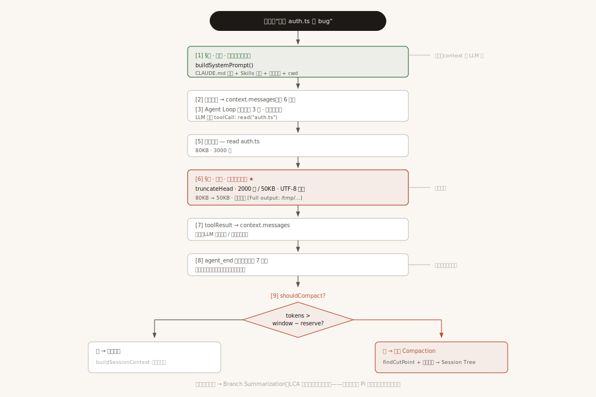

# 第8章：上下文工程 —— 让有限窗口装下无限对话

第 6 章讲消息系统时我们说过：Agent 内部用 7 种 `AgentMessage` 自由表达，但调用 LLM 之前会经过一道 `convertToLlm` 翻译边界，翻译成 3 种标准 `Message`。第 7 章讲事件驱动时又提到：`agent_end` 事件之后会触发"上下文检查"。

这两件事背后其实藏着同一个核心问题——**LLM 的上下文窗口是固定的，但 coding-agent 的对话会无限增长**。

这一章我们就打开 Pi 的"上下文工程"全貌。你会看到：上下文压缩（你或许已经在 [第9章](第9章-上下文压缩-当对话太长怎么办.md) 看过）只是冰山一角。Pi 实际上在 **输入、历史** 两个环节都布置了防线，每一层都对应一种具体的工程问题。

---

## 一、问题：窗口是固定的，对话是增长的

把一个 coding-agent 一次会话的所有"信息源"列出来，你会意识到问题的严重性：

```
一次会话送进 LLM 的内容
├── 系统提示词（工具说明、guidelines、pi 文档路径）
├── 项目上下文文件（CLAUDE.md / AGENTS.md，可能多层嵌套）
├── Skills 列表（每个 skill 一段描述）
├── 工具定义（每个工具的 JSON schema）
├── 对话历史（每一轮 user / assistant / toolResult）
│   ├── 用户输入
│   ├── LLM 回复（含 thinking、toolCall）
│   └── 工具结果（read 文件、bash 输出、grep 命中……）
└── 当前轮的新输入
```

随便挑一项都可能爆炸：

- 跑一次 `npm install` 的 stderr 可能十几 KB
- `read` 一个 5000 行的源文件，可能 80KB
- `grep` 全仓库的关键词，命中几百行
- 多轮工具调用累积下来，几十轮对话轻松破 100K token

而 LLM 的窗口是**硬上限**——超了直接报错 `prompt is too long`，对话中断。

**上下文工程（Context Engineering）** 就是应对这个问题的工程 discipline：在内容送入 LLM 之前，**多层裁剪、过滤、压缩、组织**，让有限的窗口装下"对当前任务最有价值的信息"。

Pi 在这个环节实现了 **4 种互补的技巧**。这一章我们就挨个看。

---

## 二、地图：两层防护

在钻进每个技巧之前，先建立一张总图。Pi 的上下文工程分布在两个环节：

```
┌──────────────────────────────────────────────────────────────┐
│                       输入侧（送进 LLM 之前）                 │
│  ① 工具输出截断 — bash/read/grep 结果按行/字节裁剪            │
│  ② 系统提示词组装 — 多层 CLAUDE.md 向上递归 + Skills 懒加载   │
└──────────────────────────────────────────────────────────────┘
                              │
                              ▼
┌──────────────────────────────────────────────────────────────┐
│                  历史侧（长对话管理）                         │
│  ③ Compaction —— 阈值触发，把旧消息变成结构化摘要             │
│  ④ 分支摘要     —— 切换会话树分支时，给"被放弃的分支"做摘要   │
└──────────────────────────────────────────────────────────────┘
```

| 层 | 解决的问题 | 触发频率 |
|----|-----------|---------|
| ① 工具输出截断 | 单次工具结果太大 | **每次工具调用** |
| ② 系统提示词组装 | 项目规范要进上下文，又不能让用户每次说 | 每轮 prompt |
| ③ Compaction | 长对话累积超窗口 | 阈值触发 |
| ④ 分支摘要 | 会话树分支跳转，旧分支不能丢 | 用户切换分支时 |

接下来按这个顺序展开。

---

## 三、输入侧 ①：工具输出截断（truncateHead / truncateTail）

### 问题：一条 bash 命令就能撑爆窗口

想象你让 Agent 跑 `npm test`，输出 8000 行日志；或者让它 `read` 一个 3000 行的源文件。**单次工具调用**就可能产生几十 KB 的输出。如果不加控制，几轮下来上下文窗口就被工具结果塞满了。

最朴素的解法是"按字符数截断"。但这会立刻撞到三个新问题：

1. **截断的位置不对**——bash 报错通常在末尾，截尾才是有用的；文件读取通常开头更重要，截头才对
2. **切断多字节字符**——直接按字节切，会把一个 emoji 切成两个无效码元
3. **单行就超限**——比如 `grep` 命中一行 100KB 的压缩 JS，怎么切？

Pi 用一套**双重限制 + 边界安全**的算法解决这三个问题，实现全在 [`truncate.ts`](repo/packages/coding-agent/src/core/tools/truncate.ts)。

### 双重限制：行数 + 字节，先触者胜

Pi 给所有工具输出默认定义了两个上限常量（源码在 `truncate.ts:11-13`）：

- **行数上限**：`DEFAULT_MAX_LINES = 2000`
- **字节上限**：`DEFAULT_MAX_BYTES = 50 * 1024`（50KB）
- **grep 单行长度上限**：`GREP_MAX_LINE_LENGTH = 500`

任何工具输出都按"**最多 2000 行**"或"**最多 50KB**"裁剪，**哪个先触发就用哪个**。

为什么要双限制？因为单一限制各有失败模式：

- 只限行数：单行可能极长（压缩 JS、minified CSS），3 行就撑爆字节
- 只限字节：一个 50KB 的源文件可能只有 200 行，但你想看完整结构，按字节切可能把第 100 行切一半

双限制互相兜底——行数管"展示可读性"，字节管"硬性体积"。

### 两种策略：truncateHead vs truncateTail

同样的双重限制，从哪头裁是另一个问题。Pi 提供两个函数，**核心差异只是遍历方向**：



**配图说明**：上半双重限制（2000 行 + 50KB 谁先触发谁赢）。下半左右对照——`truncateHead` 从前往后保留开头（绿色实线 = 留下，灰色虚线 = 裁掉），用在 `read` 文件（import / 接口最密）；`truncateTail` 从后往前保留末尾，用在 `bash` 输出（错误堆栈最有信号）。底部是共用的逃生通道——追加 `[Full output: /tmp/...]` 让 LLM 自己 read。

| 函数 | 保留哪一段 | 用在哪 | 为什么 |
|------|-----------|--------|--------|
| `truncateHead` | 开头 | read 文件 | 文件头部通常是 import / 类定义 / 接口签名，**最有信息密度** |
| `truncateTail` | 末尾 | bash 输出 | bash 的错误堆栈、最终结果都在末尾，**末尾最有信号** |

bash 工具的描述在源码里写得很清楚（`bash.ts:284`）：

> Output is truncated to last 2000 lines or 50KB (whichever is hit first). If truncated, full output is saved to a temp file.

**"last"** 这个词很关键——bash 工具的契约就是"保留末尾"。`truncateTail` 的核心逻辑是从末尾往回选保留行（`truncate.ts:247-266`），简化后是这样：

```typescript
// 伪代码：truncateTail 的核心思路
function truncateTail(content, maxLines, maxBytes) {
    const lines = content.split("\n");
    const kept = [];           // 从末尾往回收集的行
    let bytes = 0;

    for (let i = lines.length - 1; i >= 0; i--) {
        const lineBytes = byteLength(lines[i]) + 1;  // +1 是换行符
        if (kept.length >= maxLines) break;          // 行数到了，停
        if (bytes + lineBytes > maxBytes) break;     // 字节到了，停
        kept.unshift(lines[i]);                      // 插到头部，保持原顺序
        bytes += lineBytes;
    }
    return kept.join("\n");
}
```

`truncateHead` 完全一样，只是把 `for` 改成"从前往后"、`unshift` 改成 `push`。

### 边界安全：UTF-8 多字节字符

字节级截断最阴险的 bug 是切坏多字节字符。一个 emoji 😀 在 UTF-8 里是 4 个字节，如果你在第 2 个字节切一刀，剩下两个字节会变成无效字符 `�`。

Pi 用 `truncateStringToBytesFromEnd`（`truncate.ts:295`）解决——**逐字符地累加字节数**，遇到"加这一个字符就超字节预算"就停。代码里专门处理了代理对（surrogate pair）的情况：遇到一个字符是 4 字节 emoji 时，会把它当成不可分割的整体，要么完整保留，要么完全不要。

另外 `replaceUnpairedSurrogates`（**注意**：此函数仅在 `agent` 包 `truncate.ts:82` 存在；`coding-agent` 包的 truncate.ts 简化了实现，直接用 `Buffer.byteLength + slice`，未保留该函数）会处理一种边角情况：输入本身就损坏（含未配对代理），用 `�` 替换掉，避免后续编码炸掉。这些都是字节边界上的"细活"，不显眼但必要。

### 单行就超限：部分行兜底

`truncateTail` 还有一个边角逻辑（`truncate.ts:255-260`）：如果**第一行（最长的那行）单独就超过 maxBytes**，不能什么都不返回——那样工具结果成空了。它会取这一行的**末尾 maxBytes 字节**，并设置 `lastLinePartial: true` 标志位。

下游的 bash 工具会渲染专门的提示（`bash.ts:366-368`）：

```
[Showing last 49.5KB of line 1 (line is 92.3KB). Full output: /tmp/pi-bash-xxx.log]
```

这样 LLM 至少看到这行的末尾，并且知道完整输出存在哪个文件里——可以用 `read` 工具按需取。

### 单行限长：grep 的 500 字符规则

grep 工具还有一个独立的截断：`truncateLine`（`truncate.ts:336`），默认 `GREP_MAX_LINE_LENGTH = 500`。grep 经常命中压缩文件、minified 代码——一行几万字符。这个函数把超长行截到 500 字符并加 `... [truncated]` 后缀，避免一行就吃掉几千 token。

### 截断后的提示：让 LLM 知道发生了什么

截断本身是有损的，但 Pi 不会偷偷干。`TruncationResult` 结构（`truncate.ts:15-38`）记录了完整的元信息——是否截断（`truncated`）、被什么限制触发（`truncatedBy: "lines" | "bytes" | null`）、原始行数/字节数（`totalLines` / `totalBytes`）、输出行数/字节数（`outputLines` / `outputBytes`）、最后一行是否部分截断（`lastLinePartial`）等等。

bash 工具据此在输出末尾追加一行提示（`bash.ts:362-374`）：

```
[Showing lines 6501-8500 of 8500. Full output: /tmp/pi-bash-xxx.log]
```

这行字**也会进 LLM 上下文**——告诉模型"如果你想看完整输出，去 read 这个文件"。这是截断机制的"逃生通道"：默认截断省 token，需要时 LLM 自己拉完整内容。

> **流式输出补充**：bash 命令是流式输出的（stdout 一行一行吐，可能持续几分钟）。Pi 有个 [`OutputAccumulator`](repo/packages/coding-agent/src/core/tools/output-accumulator.ts) 类负责实时收集、控制内存、把超限内容写到临时文件——但最终截断仍然走上面这套 `truncateTail` 算法。流式累积本身是工程实现细节，不属于"上下文工程"的核心机制，这里不展开，需要深挖的读者直接看源码。

> **小结**：双重限制 + 双向策略 + 边界安全 + 兜底逃生——这是 Pi 工具输出截断的四件套。每个工具调用都会过这道关。

---

## 四、输入侧 ②：系统提示词动态组装

### 问题：项目规范要进上下文，但不能让用户每次说

工具输出截断是"减法"——把太大的东西变小。但上下文工程还有"加法"问题：**怎么让 LLM 自动知道项目的约定**？

比如用户在 monorepo 里开发，希望 LLM 知道："这个子项目用 pnpm 不用 npm"、"测试用 vitest"。如果每次对话都要手动说一遍，体验极差。

Pi 的方案在 [`system-prompt.ts`](repo/packages/coding-agent/src/core/system-prompt.ts) 和 [`resource-loader.ts`](repo/packages/coding-agent/src/core/resource-loader.ts) 里——核心是两件事：**多层 CLAUDE.md 递归** + **Skills 懒加载**。

### 多级上下文文件：从当前目录向上递归

Pi 在每个目录下找 `AGENTS.md` 或 `CLAUDE.md`（大小写都试），然后从 `cwd` 向上递归到根目录，**把沿途所有目录的规范文件全部合并**。



**配图说明**：左侧 monorepo 目录树，红色虚线箭头从 `src/`（cwd）向上爬到根，沿途每层 CLAUDE.md 全收集。右侧合并顺序——① 全局（用户级 `~/.pi/`）→ ② 祖先（从根到 cwd 上一层）→ ③ 项目（cwd 本身，最具体，覆盖在前）。最终用 XML `<project_instructions path="...">` 包装送进 system prompt。底部对照推模式 vs 拉模式——10 个 skill 全文塞要 50K token，只放清单让 LLM 按需 read 只要 500 token。

为什么向上递归？因为现代项目常常是 monorepo 嵌套结构：

```
/myorg
├── CLAUDE.md          ← 全组织规范（通用）
└── teams
    └── teamA
        ├── CLAUDE.md  ← 团队 A 规范（细化）
        └── projects
            └── app1
                ├── CLAUDE.md  ← 项目规范（最具体）
                └── src/       ← cwd 在这里
```

在 `src/` 目录启动 Agent，会向上找到 3 个 `CLAUDE.md`，**按"从外到内"的顺序合并**——祖先目录的规范在前面（最通用），项目目录的规范在后面（最具体）。这让 LLM 像读一本分层规范手册，先读总则再读细则。

除了向上递归，还有**全局上下文**——从 `agentDir`（用户主目录下的 `.pi` 配置目录）读取一份。完整的查找顺序：

```
┌──────────────────────────────────────────────────────┐
│  系统提示词组装顺序                                   │
├──────────────────────────────────────────────────────┤
│  1. agentDir/CLAUDE.md   ← 全局（用户级）            │
│  2. 祖先目录/CLAUDE.md   ← 从 / 到 cwd 上一层        │
│  3. cwd/CLAUDE.md        ← 当前项目                  │
└──────────────────────────────────────────────────────┘
```

源码在 `resource-loader.ts:85-123` 的 `loadProjectContextFiles` 函数。

### XML 包装：让 LLM 理解"这是一份项目指令"

找到了上下文文件，`buildSystemPrompt`（`system-prompt.ts:154-161`）用 XML 标签包装：

```xml
<project_context>

Project-specific instructions and guidelines:

<project_instructions path="/myorg/CLAUDE.md">
全组织规范：所有项目使用 TypeScript strict 模式...
</project_instructions>

<project_instructions path="/myorg/teams/teamA/projects/app1/CLAUDE.md">
本项目使用 pnpm，测试用 vitest...
</project_instructions>

</project_context>
```

为什么用 XML 而不是 Markdown？

1. **XML 边界明确**——`</project_instructions>` 是清晰的结束标记，LLM 不会把规范和外部指令混淆
2. **带 path 属性**——LLM 看到内容来自哪个文件，能区分"组织级规范"和"项目级规范"的优先级

这是 prompt engineering 的标准技巧——主流 LLM 对 XML 标签的结构化理解都很到位。

### Skills 懒加载：列表进 prompt，内容按需读

Skills（项目特定操作指南）有另一个微妙的设计。每个 skill 是一个 `SKILL.md` 文件，可能几千字。如果把所有 skill 全文塞进系统提示词，token 开销巨大且大部分用不上。

Pi 的方案是 `formatSkillsForPrompt`（`skills.ts:335-361`）——**只放轻量清单，全文按需 read**：

```
传统方式（推模式）              Pi 的方式（拉模式）
─────────────────────          ─────────────────────
系统提示词 ←─ 全文塞进           系统提示词 ←─ 只放清单
                                  │
                                  ▼
                               LLM 看清单，判断需要哪个
                                  │
                                  ▼
                               LLM 主动调 read 工具
                                  │
                                  ▼
                               SKILL.md 全文进入后续上下文
```

最终在系统提示词里长这样：

```xml
<available_skills>
  <skill>
    <name>test-setup</name>
    <description>How to run tests for this project</description>
    <location>/path/to/skills/test-setup/SKILL.md</location>
  </skill>
</available_skills>
```

清单顶上还有一句指令——"**Use the read tool to load a skill's file when the task matches its description**"——这就是懒加载契约：用时才付 token，不用不付。

对比"全文塞进系统提示词"：

| 方案 | Token 开销 | 信息密度 |
|------|-----------|---------|
| 全文塞 | 10 个 skill × 2000 字 ≈ 50K token | 大部分无关 |
| 懒加载 | 10 个 skill × 4 行 ≈ 500 token | 精准命中时才展开 |

**这是用"工具调用"做按需上下文加载的范式**——把 LLM 的主动性纳入上下文工程。后面 §八还会展开讨论这个设计模式。

### 系统提示词的完整骨架

把上面所有元素串起来，`buildSystemPrompt` 生成的完整提示词结构是：

```
1. 角色定位
   "You are an expert coding assistant operating inside pi..."
2. 工具列表
   "- read: Read a file\n- bash: Execute...\n- edit: ..."
3. 通用 guidelines
   "- Be concise in your responses\n- Show file paths clearly..."
4. Pi 文档路径（让 LLM 能 read 自身文档）
5. [可选] appendSystemPrompt（追加内容）
6. <project_context>... CLAUDE.md 内容 ...</project_context>
7. <available_skills>... Skills 清单 ...</available_skills>
8. Current date: 2026-07-03
9. Current working directory: /path/to/cwd
```

**末尾**才是 `Current date` 和 `cwd`——这两个看似简单的信息其实是上下文工程的"基本元数据"。LLM 需要知道"今天是哪天"（处理"昨天"、"上周"这类相对时间）、"我在哪个目录"（处理相对路径）。

> **小结**：系统提示词组装是"加法"上下文工程——通过**多层文件递归 + XML 结构化 + Skills 懒加载**，让 LLM 自动接收项目规范，无需用户重复说明。

---

## 五、历史侧 ③：Compaction（联动第9章）

长对话终究会超过窗口上限。Compaction 是 Pi 的核心压缩算法——**把旧消息变成结构化摘要**，用摘要替代原始消息，腾出空间但保留关键信息。

这个问题足够重要也足够复杂，已经独立成章：

**👉 [第9章：上下文压缩 —— 当对话太长怎么办](第9章-上下文压缩-当对话太长怎么办.md)**

那章详细讲了：
- **触发条件**：`shouldCompact` 用 `contextWindow - reserveTokens` 作为阈值
- **切割点算法**：`findCutPoint` 从后往前累积 token，排除 toolResult
- **结构化摘要**：6 section 模板（Goal / Constraints / Progress / Key Decisions / Next Steps / Critical Context）
- **增量更新**：多次压缩时用 `UPDATE_SUMMARIZATION_PROMPT` 在旧摘要基础上更新
- **文件跟踪**：摘要末尾附加 `<read-files>` 和 `<modified-files>` 列表
- **极端情况**：Turn 分割与 turnPrefix 摘要

本章 §七的全景链路会把 Compaction 整合进来，这里不重复展开。**记住一个关键事实就够**：Compaction 生成的 `CompactionSummaryMessage` 会出现在后续对话的 `context.messages` 里，作为新的上下文。

---

## 六、历史侧 ④：分支摘要（Branch Summarization）

Compaction 解决的是"线性对话过长"。但 Pi 还有一个独特特性——**会话树**（第 10 章会详讲）。简单说，对话不是一条直线，而是一棵树：用户可以从某个历史节点"分叉"出新对话。

这种结构带来一个新的上下文工程问题：**用户切换分支时，旧分支上的探索成果不能丢**。

### 问题：分支跳转后，旧分支的内容怎么处理？

举个具体场景：

```
对话树：
        root
         │
       [探索方案 A]
         │
       [A 的实现]
         │
        leaf_1 ← 用户当前在这里

用户：从 root 重新分叉探索方案 B
        root
         │
       [探索方案 A]  ← 这部分还在，但被"放弃"了
         │
       [A 的实现]
         │
        leaf_1（旧叶子）

用户切换到：
        root
         │
       [探索方案 B]  ← 新分支
         │
        leaf_2 ← 用户现在在这里
```

切换之后，**LLM 看到的上下文是 root → leaf_2 这条路径**——它完全不知道 leaf_1 那条分支上探索过什么。如果那条分支上有重要发现（"试过方案 A 但行不通，因为 X、Y、Z"），LLM 失忆了。

直接把整个旧分支接进上下文？太占空间，违背了 §一的精神。

Pi 的解法是 [`branch-summarization.ts`](repo/packages/agent/src/harness/compaction/branch-summarization.ts)——**给被放弃的分支生成摘要，注入新分支的上下文**。

### LCA 算法：找"分叉点"

第一步是确定"被放弃的分支包含哪些内容"。这需要找两个叶子节点的**最近公共祖先（Lowest Common Ancestor, LCA）**——也就是两个分支开始分叉的那个节点。

`collectEntriesForBranchSummary`（`branch-summarization.ts:67-96`）的逻辑用通俗的话讲就三步：

```
旧路径：root → ... → leaf_1
新路径：root → ... → leaf_2

1. 把两条路径都拿出来
2. 在新路径上从后往前找，第一个也在旧路径里的节点 = LCA（分叉点）
3. 从 leaf_1 向上爬到 LCA（不含 LCA），沿途收集的内容
   就是"被放弃的分支"
```

### 摘要生成：复用 Compaction 的工具

收集到 entries 后，`generateBranchSummary`（`branch-summarization.ts:199-261`）用 LLM 生成摘要。它复用了 Compaction 的几件底层工具：

- **`convertToLlm`**——把消息翻译成 LLM 格式
- **`serializeConversation`**——把消息序列化成对话文本
- **`SUMMARIZATION_SYSTEM_PROMPT`**——共享的系统提示词

也就是说，**两套摘要机制共享同一套底层管道，只是 prompt 不同**。

### 提示词：和 Compaction 的关键差异

`BRANCH_SUMMARY_PROMPT`（`branch-summarization.ts:169-196`）和 Compaction 的 `SUMMARIZATION_PROMPT` 高度相似——但只有 **5 section**（Goal / Constraints / Progress / Key Decisions / Next Steps），**没有 Critical Context**（Compaction 才有这一节，所以 Compaction 是 6 section）。差异主要在两点：

**差异 1：上下文前言不同**

```typescript
// 这段前言精准描述了语义——"用户探索了一个不同的分支，然后回到这里"
// LLM 看到这句，知道这不是"主线历史"，而是"另一条线的探索记录"
// 对待方式会更轻量（当作参考，而不是主线）
const BRANCH_SUMMARY_PREAMBLE =
    `The user explored a different conversation branch before returning here.\nSummary of that exploration:\n\n`;
```

**差异 2：maxTokens 更小**

Compaction 的 maxTokens 是 `min(0.8 × reserveTokens, model.maxTokens)`——可能上万 token。但 Branch Summary 的 maxTokens 写死成 `2048`（`branch-summarization.ts:234`）。

**为什么分支摘要要求更精简？** 因为它只是辅助上下文，主线还是新分支。新分支自己也需要 token 预算，分支摘要不能喧宾夺主。

### 摘要的注入：成为 BranchSummaryMessage

生成的摘要包上 `BRANCH_SUMMARY_PREAMBLE` 前言和 `<read-files>` / `<modified-files>` 标签，存为 `BranchSummaryMessage`。下次 buildSessionContext 时，它出现在新分支的上下文开头：

```
The following is a summary of a branch that this conversation came back from:

<summary>
The user explored a different conversation branch before returning here.
Summary of that exploration:

## Goal
Try approach A (PostgreSQL triggers)

## Progress
### Done
- [x] Read schema.ts, identified trigger points

### Blocked
- [x] Performance test showed 3x slowdown — abandoned this approach

## Key Decisions
- **Abandon triggers**: Too slow for high-throughput tables

<read-files>
schema.ts
benchmark/trigger-bench.ts
</read-files>
</summary>
```

LLM 看到这个，立刻知道"之前试过触发器方案，因为性能问题放弃了"——避免了它再次走进同一条死胡同。

### Compaction vs Branch Summarization 对照

| 维度 | Compaction | Branch Summarization |
|------|-----------|---------------------|
| **触发** | 阈值（contextTokens > window - reserve） | 用户切换会话树分支 |
| **目的** | 防止窗口溢出 | 保留被放弃分支的探索成果 |
| **切割** | findCutPoint 算法（向后累积） | LCA 算法（找分叉点） |
| **保留区** | 最近 N tokens 的消息 | 新分支路径（完全保留） |
| **压缩区** | 旧消息（被摘要替代） | 旧分支整条路径 |
| **maxTokens** | min(0.8×reserve, model.maxTokens) | 2048（固定，更精简） |
| **前言语义** | "history compacted" | "explored a different branch" |
| **共存** | 一个对话可能有多次 compaction | 一个分支跳转产生一条分支摘要 |

两者**互补**——Compaction 处理"线性对话的长度问题"，Branch Summarization 处理"树状对话的分支遗忘问题"。Pi 的会话树同时支持两种机制。

---

## 七、全景链路：一次工具调用经过的所有上下文处理

把 §三~§六串起来，看一次完整的 LLM 调用经过的所有上下文工程关卡。



**配图说明**：用户提问 → [1] 系统提示词组装（§四加法）→ [2-3] 消息进 context + Agent Loop → [5] 执行 read 工具 → [6] ★ 工具输出截断（§三减法，红色高亮）→ [7] toolResult 进历史 → [8] agent_end → [9] shouldCompact 判定（否→等下一轮 / 是→Compaction）。§三 控制**单条**体积，§四 控制**提示词**内容，§五 控制**长对话**总长，§六 控制**多分支**信息——四层兜底组成完整漏斗。

```
用户输入 "修复 auth.ts 的 bug"
    │
    ▼
[1] 系统提示词组装（§四）
    buildSystemPrompt()
    ├─ 找 CLAUDE.md（向上递归 + agentDir）
    ├─ 加载 Skills 清单（懒加载）
    ├─ 拼接工具列表 + guidelines
    └─ 末尾加 Current date / cwd
    │
    ▼
[2] 用户消息进入 context.messages（第6章）
    │
    ▼
[3] Agent Loop 开始（第3章五步管道）
    │
    ▼
[4] LLM 返回 toolCall: read("auth.ts")
    │
    ▼
[5] 执行工具 —— read auth.ts
    │
    ▼
[6] 工具输出截断（§三）
    ├─ truncateHead（read 用 head）
    │   └─ 2000 行 / 50KB 双限制
    ├─ UTF-8 边界安全
    └─ 超限返回 firstLineExceedsLimit 标志
    │
    ▼
[7] 工具结果进入 context.messages（第5章）
    │
    ▼
   ...循环...
    │
    ▼
[8] agent_end 事件触发（第7章）
    │
    ▼
[9] 检查 shouldCompact？（§五 / 第9章）
    │
    ├── 否 → 等下一轮
    │
    └── 是 → 执行 Compaction
         ├─ findCutPoint
         ├─ generateSummary（LLM 调用）
         ├─ 生成 CompactionSummaryMessage
         └─ 写入 Session Tree

    用户切换分支？
         │
         ▼
[10] Branch Summarization（§六）
     ├─ collectEntriesForBranchSummary（LCA）
     ├─ generateBranchSummary（LLM 调用）
     └─ 生成 BranchSummaryMessage
```

**这就是 Pi 上下文工程的完整链路**。每一层都是"对 LLM 看到的东西"的一次塑形：

- §三 控制**单条工具结果**的体积
- §四 控制**系统提示词**的内容
- §五 控制**长对话**的总长度
- §六 控制**多分支**的信息保留

任何一层都不是孤立的——它们组合成一道"漏斗"，每一层都过滤/塑形一部分内容，最后送进 LLM 的才是"对当前任务最有价值的信息"。

---

## 八、设计精华

回顾整章，Pi 的上下文工程有三个值得带走的设计思路。

### 1. 多层防护：没有银弹，只有层层兜底

§一开头那张"两层防护"图是这一章最重要的一张图。它的核心思想是——**没有任何单一机制能搞定所有上下文问题**。

- 工具输出截断解决"单条太大"
- 系统提示词组装解决"项目规范注入"
- Compaction 解决"线性对话过长"
- Branch Summarization 解决"分支跳转遗忘"

**每层都只解决自己擅长的问题，互不替代**。你可以把 Compaction 调得非常激进（reserveTokens 设很大），但单条工具输出仍然需要 truncate——因为单条 80KB 的 read 结果，在没有截断的情况下，连一轮都撑不过。反过来也一样。

这是工程化的智慧——**承认每个机制的能力边界，组合使用**。新手常犯的错误是"找到一招就用到底"（比如只靠 LLM 自己处理超长输入），结果遇到具体场景就炸。Pi 的方案是：每一层都做最朴素、最可靠的事，多层叠加形成完整防线。

> 实现：散落在 `packages/coding-agent/src/core/{tools,system-prompt,compaction}/*.ts` 与 `packages/agent/src/harness/`

### 2. 加法 + 减法：上下文工程的双向操作

§三 是"减法"——把太大的东西变小。§四 是"加法"——主动**加入**项目规范和 Skills。§五~§六 在裁剪的同时也做"加法"——**加入**结构化摘要、加入被放弃分支的探索成果。

上下文工程不是单纯的"压缩"，而是"**塑形**"——在体积约束下，让信息**更准确、更有结构、更易理解**。

举个反例：直接把 50 轮对话的原始文本拼成一坨扔给 LLM，体积上是没问题的（如果总 token 没超窗口），但效果远不如"结构化摘要 + 近期消息"。前者要求 LLM 自己从大段文本里提取重点，后者已经把重点整理好。**同等 token，结构化的信息密度更高**。

Pi 在三处体现了这个思想：

- Compaction 用 6 section 模板（含 Critical Context）
- Branch Summary 用 5 section 模板（无 Critical Context）
- 系统提示词组装用 XML 标签（明确语义边界）

**结构化是上下文工程的杠杆**——用一点点 prompt 工程，撬动 LLM 对信息理解的巨大提升。

### 3. 工具调用 = 按需上下文加载

§四的 Skills 懒加载揭示了一个更深的设计模式——**用工具调用做按需上下文加载**。

传统上下文工程是"**推**"模式：系统决定给 LLM 看什么，一股脑塞进 system prompt。

Pi 的 Skills 是"**拉**"模式：系统只给一个清单（轻量），LLM 根据当前任务**主动调用 read 工具**拉取需要的 skill 全文。

| 维度 | 推模式 | 拉模式 |
|------|--------|--------|
| Token 开销 | 全部预付 | 用时才付 |
| 信息密度 | 大部分无关 | 精准命中 |
| LLM 主动性 | 被动接收 | 主动选择 |
| 适用场景 | 必须知道的信息 | 可能用到的信息 |

**核心洞察**：当 LLM 有工具调用能力时，"工具"本身就是上下文工程的载体——不需要把所有可能用到的信息都塞进 prompt，让 LLM 用工具按需取。

这个思想在现代 Agent 系统里越来越重要。Claude Code 的"Skills"、Cursor 的"docs"、Cline 的"context files"——本质上都是同一套机制的不同实现。Pi 的实现是最干净的：XML 清单 + read 工具 + 路径解析约定，三行字定义全部契约。

> 实现：`formatSkillsForPrompt`（`skills.ts:335`）+ 提示词中的 `"Use the read tool to load a skill's file when the task matches its description"`

---

## 九、下一站

这一章我们看了 Pi 的上下文工程全景。其中 §五的 Compaction 和 §六的 Branch Summarization 都涉及一个我们反复提到但没展开的概念——**Session Tree**。

Compaction 的结果存为 CompactionEntry，"追加到 Session Tree"。Branch Summarization 触发于"用户切换会话树分支"。但 Session Tree 到底是什么结构？为什么对话历史不是线性数组而是一棵树？分支跳转的 LCA 算法依赖什么数据结构？

下一章——会话管理——回答这些问题。

---

> **本章关键源码索引**：
> - `packages/coding-agent/src/core/tools/truncate.ts` — 截断算法（truncateHead / truncateTail / truncateLine）
> - `packages/coding-agent/src/core/tools/output-accumulator.ts` — 流式累积器（实现细节，本章不展开）
> - `packages/coding-agent/src/core/tools/bash.ts` — bash 工具的整合（截断 + 累积 + 落盘）
> - `packages/coding-agent/src/core/system-prompt.ts` — 系统提示词组装（buildSystemPrompt）
> - `packages/coding-agent/src/core/resource-loader.ts:85-123` — CLAUDE.md / AGENTS.md 向上递归查找
> - `packages/coding-agent/src/core/skills.ts:335-361` — Skills 懒加载（formatSkillsForPrompt）
> - `packages/agent/src/harness/compaction/branch-summarization.ts` — 分支摘要（LCA + 5 section 模板；同名文件在 coding-agent 包有更详细的 371 行实现，本节引用 agent 包行号）
> - `packages/agent/src/harness/compaction/compaction.ts` — Compaction 主算法（详见第9章）
